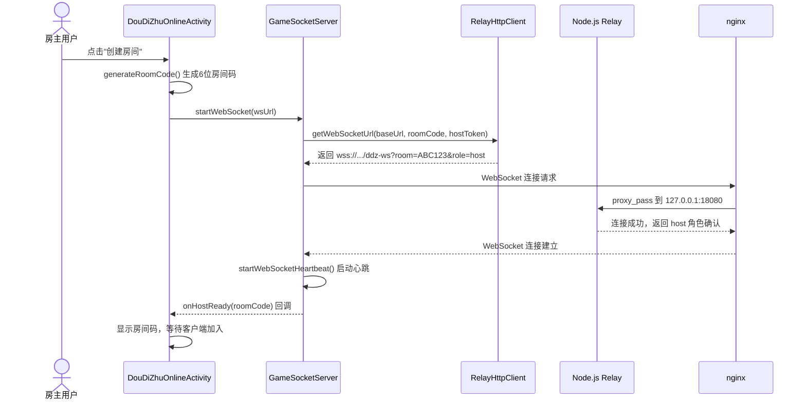
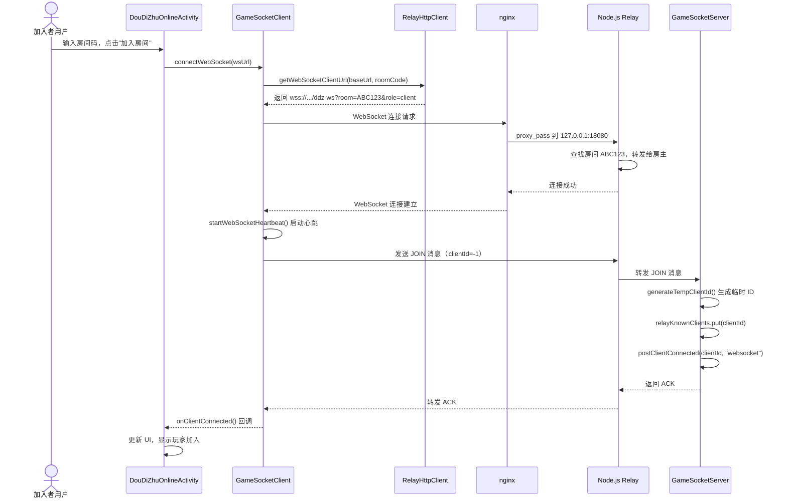
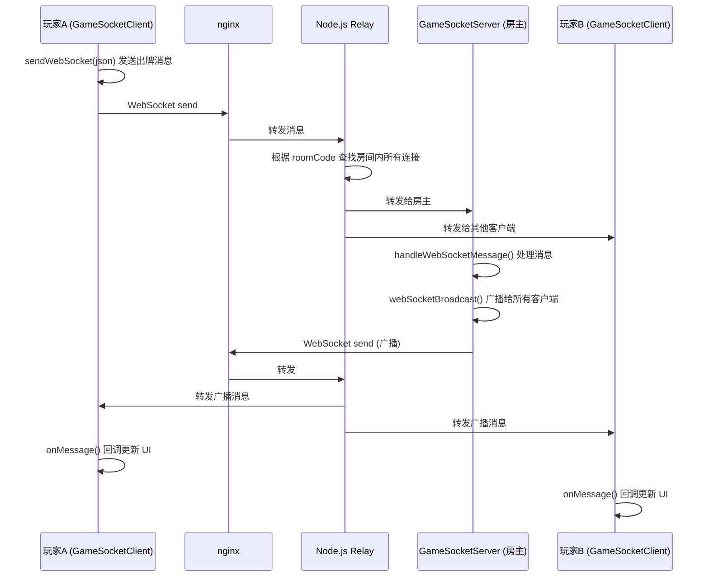
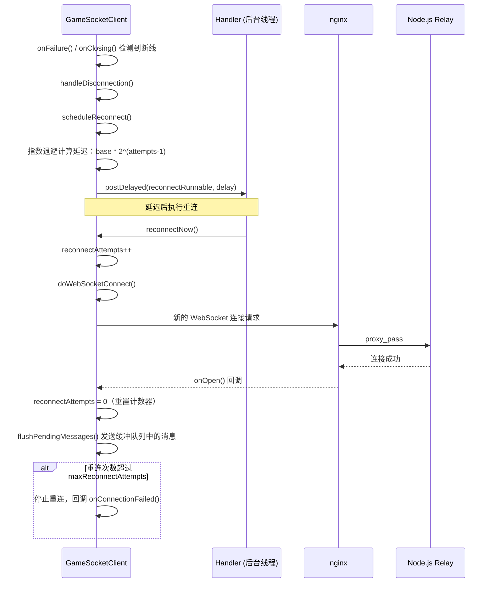

# AI_CONTEXT.md — GameCenter App 项目上下文

> 本文档供后续 AI 编程助手（Trae / Codex / Claude 等）阅读。
> 目标：让 AI 读完后能安全上手，不会因为不了解项目背景而乱改代码。

---

## 2. 项目概览

**项目用途**：一个集成 25+ 款经典小游戏的 Android 游戏中心 App。

**当前状态**：
- 主版本（`games.doudizhu`）：稳定运行，支持局域网 TCP + HTTP Relay + WebSocket 三模联机
- 5 个游戏支持云联机：斗地主、五子棋、中国象棋、围棋、石头剪刀布
- 公共网络模块（`com.gamecenter.app.network`）：所有联机游戏共享
- 其余 20+ 款游戏为单机模式
- **APK 签名配置已修复**：Release 构建自动签名，支持正式发布（v1.3.17）
- **自动更新源选择已修复**：版本比较逻辑正确，可检测新版本
- **自动化发布流程**：一键上传到 HK VPS、US VPS、GitHub Releases
- **Kotlin 升级**：1.9.25 → 2.1.10
- **Hilt 升级**：2.52 → 2.55
- **JSON 序列化替换**：GameUsageStore 手工 JSON 改为 Gson 2.11.0
- **日志工具统一**：删除 util/Log.java，统一使用 AppLog (Extensions.kt)
- **Play Store 描述更新**：README 首部版本徽标同步至 1.3.20
- **AI 助手入口**：独立底部导航 AI 页面，支持 7 种任务、历史搜索、收藏、导出和常用模板
- **多 AI 提供商支持**：默认 DeepSeek API，可选阿里云通义、硅基流动、智谱 AI、零一万物、OpenAI（全部 OpenAI 兼容接口）

**当前版本**：v1.3.20 (versionCode=236)

**重点模块**：
1. **公共联机网络模块** — `com.gamecenter.app.network` 包，包含 GameSocketClient/Server/LANManager/RelayHttpClient/RemoteP2PUtil/OnlineChatHelper
2. **应用更新模块** — 三级下载源（GitHub Releases → 香港 VPS → 美国 VPS），版本比较逻辑已修复
3. **游戏大厅** — GamesFragment + GameRegistry 管理 25+ 游戏入口
4. **工具箱** — ToolsFragment 包含 20+ 网络/设备工具，使用 ToolBinder 架构
5. **APK 签名模块** — keystore.properties + gamecenter.keystore + signingConfigs（已修复）
6. **自动化发布** — upload_to_vps.py + upload_to_github_release.py + auto-publish.bat

---

## 2. 完整文件索引

### 2.1 根包 / com.gamecenter.app

| 文件路径 | 类职责 | 被谁调用 | 调用了谁 |
|---------|--------|----------|----------|
| App.java | Application 入口，全局初始化主题和配色 | Android 系统（Manifest 注册） | SettingsManager, ColorSchemeManager, UpdateManager |
| MainActivity.java | 主界面，底部导航栏 + 更新检查 + 自动下载 | Android 系统（Launcher） | UpdateManager, SettingsManager, GamesFragment, ToolsFragment, BrowserFragment, AppSettingsDialog |
| SettingsManager.java | SharedPreferences 封装，管理所有用户设置 | MainActivity, App, AppSettingsDialog, DouDiZhuOnlineActivity, UpdateManager | 无 |
| ColorSchemeManager.java | 主题配色管理（亮色/暗色/跟随系统） | App, MainActivity | 无 |

### 2.2 Fragments / com.gamecenter.app.fragments

| 文件路径 | 类职责 | 被谁调用 | 调用了谁 |
|---------|--------|----------|----------|
| GamesFragment.java | 游戏大厅，RecyclerView 展示游戏列表 | MainActivity | GameRegistry, GameUsageStore, GameTutorialHelper, 各游戏 Activity |
| ToolsFragment.java | 工具箱，20+ 网络/设备/编码工具 | MainActivity | ToolSectionStore, ToolSection, AdvancedToolBinders, HashToolBinder, ColorPickerToolBinder, ClipboardToolBinder, SystemInfoCollector, ColorSVPanel, ColorHueBar, ColorAlphaBar |
| BrowserFragment.java | 内置浏览器 | MainActivity | 无（独立 WebView） |

### 2.3 Games 注册中心 / com.gamecenter.app.games

| 文件路径 | 类职责 | 被谁调用 | 调用了谁 |
|---------|--------|----------|----------|
| GameRegistry.java | 游戏元数据注册中心（名称、图标、描述、Activity 类） | GamesFragment | 各游戏 Activity 类（仅引用，不实例化） |
| GameUsageStore.java | 游戏使用次数/收藏状态存储 | GamesFragment | 无 |
| GameTutorialHelper.java | 游戏教程弹窗管理 | 各游戏 Activity（showXxxTutorial） | 无 |

### 2.4 斗地主 / com.gamecenter.app.games.doudizhu

| 文件路径 | 类职责 | 被谁调用 | 调用了谁 |
|---------|--------|----------|----------|
| DouDiZhuMenuActivity.java | 菜单界面（单机/联机/远程 P2P） | GameRegistry | DouDiZhuActivity, DouDiZhuOnlineActivity |
| DouDiZhuActivity.java | 游戏主界面 | DouDiZhuMenuActivity | DouDiZhuTableView, AIBot, DouDiZhuSoundManager, GameRuleUtil, model.* |
| DouDiZhuOnlineActivity.java | 联机对战界面（三模：TCP/HTTP/WS） | DouDiZhuMenuActivity | GameSocketClient, GameSocketServer, LANManager, RelayHttpClient, RemoteP2PUtil, DouDiZhuTableView, DouDiZhuSoundManager |
| DouDiZhuTableView.java | 牌桌自定义 View | DouDiZhuActivity, DouDiZhuOnlineActivity | model.Card |
| DouDiZhuSoundManager.java | 音效播放管理 | DouDiZhuActivity, DouDiZhuOnlineActivity | 无（直接操作 MediaPlayer） |
| AIBot.java | AI 出牌决策逻辑 | DouDiZhuActivity | model.Card, GameRuleUtil |
| model/Card.java | 扑克牌数据模型 | AIBot, GameRuleUtil, DouDiZhuTableView, DouDiZhuActivity | model.Rank, model.Suit |
| model/CardType.java | 牌型枚举（单牌/对子/顺子/炸弹等） | GameRuleUtil, AIBot | 无 |
| model/Rank.java | 牌面大小枚举 | Card | 无 |
| model/Suit.java | 花色枚举 | Card | 无 |
| utils/GameRuleUtil.java | 牌型判定、洗牌发牌、合法性检查 | AIBot, DouDiZhuActivity | model.Card, model.CardType |
| network/GameSocketClient.java | 客户端网络（TCP + HTTP Relay + WebSocket 三模） | DouDiZhuOnlineActivity | RelayHttpClient, LANManager, BuildConfig |
| network/GameSocketServer.java | 服务器端网络（TCP + HTTP Relay + WebSocket 三模） | DouDiZhuOnlineActivity | RelayHttpClient, LANManager, BuildConfig |
| network/LANManager.java | NSD 局域网服务发现 | DouDiZhuOnlineActivity | 无 |
| network/RelayHttpClient.java | HTTP Relay 通信 + WebSocket URL 生成 | DouDiZhuOnlineActivity | BuildConfig |
| network/RemoteP2PUtil.java | 房间码规范化、P2P 地址格式化与解析 | DouDiZhuOnlineActivity | 无 |

### 2.5 联机游戏 / com.gamecenter.app.games.{gomoku,chinesechess,go,rock}

以下 4 个游戏支持云联机，使用公共网络模块 `com.gamecenter.app.network`：

| 游戏 | OnlineActivity | 协议前缀 | P2P_PREFS | 棋盘 View |
|------|---------------|---------|-----------|----------|
| 五子棋 | GomokuOnlineActivity | GMK:// | gomoku_p2p | GomokuView（复用单机） |
| 中国象棋 | ChineseChessOnlineActivity | XQ:// | xiangqi_p2p | ChineseChessView（复用单机） |
| 围棋 | GoOnlineActivity | GO:// | go_p2p | GoView（复用单机） |
| 石头剪刀布 | RockOnlineActivity | ROCK:// | rock_p2p | 无棋盘 |

每个游戏包通常包含：
- `XxxActivity.java` — 单机游戏入口（被 GameRegistry 引用）
- `XxxOnlineActivity.java` — 联机对战界面
- `XxxView.java` 或 `XxxGame.java` — 游戏逻辑与绘制
- 部分游戏有 `XxxAI.java`（如 GomokuAI, ChineseChessAI）

### 2.6 其他游戏 / com.gamecenter.app.games.*

其余 20+ 款游戏为单机模式，无联机功能。包括：blackjack、breakout、brotato、checkers、dice、flappy、game2048、guess、klotski、match、memory、pipeline、plane、reaction、snake、sokoban、sudoku、tetris、tic、tiles、whack

### 2.7 公共网络模块 / com.gamecenter.app.network

| 文件路径 | 类职责 | 被谁调用 | 调用了谁 |
|---------|--------|----------|----------|
| GameSocketClient.java | 客户端连接管理（TCP + HTTP Relay + WebSocket 三模） | 所有联机 OnlineActivity | RelayHttpClient, LANManager, BuildConfig |
| GameSocketServer.java | 房主权威服务器（TCP + HTTP Relay + WebSocket 三模） | 所有联机 OnlineActivity | RelayHttpClient, LANManager, BuildConfig |
| LANManager.java | NSD 局域网服务发现 | GameSocketClient, GameSocketServer | 无 |
| RelayHttpClient.java | HTTP Relay 通信 + WebSocket URL 生成 | GameSocketClient, GameSocketServer | BuildConfig |
| RemoteP2PUtil.java | 房间码规范化、P2P 地址格式化与解析 | 各 OnlineActivity | 无 |
| OnlineChatHelper.java | 可复用联机聊天组件（支持内联模式和弹窗模式） | 所有联机 OnlineActivity | 无 |

### 2.8 工具箱 / com.gamecenter.app.tools

| 文件路径 | 类职责 | 被谁调用 | 调用了谁 |
|---------|--------|----------|----------|
| ToolBinder.java | 工具绑定器接口 | ToolsFragment, 各 ToolBinder | 无 |
| ToolHelper.java | 工具通用辅助方法 | 各 ToolBinder | 无 |
| ToolSectionStore.java | 工具分类与排序持久化 | ToolsFragment | ToolSection |
| ToolSection.java | 工具分类数据模型 | ToolSectionStore, ToolsFragment | 无 |
| AdvancedToolBinders.java | 高级工具绑定（被新 Binder 类调用） | NetworkDiagnosisToolBinder 等 | 大量 Android API |
| NetworkDiagnosisToolBinder.java | 网络体检工具 | ToolsFragment | AdvancedToolBinders |
| DiagnosticReportToolBinder.java | 诊断报告工具 | ToolsFragment | AdvancedToolBinders |
| DnsLookupToolBinder.java | DNS 查询工具 | ToolsFragment | AdvancedToolBinders |
| LanScanToolBinder.java | 局域网扫描工具 | ToolsFragment | AdvancedToolBinders |
| TextCodecToolBinder.java | 编码/时间戳/JSON 工具 | ToolsFragment | AdvancedToolBinders |
| FileHashToolBinder.java | 文件哈希工具 | ToolsFragment | AdvancedToolBinders |
| QrPlusToolBinder.java | 二维码增强工具 | ToolsFragment | AdvancedToolBinders |
| ColorPlusToolBinder.java | 颜色增强工具 | ToolsFragment | AdvancedToolBinders |
| PermissionPrivacyToolBinder.java | 权限隐私说明工具 | ToolsFragment | AdvancedToolBinders |
| IpToolBinder.java | IP 地址查询工具 | ToolsFragment | ToolHelper |
| DnsToolBinder.java | DNS 服务器查询工具 | ToolsFragment | ToolHelper |
| WifiToolBinder.java | WiFi 信号信息工具 | ToolsFragment | ToolHelper |
| SpeedTestToolBinder.java | 网络测速工具 | ToolsFragment | ToolHelper |
| PortScanToolBinder.java | 端口扫描工具 | ToolsFragment | ToolHelper |
| QrToolBinder.java | 二维码生成/识别工具 | ToolsFragment | ZXing |
| BatteryToolBinder.java | 电池信息工具 | ToolsFragment | BatteryManager |
| DeviceToolBinder.java | 设备信息工具 | ToolsFragment | Build |
| PingToolBinder.java | Ping 工具 | ToolsFragment | ToolHelper |
| TracerouteToolBinder.java | 路由追踪工具 | ToolsFragment | ToolHelper |
| SubnetToolBinder.java | 子网计算器 | ToolsFragment | ToolHelper |
| ScreenToolBinder.java | 屏幕信息工具 | ToolsFragment | DisplayMetrics |
| SensorToolBinder.java | 传感器信息工具 | ToolsFragment | SensorManager |
| HashToolBinder.java | 哈希计算工具（MD5/SHA1/SHA256） | ToolsFragment | 无 |
| ClipboardToolBinder.java | 剪贴板历史工具 | ToolsFragment | ClipboardManager |
| ColorPickerToolBinder.java | 颜色取色器工具 | ToolsFragment | ColorSVPanel, ColorHueBar, ColorAlphaBar |
| SystemInfoToolBinder.java | 手机系统详细信息 | ToolsFragment | Build, SystemProperties |

### 2.8 更新模块 / com.gamecenter.app.update

| 文件路径 | 类职责 | 被谁调用 | 调用了谁 |
|---------|--------|----------|----------|
| UpdateManager.java | 更新检查、下载、安装管理 | MainActivity, App | UpdateInfo, SSLHelper, SettingsManager, BuildConfig |
| UpdateInfo.java | 版本信息数据模型 | UpdateManager, MainActivity | 无 |
| SSLHelper.java | SSL 证书信任（仅针对更新服务器域名启用） | UpdateManager | 无 |

### 2.9 自定义 View / com.gamecenter.app.views

| 文件路径 | 类职责 | 被谁调用 | 调用了谁 |
|---------|--------|----------|----------|
| ColorSVPanel.java | 颜色饱和度/明度选择面板 | ColorPickerToolBinder | 无 |
| ColorHueBar.java | 颜色色相条 | ColorPickerToolBinder | 无 |
| ColorAlphaBar.java | 颜色透明度条 | ColorPickerToolBinder | 无 |

### 2.10 通用工具 / com.gamecenter.app.utils

| 文件路径 | 类职责 | 被谁调用 | 调用了谁 |
|---------|--------|----------|----------|
| SystemInfoCollector.java | 设备硬件/软件信息收集 | ToolsFragment | 无 |
| PermissionHelper.java | 权限管理辅助，处理首次启动权限说明和运行时权限请求 | MainActivity | ActivityResultLauncher, Build.VERSION |

### 2.11 设置 / com.gamecenter.app.settings

| 文件路径 | 类职责 | 被谁调用 | 调用了谁 |
|---------|--------|----------|----------|
| AppSettingsDialog.java | 设置弹窗（主题/更新/反馈/关于） | MainActivity, GamesFragment | SettingsManager, ColorSchemeManager |

---

## 3. 依赖清单

### 3.1 主要依赖

| 依赖 | 用途 | 说明 |
|------|------|------|
| androidx.activity:activity | ActivityResultLauncher 权限请求 | 必须包含，用于 `PermissionHelper` 的运行时权限处理 |
| androidx.appcompat | AppCompatActivity 兼容 | 核心支持库 |
| androidx.recyclerview | RecyclerView | 游戏列表/工具箱列表展示 |
| androidx.navigation:navigation-fragment | 导航组件 | 可能未使用（详见 7.6） |
| androidx.webkit:webkit | WebView 增强 | 可能未使用（详见 7.6） |
| com.google.zxing:core | 二维码生成/识别 | QrToolBinder 使用 |

### 3.2 Debug 依赖

| 依赖 | 用途 | 说明 |
|------|------|------|
| com.squareup.leakcanary:leakcanary-android:2.14 | 内存泄漏检测 | `debugImplementation`，自动检测 Activity/Fragment 泄漏 |

---

## 4. 核心架构与约定

### 4.1 权限管理约定

- **首次启动权限说明**：App 首次启动时弹出权限说明对话框，向用户解释所需权限的用途
- **用户选择权**：用户可选择立即授权或暂不授权，暂不授权不影响 App 基础功能使用
- **实现方式**：通过 `PermissionHelper` + `ActivityResultLauncher` 处理运行时权限请求
- **权限状态持久化**：已授权状态通过 SharedPreferences 记录，避免重复弹窗

### 4.2 构建与混淆约定

- **Release 构建已启用 R8/ProGuard 混淆**：所有发布版本 APK 均经过代码混淆
- **Keep 规则**：`com.gamecenter.app.**` 包下的所有类已配置 keep 规则，防止被混淆
- **原因**：游戏注册、反射调用、JNI 交互等场景需要保持类名/方法名不变

### 4.3 模块调用约定

- **GameRegistry 仅引用不实例化**：游戏 Activity 类仅作为 Class 引用传入 GameRegistry，由系统负责实例化
- **联机游戏共享网络模块**：所有联机游戏使用 `com.gamecenter.app.network` 包中的公共网络组件
- **工具 Binder 架构**：每个 ToolBinder 独立实现，通过 ToolBinder 接口与 ToolsFragment 解耦

### 4.4 网络错误处理约定

- **统一使用 NetworkErrorHandler**：所有网络请求的错误处理必须通过 NetworkErrorHandler 统一处理
- **禁止混用 Toast/日志**：不要在不同位置随意使用 Toast 弹出或 Log 打印，统一交给 NetworkErrorHandler 处理
- **错误分类**：网络超时、连接失败、HTTP 错误码等需分类处理，给出明确的用户提示

### 4.5 国际化约定

- **用户可见文本提取到 strings.xml**：所有面向用户的界面文本必须提取到 `res/values/strings.xml`
- **支持中英文双语**：同时提供 `res/values-zh/strings.xml`（中文）和 `res/values/strings.xml`（英文默认）
- **禁止硬编码文本**：不要在布局文件或 Java 代码中直接写死用户可见的文本内容

### 4.6 内存泄漏约定

- **Debug 版集成 LeakCanary**：Debug 构建自动集成 LeakCanary 2.14，使用 `debugImplementation` 依赖
- **自动检测**：LeakCanary 自动检测 Activity/Fragment/View 泄漏，无需手动配置
- **修复原则**：发现泄漏后优先检查未取消的监听器、未关闭的 Handler、静态引用等问题

### 4.7 CI/CD 约定

- **GitHub Actions 工作流**：CI/CD 配置定义在 `.github/workflows/ci.yml`
- **自动化流程**：Push/PR 触发构建、Lint 检查、单元测试（如有）
- **本地与 CI 一致性**：确保本地构建与 CI 环境使用相同的 Gradle 参数和检查规则

### 4.8 Lint 规则约定

- **Release 构建强制检查**：Lint 配置为 `abortOnError = true`，`warningsAsErrors = true`
- **禁止忽略警告**：所有 Lint 警告必须修复，不得通过 `tools:ignore` 粗暴屏蔽
- **CI 集成**：CI 工作流包含 Lint 检查步骤，失败则阻断合并

---

## 5. 模块依赖关系图

```mermaid
graph TD
    subgraph Android系统
        Manifest[AndroidManifest.xml]
    end

    subgraph 应用层
        App[App.java]
        MainActivity[MainActivity.java]
        SettingsManager[SettingsManager.java]
        ColorSchemeManager[ColorSchemeManager.java]
    end

    subgraph Fragments
        GamesFragment[GamesFragment]
        ToolsFragment[ToolsFragment]
        BrowserFragment[BrowserFragment]
    end

    subgraph 游戏注册
        GameRegistry[GameRegistry.java]
        GameUsageStore[GameUsageStore.java]
        GameTutorialHelper[GameTutorialHelper.java]
    end

    subgraph 斗地主
        DDZ_Menu[DouDiZhuMenuActivity]
        DDZ_Activity[DouDiZhuActivity]
        DDZ_Online[DouDiZhuOnlineActivity]
        DDZ_Network[GameSocketClient<br/>GameSocketServer<br/>LANManager<br/>RelayHttpClient<br/>RemoteP2PUtil]
    end

    subgraph 斗地主公共
        DDZ_TableView[DouDiZhuTableView]
        DDZ_Sound[DouDiZhuSoundManager]
        DDZ_AIBot[AIBot]
        DDZ_RuleUtil[GameRuleUtil]
        DDZ_Model[Card/CardType<br/>Rank/Suit]
    end

    subgraph 联机游戏
        Gomoku[GomokuOnlineActivity]
        ChineseChess[ChineseChessOnlineActivity]
        Go[GoOnlineActivity]
        Rock[RockOnlineActivity]
        OnlineChat[OnlineChatHelper]
    end

    subgraph 其他20款游戏
        OtherGames[各游戏 Activity/View/Game]
    end

    subgraph 工具箱
        ToolSectionStore[ToolSectionStore]
        ToolBinder[ToolBinder接口]
        NetworkDiagnosis[NetworkDiagnosisToolBinder]
        DiagnosticReport[DiagnosticReportToolBinder]
        DnsLookup[DnsLookupToolBinder]
        LanScan[LanScanToolBinder]
        TextCodec[TextCodecToolBinder]
        FileHash[FileHashToolBinder]
        QrPlus[QrPlusToolBinder]
        ColorPlus[ColorPlusToolBinder]
        PermissionPrivacy[PermissionPrivacyToolBinder]
        OtherBinders[其他17个Binder]
        ColorViews[ColorSVPanel<br/>ColorHueBar<br/>ColorAlphaBar]
    end

    subgraph 更新模块
        UpdateManager[UpdateManager]
        UpdateInfo[UpdateInfo]
        SSLHelper[SSLHelper]
    end

    subgraph 设置
        AppSettingsDialog[AppSettingsDialog]
    end

    Manifest --> App
    Manifest --> MainActivity
    App --> SettingsManager
    App --> ColorSchemeManager
    App --> UpdateManager

    MainActivity --> GamesFragment
    MainActivity --> ToolsFragment
    MainActivity --> BrowserFragment
    MainActivity --> UpdateManager
    MainActivity --> SettingsManager
    MainActivity --> AppSettingsDialog

    GamesFragment --> GameRegistry
    GamesFragment --> GameUsageStore
    GamesFragment --> GameTutorialHelper
    GamesFragment --> AppSettingsDialog

    GameRegistry --> DDZ_Menu
    GameRegistry --> Gomoku
    GameRegistry --> ChineseChess
    GameRegistry --> Go
    GameRegistry --> Rock
    GameRegistry --> OtherGames

    DDZ_Menu --> DDZ_Activity
    DDZ_Menu --> DDZ_Online
    DDZ_Online --> DDZ_Network

    DDZ_Activity --> DDZ_TableView
    DDZ_Activity --> DDZ_AIBot
    DDZ_Activity --> DDZ_Sound
    DDZ_Activity --> DDZ_RuleUtil
    DDZ_Activity --> DDZ_Model

    DDZ_Online --> DDZ_TableView
    DDZ_Online --> DDZ_Sound

    Gomoku --> OnlineChat
    ChineseChess --> OnlineChat
    Go --> OnlineChat
    Rock --> OnlineChat

    DDZ_AIBot --> DDZ_RuleUtil
    DDZ_AIBot --> DDZ_Model

    ToolsFragment --> ToolSectionStore
    ToolsFragment --> ToolBinder
    ToolBinder --> NetworkDiagnosis
    ToolBinder --> DiagnosticReport
    ToolBinder --> DnsLookup
    ToolBinder --> LanScan
    ToolBinder --> TextCodec
    ToolBinder --> FileHash
    ToolBinder --> QrPlus
    ToolBinder --> ColorPlus
    ToolBinder --> PermissionPrivacy
    ToolBinder --> OtherBinders
    ColorPickerToolBinder --> ColorViews

    UpdateManager --> UpdateInfo
    UpdateManager --> SSLHelper
    UpdateManager --> SettingsManager

    AppSettingsDialog --> SettingsManager
    AppSettingsDialog --> ColorSchemeManager
```



---

## 6. 网络层调用链

### 6.1 房主建房流程



### 6.2 客户端加入流程



### 6.3 消息收发流程



### 6.4 断线重连流程



---

## 7. 配置项完整说明

### 7.1 local.properties（用户本地配置，不提交 Git）

| key名 | 所在文件 | 作用 | 缺失时默认值 | 缺失后果 |
|-------|---------|------|-------------|---------|
| `sdk.dir` | local.properties | Android SDK 路径 | 无 | 编译失败 |
| `server.url` | local.properties → BuildConfig.SERVER_URL | 更新检查服务器地址 | `"https://your-server.example.com"` | 更新检查 404，无法获取新版本 |
| `relay.url` | local.properties → BuildConfig.RELAY_URL | 云联机 Relay 服务器地址 | `"https://your-server.example.com/api/ddz-relay"` | 云联机功能不可用，只能局域网对战 |
| `feedback.url` | local.properties → BuildConfig.FEEDBACK_URL | 用户反馈提交地址 | `"https://your-server.example.com/api/feedback"` | 反馈功能不可用 |

### 7.2 version.properties（版本控制，提交 Git）

| key名 | 所在文件 | 作用 | 说明 |
|-------|---------|------|------|
| `version.code` | version.properties | 内部版本号（整数） | 每次打包自动 +1 |
| `version.name` | version.properties | 展示版本号（如 1.3.8） | 正式版发布时手动提升 |
| `version.channel` | version.properties | 版本通道（beta/stable） | beta 为测试版，stable 为正式版 |

### 6.3 app/build.gradle 中的构建配置

| 配置项 | 作用 | 来源 |
|--------|------|------|
| `versionCode` | APK 内部版本号 | version.properties |
| `versionName` | APK 展示版本号 | version.properties |
| `VERSION_CHANNEL` | BuildConfig 中的通道标识 | version.properties |
| `SERVER_URL` | BuildConfig 中的服务器地址 | local.properties |
| `RELAY_URL` | BuildConfig 中的 Relay 地址 | local.properties |
| `FEEDBACK_URL` | BuildConfig 中的反馈地址 | local.properties |
| `CHANGELOG` | BuildConfig 中的更新日志 | CHANGELOG.md |
| `release.minifyEnabled` | Release 构建代码混淆 | 已设为 `true`，启用 R8/ProGuard |
| `release.shrinkResources` | Release 构建资源压缩 | 已设为 `true`，移除未使用资源 |
| `lint.abortOnError` | Lint 检查失败时中止构建 | 已设为 `true`，Lint 错误将阻断 Release 打包 |
| `lint.checkReleaseBuilds` | Release 构建时执行 Lint 检查 | 已设为 `true`，Release 构建强制检查 |
| `lint.warningsAsErrors` | Lint 警告视为错误 | 已设为 `true`，所有警告必须修复 |

> **构建参数**：
> - `-PautoBumpVersion`：构建时自动递增 `version.properties` 中的 `version.code`，CI 打包时推荐使用
> 
> **重要**：修改 `local.properties` 或 `version.properties` 后，必须执行 **Build → Clean Project → Rebuild Project**，否则 `BuildConfig` 不会更新。

---

## 6. 核心约束（禁止事项）

以下内容是 AI 绝对不应该自行修改的：

### 6.1 包结构约束

- **不要删除斗地主包** — 斗地主是主入口，删除会导致 GameRegistry 引用失效。
- **斗地主已合并为单一包** — `doudizhu` 包包含完整的三模联机支持（TCP + HTTP Relay + WebSocket）。

### 6.2 游戏逻辑约束

- **不要修改 `GameRuleUtil` 中的牌型判断逻辑** — 牌型判定是斗地主核心规则，修改会导致游戏逻辑错误。
- **不要修改 `AIBot` 的出牌决策逻辑** — AI 逻辑经过大量调试，随意修改可能导致 AI 行为异常。
- **不要修改 `Card/CardType/Rank/Suit` 的数据结构** — 这些模型类被多处引用，修改会影响整个游戏逻辑。

### 6.3 网络层约束

- **不要删除网络层的心跳/重连机制** — GameSocketClient 中的心跳（10s）、重连（指数退避）、消息缓冲队列是保障弱网稳定性的核心机制。
- **不要修改 WebSocket 路径 `/ddz-ws`** — 此路径与 nginx 配置和 Node.js Relay 服务绑定，修改会导致连接失败。
- **不要修改 `RelayHttpClient` 中的 URL 转换逻辑** — `convertHttpToWs()` 负责将 HTTP baseUrl 转换为 WebSocket URL，修改可能导致 URL 格式错误。
- **不要把 BuildConfig 中的 URL 硬编码** — 所有服务器地址必须通过 `local.properties` 配置，走 BuildConfig 生成。禁止在代码中写死任何服务器地址。

### 6.4 更新系统约束

- **不要修改双版本分发逻辑** — UpdateManager 中的 `acceptBeta` 开关、`version-beta.json` / `version-release.json` 双通道机制是经过设计的，修改可能导致更新系统失效。
- **不要修改 `upload_to_vps.py` 中的 channel 逻辑** — `--channel beta` / `--channel release` 控制上传哪个版本的 APK，修改可能导致版本混乱。

### 6.3 构建约束

- **不要修改 `version.properties` 中的版本号格式** — `version.code` 必须是整数，`version.name` 必须是 `x.y.z` 格式。
- **不要删除 `version.properties` 或 `local.properties`** — 这两个文件是构建系统的必要输入。
- **不要提交签名文件到 Git** — `gamecenter.keystore` 和 `keystore.properties` 包含敏感信息，已添加到 `.gitignore`
- **不要修改签名配置** — `signingConfigs.release` 已配置完成，除非明确需要更换密钥

---

## 8. 已知问题与技术债务

### 8.1 WebSocket 临时 clientId 机制

| 位置 | 内容 | 影响 |
|------|------|------|
| `GameSocketServer.java:99-101` | `generateTempClientId()` — 为尚未分配 ID 的 WebSocket 客户端生成临时 ID | 临时 ID 可能与后续正式 ID 冲突，需要房主端确认机制 |
| `GameSocketServer.java:483-486` | JOIN 消息处理中，clientId=-1 时生成临时 ID | 客户端重连后可能获得不同 ID，导致状态不一致 |

### 8.2 联机状态同步

| 位置 | 内容 | 影响 |
|------|------|------|
| 各 OnlineActivity | SYNC_STATE 同步逻辑 | 已修复：胜利状态双向同步 |
| GameSocketClient.java | 消息缓冲队列 `MAX_PENDING_MESSAGES = 32` | 极端弱网下可能丢消息 |

### 8.3 更新系统

| 位置 | 内容 | 影响 |
|------|------|------|
| `UpdateManager.java` | HTTP 80 端口访问更新服务器 | Cloudflare 2083 端口 HTTPS 被 Xray 占用，443 无法复用；已在 nginx 1443 端口配置 HTTPS，云防火墙开放后启用 |
| `local.properties` | `server.url=http://<YOUR_DOMAIN>` | 使用明文 HTTP；SSLHelper 只对更新服务器域名绕过证书验证，不影响其他 HTTPS 连接 |
| `SSLHelper.java` | 信任特定更新服务器域名 | 改为 `trustUpdateServer(baseUrl)`，只对指定域名禁用证书验证，不再全局禁用所有证书 |

### 8.4 资源重复

| 位置 | 内容 | 影响 |
|------|------|------|
| `res/raw/` vs `res/raw/doudizhu_archive/` | 约 70 个 mp3 文件完全重复 | APK 体积增大，但代码只引用根目录的文件 |

### 8.5 布局文件缺失

| 位置 | 内容 | 影响 |
|------|------|------|
| `ToolsFragment.java:670` | 引用 `R.layout.item_tool_section` | 该布局文件不存在，可能导致运行时崩溃（需确认） |

### 8.6 可能的未使用依赖

| 依赖 | 状态 | 说明 |
|------|------|------|
| `androidx.navigation:navigation-fragment` | ⚠️ 可能未使用 | 代码中使用的是 BottomNavigationView + FragmentTransaction，没有使用 Navigation 组件 |
| `androidx.webkit:webkit` | ⚠️ 可能未使用 | BrowserFragment 可能使用系统 WebView 而非 androidx.webkit.WebView |

---

## 9. 修改某功能时必须同步修改的文件清单

### 9.1 修改联机协议/消息格式

| 必须同步修改的文件 | 原因 |
|-------------------|------|
| `GameSocketClient.java` | 客户端发送/接收消息格式 |
| `GameSocketServer.java` | 服务器端发送/接收消息格式 |
| `DouDiZhuOnlineActivity.java` | UI 层消息处理逻辑 |
| `Node.js Relay (server.js)` | 服务端消息转发逻辑 |

### 9.2 修改房间码格式/长度

| 必须同步修改的文件 | 原因 |
|-------------------|------|
| `RemoteP2PUtil.java` | `ROOM_CODE_LENGTH`、`normalizeRoomCode()`、`findRoomCode()` |
| `DouDiZhuOnlineActivity.java` | `generateRoomCode()` 生成逻辑 |
| `Node.js Relay (server.js)` | 房间码验证逻辑 |

### 9.3 修改 WebSocket 路径/端口

| 必须同步修改的文件 | 原因 |
|-------------------|------|
| `RelayHttpClient.java` | `WS_PATH` 常量 |
| `nginx conf` | `location /ddz-ws` 配置 |
| `Node.js Relay (server.js)` | WebSocket 服务器监听路径 |
| `local.properties` | `relay.url` 配置 |

### 9.4 修改更新检查 URL/协议

| 必须同步修改的文件 | 原因 |
|-------------------|------|
| `local.properties` | `server.url` 配置 |
| `UpdateManager.java` | `buildVersionJsonUrl()` 方法 |
| `upload_to_vps.py` | `publicBaseUrl` 配置 |
| `update_server.py` | 服务端接口路径 |

### 9.5 修改版本号规则

| 必须同步修改的文件 | 原因 |
|-------------------|------|
| `version.properties` | 版本号定义 |
| `app/build.gradle` | `readVersionProperties()` 解析逻辑 |
| `UpdateManager.java` | 版本比较逻辑 |
| `upload_to_vps.py` | 版本验证逻辑 |

### 9.6 添加新游戏

| 必须同步修改的文件 | 原因 |
|-------------------|------|
| `GameRegistry.java` | 注册游戏元数据 |
| `AndroidManifest.xml` | 注册 Activity |
| `GamesFragment.java` | 如需要特殊分类处理 |
| `res/layout/activity_xxx.xml` | 游戏布局 |
| `res/drawable/ic_xxx.xml` | 游戏图标 |
| `res/values/strings.xml` | 游戏名称和描述 |
| `GameTutorialHelper.java` | 添加教程方法（可选） |

### 8.7 修改主题/配色

| 必须同步修改的文件 | 原因 |
|-------------------|------|
| `ColorSchemeManager.java` | 主题切换逻辑 |
| `res/values/themes.xml` | 亮色主题定义 |
| `res/values-night/themes.xml` | 暗色主题定义 |
| `res/values/colors.xml` | 颜色值定义 |
| `res/values-night/colors.xml` | 暗色颜色值定义 |
| `AppSettingsDialog.java` | 主题选择 UI |

---

## 附录：快速参考

### 构建命令

```bash
# 本地编译
.\gradlew.bat :app:assembleDebug

# 打包并上传 Beta 版到 VPS
.\gradlew.bat :app:buildAndUploadDebugToVps

# 打包并上传正式版
.\gradlew.bat :app:assembleDebug -PupdateChannel=stable -PautoUploadVps=true
```

### 关键常量

| 常量 | 值 | 位置 |
|------|-----|------|
| WebSocket 心跳间隔 | 10 秒 | `GameSocketClient.java` / `GameSocketServer.java` |
| WebSocket 超时时间 | 45 秒 | `GameSocketClient.java` |
| 最大重连次数 | 3 次 | `GameSocketClient.java` |
| 消息缓冲队列上限 | 50 条 | `GameSocketClient.java` |
| 房间码长度 | 6 位 | `RemoteP2PUtil.java` |
| HTTP 轮询超时 | 35 秒 | `RelayHttpClient.java` |
| HTTP 创建房间超时 | 10 秒 | `RelayHttpClient.java` |

### 服务器端文件位置（VPS）

```
/var/www/update/
├── server.py              # Python 更新服务
├── app/
│   ├── app-beta.apk       # Beta 版 APK
│   ├── version-beta.json  # Beta 版版本信息
│   ├── app-release.apk    # 正式版 APK
│   └── version-release.json # 正式版版本信息
└── ddz_ws_relay/
    ├── server.js          # Node.js WebSocket Relay
    └── node_modules/      # ws 库依赖
```

### nginx 配置位置

```
/etc/nginx/conf.d/ws-ssl.conf    # 2083 端口 HTTPS + WebSocket
/etc/nginx/conf.d/update.conf    # 80 端口 HTTP 更新服务
```

### systemd 服务

```bash
systemctl status update-server           # 更新服务
systemctl status gamecenter-ddz-ws-relay # WebSocket Relay
```
---

## 2026-05-14 文档同步：文字适配与应用语言

- 新增全局按钮文字适配样式，统一提升 MaterialButton 与平台 Button 的最小高度、内边距和两行显示能力，减少“进入游戏”“发送”等按钮文字被裁切的问题。
- 设置弹窗新增应用语言选项：跟随系统、中文、English；应用启动时会恢复已选择语言。
- AI 任务下拉改为资源字符串，切换 English 后可显示 Chat、Summary、Translate 等英文选项。
- 发布前检查需覆盖中文/英文两种语言、深色/浅色主题、游戏大厅卡片按钮、AI 发送按钮、工具箱小按钮和斗地主操作按钮。
## 2026-05-15 文档同步：Dependabot 与 CI 修复

- Dependabot 安全告警已处理：升级 Android Gradle Plugin 到 8.13.2、Gradle Wrapper 到 8.13、Kotlin 到 2.2.21、Hilt 到 2.57.2。
- 构建 classpath 已强制解析到安全版本：Netty 4.1.133.Final、BouncyCastle 1.84、commons-compress 1.26.0、jose4j 0.9.6、jdom2 2.0.6.1。
- GitHub Actions 已改为验证型 CI：使用 JDK 21，执行 debug 构建与单元测试，不在云端构建 release 包，避免暴露或依赖 release 签名文件。
- CI 命令统一添加 `-PautoBumpVersion=false`，避免自动修改 `version.properties`。
- `.gitignore` 的 `data/` 规则已收窄为 `/data/`，防止误忽略 `app/src/main/java/com/gamecenter/app/ai/data/` 源码。
- 最新 GitHub Actions `CI/CD Pipeline` 已通过；正式签名、R8 混淆和 VPS/GitHub Release 发布仍以本机发布流程为准。
