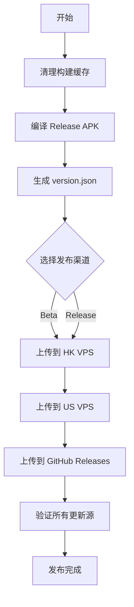

# GameCenterApp 发布指南

本文档说明如何将 GameCenterApp APK 自动发布到所有更新源。

## 重要更新（2026-05-12）

### 双版本分发架构重构 🎯

从 v1.3.19 开始，发布系统已重构为**双版本分发架构**：

#### 核心变化
- **测试版和正式版完全分离**：VPS 上同时维护 `app-beta.apk` 和 `app-release.apk`
- **上传脚本修复**：`upload_to_vps.py` 的 `cleanup_remote` 函数现在保护两个通道的文件
- **更新逻辑优化**：
  - 用户开启"接收测试版" → 检查 version-beta.json
  - 用户关闭"接收测试版" → 只检查 version-release.json
  - 旧版 APP 使用 /api/update/check API 自动兼容

#### 发布命令

**发布测试版**：
```bash
python tools/upload_to_vps.py --apk app/build/outputs/apk/release/app-release.apk \
    --version app/build/outputs/apk/release/version.json --channel beta
```

**发布正式版**：
```bash
python tools/upload_to_vps.py --apk app/build/outputs/apk/release/app-release.apk \
    --version app/build/outputs/apk/release/version.json --channel release
```

### APK 签名问题已修复

之前的版本存在 APK 签名配置问题，导致安装包提示"开发者签名异常"。现已修复：

1. **修复 keystore 路径错误**
   - 错误：`storeFile file(props['STORE_FILE'])`
   - 正确：`storeFile rootProject.file(props['STORE_FILE'])`

2. **启用 V1 和 V2 签名方案**
   ```groovy
   signingConfigs {
       release {
           enableV1Signing = true
           enableV2Signing = true
       }
   }
   ```

3. **验证签名**
   ```bash
   cd app\build\outputs\apk\release
   jarsigner -verify app-release.apk
   # 输出：jar 已验证 ✅
   ```

### VPS 文件结构

```
/var/www/update/app/
├── app-beta.apk         # 测试版安装包
├── version-beta.json     # 测试版元数据
├── app-release.apk      # 正式版安装包
└── version-release.json  # 正式版元数据
```

---

## 更新源列表

| 序号 | 更新源 | URL | 类型 | 用途 |
|------|--------|-----|------|------|
| 1 | 香港 VPS | https://hk-update.tcp0053.shop | SFTP | 主要更新源，低延迟 |
| 2 | 美国 VPS | https://tcp0053.shop:1443 | SFTP | 备用更新源 |
| 3 | GitHub Releases | https://github.com/3571949306/GameCenterApp/releases | HTTPS API | 公开分发 |

## 前置准备

### 1. 安装依赖

```bash
# 安装 Python 依赖
pip install paramiko requests
```

### 2. 配置签名

在项目根目录创建 `keystore.properties` 文件：

```properties
# GameCenterApp 签名配置
STORE_FILE=gamecenter.keystore
STORE_PASSWORD=GameCenter2026
KEY_ALIAS=gamecenter
KEY_PASSWORD=GameCenter2026
```

确保 `gamecenter.keystore` 文件存在于项目根目录。

### 3. 配置 VPS 凭证

VPS 配置文件位于 `local_private/vps/` 目录（已排除在版本控制外）：

- `upload_config_hk.json` - 香港 VPS 配置
- `upload_config_hk.json` - 美国 VPS 配置

配置示例：

```json
{
  "host": "your-vps-ip",
  "port": 22,
  "user": "root",
  "authMethod": "password",
  "password": "your-password",
  "remoteDir": "/var/www/update/app",
  "publicBaseUrl": "https://your-update-domain.com",
  "postUploadCommands": [
    "systemctl restart gamecenter-update"
  ]
}
```

### 4. 获取 GitHub Token

1. 访问 https://github.com/settings/tokens
2. 创建新 Token，勾选 `repo` 权限
3. 复制 Token 并保存（只显示一次）

## 发布方式

### 方式一：一键发布脚本（推荐）

#### Windows (批处理)

```bash
# 发布 Beta 版
publish-all.bat beta

# 发布正式版
publish-all.bat release
```

#### Python 脚本（跨平台）

```bash
# 发布 Beta 版
python tools/publish-all.py --channel beta --github-token YOUR_GITHUB_TOKEN

# 发布正式版
python tools/publish-all.py --channel release --github-token YOUR_GITHUB_TOKEN

# 只上传到特定更新源
python tools/publish-all.py --channel beta --github-token YOUR_TOKEN --sources hk_vps github

# 跳过验证
python tools/publish-all.py --channel release --github-token YOUR_TOKEN --skip-verify
```

### 方式二：分步执行

#### 步骤 1: 编译 APK

```bash
# 编译 Beta 版（带签名）
gradlew assembleRelease -x lintVitalReportRelease -x lintVitalRelease

# 编译正式版（带签名）
gradlew assembleRelease -x lintVitalReportRelease -x lintVitalRelease
```

**注意**：现在 APK 会自动签名，无需手动签名步骤。

#### 步骤 2: 生成 version.json

```bash
gradlew generateVersionJson
```

version.json 会自动生成到：
- `app/build/outputs/apk/debug/version.json`
- `app/build/outputs/apk/release/version.json`

#### 步骤 3: 验证签名

```bash
cd app/build/outputs/apk/release
jarsigner -verify app-release.apk
# 输出：jar 已验证 ✅
```

#### 步骤 4: 上传到 VPS

```bash
# 上传到香港 VPS + 美国 VPS
python tools/upload_to_vps.py --apk app/build/outputs/apk/release/app-release.apk \
    --version app/build/outputs/apk/release/version.json \
    --channel beta
```

**注意**：现在使用已签名的 `app-release.apk`，而非 `app-release-unsigned.apk`。

#### 步骤 5: 上传到 GitHub Releases

```bash
python tools/upload_to_github_release.py \
    app/build/outputs/apk/release/app-release.apk \
    "v1.3.17"
```

## 发布流程



## 验证发布

### 1. 检查 VPS 更新源

访问以下 URL 确认文件已上传：

- 香港 VPS: https://hk-update.tcp0053.shop/version-beta.json
- 美国 VPS: https://tcp0053.shop:1443/version-beta.json

### 2. 检查 GitHub Releases

访问：https://github.com/3571949306/GameCenterApp/releases

### 3. 应用内检查更新

在应用设置中切换到对应更新源，点击"检查更新"。

## 常见问题

### Q: 上传到 VPS 失败

**A:** 检查以下项目：
1. VPS 配置文件是否存在且正确
2. 网络连接是否正常
3. VPS 的 SSH 服务是否运行
4. 防火墙是否允许 SSH 连接

### Q: GitHub Releases 上传失败

**A:** 确认：
1. GitHub Token 是否有效
2. Token 是否有 `repo` 权限
3. 仓库名称是否正确

### Q: 版本号不匹配

**A:** 确保：
1. `version.properties` 中的版本号已更新
2. 使用正确的 `-PupdateChannel` 参数
3. 清理旧的构建文件后重新编译

## 自动化发布（CI/CD）

项目已配置 GitHub Actions 工作流 (`.github/workflows/ci.yml`)，推送代码时自动构建和上传。

如需手动触发发布，可以使用：

```bash
# 本地一键发布
python tools/publish-all.py --channel beta --github-token ${{ secrets.GITHUB_TOKEN }}
```

## 发布记录

发布记录会自动更新到 `CHANGELOG.md` 和 `RELEASE_NOTES_*.md` 文件。

---

**最后更新**: 2026-05-11  
**版本**: v1.11.0
