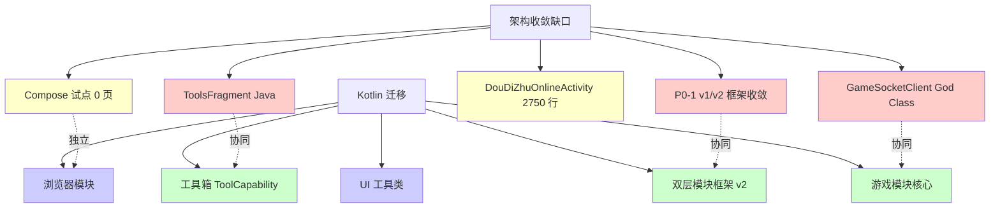

<!-- flutter-store-doc-sync: 2026-07-22 -->
> **Flutter-first production sync:** The Flutter module-store UI and customizable host navigation are live in stable vc595; Android remains authoritative for catalog trust, download, install, rollback, and runtime lifecycle. Production completion: 100%. See `/docs/flutter-store/MIGRATION_STATUS.md`.

# 架构收敛与 Kotlin 迁移时间表

> **文档编号**：ROADMAP-ARCH-KT-001
> **覆盖改进项**：P2-8（架构收敛与 Kotlin 迁移）
> **版本**：v1.0
> **编制日期**：2026-07-19
> **基线版本**：versionCode=587 / versionName=1.4.1
> **GitHub**：https://github.com/3571949306/GameMatrixApp
> **关联文档**：`docs/SPEC.md` §3 技术架构、`docs/COMPOSE_MIGRATION.md`、`docs/ROOM_MIGRATION.md`、`docs/PROJECT_STATUS.md`、`docs/项目改进建议书.md` §3.4/§4.4

---

## 1. 背景

GameMatrixApp 当前语言比例为 Java 55% + Kotlin 45%。循环 23 已完成宿主层首批 Kotlin 迁移（`App.kt` / `MainActivity.kt` / `GameRegistry.kt`），但游戏模块、工具箱、浏览器、UI 工具类仍以 Java 为主。Spec v1.0 §3 锁定 Kotlin 2.0.21 为目标语言，长期目标是 Java 降到 30% 以下。

同时，架构层存在多个收敛缺口：

- 双层模块框架 v1/v2 并存（P0-1，详见 `docs/ROADMAP_MVP_CONVERGENCE.md`）
- `GameSocketClient` 仍承担三模式连接 + 重连状态机
- `ToolsFragment` 仍是 Java，等待 `ToolCapability` 接口落地
- Compose 试点按 Spec Phase 1 锁定为设置页 + AI 对话页

本路线图回答两个问题：(1) Kotlin 迁移按什么优先级推进？(2) 架构收敛与 Kotlin 迁移如何协同？

---

## 2. 现状

### 2.1 语言比例（基于 vc587 工作区）

| 层 | Java 占比 | Kotlin 占比 | 主要文件 |
|----|----------|------------|---------|
| 宿主层（`app/`） | ~40% | ~60% | `App.kt` / `MainActivity.kt` / `GameRegistry.kt`（已迁移）；`ToolsFragment.java`（未迁移） |
| 核心模块（`core/`） | ~70% | ~30% | `moduleloader` / `modulestore` / `online` 多为 Java |
| 游戏模块（`app/src/main/java/com/gamecenter/app/games/`） | ~90% | ~10% | `gomoku/` / `doudizhu/` / `chinesechess/` / `go/` 全 Java |
| 动态功能模块（`module-store/feature/`） | ~60% | ~40% | `tts` 已 Compose；其他 Java |
| 测试 | ~80% | ~20% | `EmulatorTestBase.kt` + `GameTestHelper.kt`；其他 Java |
| **总计** | **~55%** | **~45%** | 循环 23 宿主 Kotlin 迁移后 |

### 2.2 已完成 Kotlin 迁移清单（循环 23）

| 文件 | 原 | 迁后 | 路径 |
|------|----|-----|------|
| Application 入口 | `App.java` | `App.kt` | `app/src/main/kotlin/com/gamecenter/app/App.kt` |
| 主界面 | `MainActivity.java` | `MainActivity.kt` | `app/src/main/kotlin/com/gamecenter/app/MainActivity.kt` |
| 游戏注册中心 | `GameRegistry.java` | `GameRegistry.kt` | `app/src/main/kotlin/com/gamecenter/app/games/GameRegistry.kt` |
| 模块上下文辅助 | — | `ModuleContextHelper.kt` | `core/moduleloader/.../ModuleContextHelper.kt` |

### 2.3 架构收敛缺口

| 缺口 | 现状 | 阻塞 |
|------|------|------|
| 双层模块框架 v1/v2 并存（P0-1） | v1 是生产路径；v2 是设计稿 | F1 框架收敛一期 |
| `GameSocketClient` God Class | 仍承担 TCP + Relay + WebSocket 三模式 + 重连状态机 | P4 TCP helper 拆分 |
| `ToolsFragment` Java | 等待 `ToolCapability` 接口落地 | A16 重复代码提取 |
| Compose 试点 | 仅 TTS 模块用 Compose；设置/AI 对话仍是 XML | Spec Phase 1 |
| `DouDiZhuOnlineActivity` 2750 行 | 已拆出 6 个辅助类，仍臃肿 | A14 用户选择跳过 |

### 2.4 Java/Kotlin 互操作已知风险

| 风险 | 案例 | 缓解 |
|------|------|------|
| `@JvmStatic` 缺失导致 Java 找不到符号 | `AchievementDetailActivity.launch()`（第六轮 Batch 9） | Kotlin 伴生对象方法必须 `@JvmStatic` |
| `com.google.android.material.R.attr.colorPrimary` 编译期解析失败 | `AchievementProgressRingView.kt`（第七轮 Batch 10） | 用 `context.theme.resolveAttribute(android.R.attr.colorPrimary, ...)` |
| Kotlin 密封类在 Java 侧无法 exhaustive when | `AppError` / `NetworkResult` / `CheckResult` / `DownloadResult` | Java 侧用 `if-else` 链 + `instanceof` |
| Kotlin 扩展函数在 Java 侧不可见 | `String.trimTrailingSlash()` | 改为伴生对象 `@JvmStatic` 或独立工具类 |
| 默认参数在 Java 侧不可用 | `ModuleLoader.load(url: String, force: Boolean = false)` | `@JvmOverloads` 注解 |

---

## 3. 目标

### 3.1 总体目标

- **G1**：6 个月内 Java 占比从 55% 降到 30%。
- **G2**：高优先级游戏模块（gomoku/doudizhu/chinesechess/go）核心逻辑迁移到 Kotlin。
- **G3**：Compose 试点按 Spec Phase 1 落地（设置页 + AI 对话页）。
- **G4**：架构收敛缺口（v1/v2 框架、GameSocketClient、ToolsFragment）协同推进。
- **G5**：Java/Kotlin 互操作边界规范化，文档化所有 `@JvmStatic` / `@JvmOverloads` 强制场景。

### 3.2 量化目标

| 指标 | 当前 | 6 个月目标 |
|------|------|-----------|
| Java 占比 | ~55% | ≤30% |
| Kotlin 占比 | ~45% | ≥70% |
| Compose 试点页 | 0（仅 TTS 模块） | 2（设置 + AI 对话） |
| `@JvmStatic` 缺失导致的编译错误 | 0（已修复） | 0（持续保持） |
| 架构收敛缺口数 | 5 | ≤2 |

---

## 4. 方案

### 4.1 Kotlin 迁移优先级

| 优先级 | 模块 | 理由 | 工作量 | 月份 |
|--------|------|------|--------|------|
| **高** | 游戏模块核心（gomoku/doudizhu/chinesechess/go） | 业务核心；Java 互操作边界复杂；测试覆盖好 | ~6 人周 | M1-M3 |
| **高** | 双层模块框架 v2（`core/moduleloader/`） | P0-1 收敛前置；v2 必须 Kotlin 原生 | ~3 人周 | M1-M2 |
| **中** | 工具箱（`ToolsFragment` + `ToolCapability` 接口） | 解锁 A16 重复代码提取 | ~2 人周 | M4 |
| **中** | 浏览器模块（`app/src/main/java/com/gamecenter/app/browser/`） | 循环 19 重构后包结构清晰，迁移成本低 | ~3 人周 | M4-M5 |
| **低** | UI 工具类（`ColorSchemeManager` / `NetworkLogger` 等） | 影响面广但风险低 | ~2 人周 | M5-M6 |
| **低** | Fragment（非核心） | 数量多但单个简单 | ~2 人周 | M6 |

### 4.2 Compose 试点方案（按 Spec Phase 1）

> **铁律**：不做一次性全量 Compose 重写；遵循 `docs/COMPOSE_MIGRATION.md` 渐进迁移。

#### 4.2.1 Phase 1 试点页（锁定）

| 页面 | 路由 | 核心组件 | 设计 Token 主题 |
|------|------|---------|-----------------|
| 设置页 | `SettingsActivity` → Compose | M3 列表 + Switch/Slider + 分组 | `GameMatrixTheme` |
| AI 对话页 | `AIChatActivity` → Compose | 消息流 + 输入栏 + Loading Indicator | `GameMatrixTheme` |

#### 4.2.2 Phase 2 迁移页（锁定方向，不在本路线图范围）

| 页面 | 优先级 | 备注 |
|------|--------|------|
| 游戏大厅（首页） | 高 | Large TopAppBar + 内容 Rail |
| 模块商店 | 高 | SearchBar + Filter Chip + 响应式网格 |
| 新手引导（斗地主/围棋） | 高 | 交互式 Coachmark |
| 错题本 | 中 | 折叠段 + 错题卡 + 复习进度环 |

#### 4.2.3 Compose 互操作原则

- 使用 `ComposeView`（XML 嵌 Compose）+ `AndroidView`（Compose 嵌 XML），不重写现有 XML 页面。
- 新页面优先 Compose；现有页面在重构时逐步迁移。
- Compose 试点页必须接入 `GameMatrixTheme`（基于 A2 设计 Token）。
- 145 UI 自动化测试用例必须全过；新增 Compose 页面需补 `createAndroidComposeRule` 测试。

### 4.3 架构收敛与 Kotlin 迁移协同



| 协同对 | 说明 |
|--------|------|
| P0-1 ↔ v2 Kotlin 化 | v2 `moduleloader` 迁移到 Kotlin 原生；v1 `CompatShim` 用 Kotlin 包装 |
| GameSocketClient ↔ 游戏模块迁移 | 抽出 `TcpClientHelper`（Kotlin）后再迁移游戏模块 |
| ToolsFragment ↔ ToolCapability | `ToolCapability` 接口用 Kotlin 定义；`ToolsFragment` 迁 Kotlin |
| Compose 试点 ↔ 设置页 | `SettingsActivity` 迁 Compose 时，A2 设计 Token 必须先落地 |

### 4.4 不要做（明确排除项）

| 项 | 原因 |
|----|------|
| 一次性全量 Compose 重写 | Spec §2 明确排除；与渐进迁移哲学冲突 |
| `DouDiZhuOnlineActivity` 大重构 | A14 用户选择跳过；保持现状 |
| Java 降到 0% | 不现实；测试、第三方集成、低风险工具类可保留 Java |
| 引入 KMP（Kotlin Multiplatform） | Spec §3 锁定 Android 专域；iOS/桌面端不在范围 |
| 强制所有新代码用 Kotlin | 例外：游戏规则引擎（`DouDiZhuRuleEngine` / `GoGame`）保持纯 Java 便于持续增加单元测试 |

---

## 5. 时间表（6 个月）

### 5.1 每月可迁移的模块清单

| 月份 | 迁移模块 | 文件数（估） | Java 占比变化 | Compose 试点 |
|------|---------|-------------|---------------|--------------|
| **M1**（2026-08） | `core/moduleloader/` v2 框架 Kotlin 化 | ~5 | 55% → 52% | — |
| **M2**（2026-08 ~ 09） | `games/gomoku/`（UI + AI + 音效） | ~8 | 52% → 48% | — |
| **M3**（2026-09 ~ 10） | `games/chinesechess/` + `games/go/` 核心 | ~12 | 48% → 43% | — |
| **M4**（2026-10 ~ 11） | `games/doudizhu/` 辅助类（已拆出的 6 个） + `ToolsFragment` + `ToolCapability` | ~10 | 43% → 38% | 设置页 → Compose |
| **M5**（2026-11 ~ 12） | `browser/` 模块（循环 19 重构后） | ~15 | 38% → 33% | AI 对话页 → Compose |
| **M6**（2026-12） | UI 工具类 + 低风险 Fragment | ~10 | 33% → 30% | — |

> **甘特图（Mermaid）**：
> ```mermaid
> gantt
>     title 架构收敛与 Kotlin 迁移 6 个月时间表
>     dateFormat YYYY-MM
>     axisFormat %Y-%m
>     section Kotlin 迁移
>     v2 moduleloader Kotlin 化   :k1, 2026-08, 1M
>     games/gomoku/             :k2, 2026-08, 2M
>     games/chinesechess/ + go/ :k3, 2026-09, 2M
>     games/doudizhu/ 辅助类     :k4, 2026-10, 1M
>     ToolsFragment + ToolCapability :k5, 2026-10, 1M
>     browser/ 模块             :k6, 2026-11, 2M
>     UI 工具类 + Fragment      :k7, 2026-12, 1M
>     section Compose 试点
>     设置页 → Compose           :c1, 2026-10, 1M
>     AI 对话页 → Compose        :c2, 2026-11, 1M
>     section 架构收敛
>     P0-1 v1/v2 框架收敛        :a1, 2026-08, 2M
>     GameSocketClient 拆分      :a2, 2026-09, 2M
> ```

### 5.2 关键里程碑

| 里程碑 | 月份 | 验收 |
|--------|------|------|
| Java 占比降至 50% | M2 末 | `git ls-files '*.java' | wc -l` 占比 ≤50% |
| 游戏模块核心 Kotlin 化 | M3 末 | gomoku/doudizhu/chinesechess/go 核心 `.kt` |
| Compose 设置页可用 | M4 末 | `SettingsActivity` 用 Compose 渲染；145 UI 用例全过 |
| Compose AI 对话页可用 | M5 末 | `AIChatActivity` 用 Compose 渲染；本地 LLM 链路通 |
| Java 占比降至 30% | M6 末 | `git ls-files '*.java' | wc -l` 占比 ≤30% |

---

## 6. 风险

| 编号 | 风险 | 级别 | 缓解措施 |
|------|------|------|---------|
| R1 | Java/Kotlin 互操作边界 `@JvmStatic` 缺失导致编译失败 | 🟡 中 | 迁移时强制 `@JvmStatic`；CI Lint 规则检查伴生对象 public 方法 |
| R2 | 游戏模块迁移破坏现有 145 UI 自动化测试 | 🟠 高 | 每个模块迁移后立即跑 UI 测试；不通过则回滚 |
| R3 | Kotlin 密封类在 Java 侧 `when` 不 exhaustive | 🟡 中 | Java 侧用 `if-else` 链 + `instanceof`；逐步将 Java 调用方也迁 Kotlin |
| R4 | Compose 试点页性能不达预期（首帧渲染慢） | 🟡 中 | 接入 Baseline Profile；`createAndroidComposeRule` 测试 |
| R5 | `DouDiZhuOnlineActivity` 不迁移但辅助类迁移，导致边界混乱 | 🟡 中 | 辅助类用 Kotlin 时，Activity 侧调用通过 `@JvmStatic` 包装 |
| R6 | 测试代码（Java 80%）迁移滞后，导致测试覆盖率门禁失败 | 🟡 中 | 测试代码迁移与生产代码同步；M6 集中迁移 |
| R7 | `ToolsFragment` 迁移依赖 `ToolCapability` 接口未落地 | 🟡 中 | M4 先定义 `ToolCapability` Kotlin 接口，再迁移 `ToolsFragment` |
| R8 | Compose 依赖增加 APK 体积 | 🟡 中 | 启用 R8 资源收缩；Compose BOM 统一管理版本 |
| R9 | kapt/ksp 混用（Hilt 用 kapt，Room 用 ksp）阻塞 Kotlin 迁移 | 🟡 中 | P5 kapt→ksp 一期落地；Hilt 2.57.2+ 支持 KSP |

---

## 7. 验收标准

### 7.1 Kotlin 迁移

| 编号 | Given | When | Then |
|------|-------|------|------|
| V-KT-1 | 工作区源码 | `git ls-files '*.java' \| wc -l` 占比 | ≤30%（M6 末） |
| V-KT-2 | 迁移后的 Kotlin 文件 | 编译 | 无 `@JvmStatic` 缺失导致的 Java 调用失败 |
| V-KT-3 | 迁移后的模块 | 跑 145 UI 用例 + 14 单测 | 全过，不回退质量基线 |
| V-KT-4 | 游戏模块核心 | 检查 | gomoku/doudizhu/chinesechess/go 核心 `.kt` |

### 7.2 Compose 试点

| 编号 | Given | When | Then |
|------|-------|------|------|
| V-COMPOSE-1 | 设置页 | 用 Compose 渲染 | `SettingsActivity` 用 `setContent { GameMatrixTheme { SettingsScreen() } }` |
| V-COMPOSE-2 | AI 对话页 | 用 Compose 渲染 | `AIChatActivity` 用 `setContent { GameMatrixTheme { ChatScreen() } }` |
| V-COMPOSE-3 | Compose 试点页 | 接入设计 Token | 使用 `GameMatrixTheme`；明/暗双主题正确跟随 |
| V-COMPOSE-4 | Compose 试点页 | 跑测试 | 新增 `createAndroidComposeRule` 测试；145 UI 用例不回退 |

### 7.3 架构收敛协同

| 编号 | Given | When | Then |
|------|-------|------|------|
| V-ARCH-1 | `core/moduleloader/` v2 | 检查 | 全部 Kotlin；v1 `CompatShim` 用 Kotlin 包装 |
| V-ARCH-2 | `GameSocketClient` | 检查 | 抽出 `TcpClientHelper`（Kotlin）；与 Server 端委托对称 |
| V-ARCH-3 | `ToolsFragment` | 检查 | 迁移到 Kotlin；`ToolCapability` 接口定义在 Kotlin |
| V-ARCH-4 | Java/Kotlin 互操作 | Lint | 无 `@JvmStatic` 缺失告警；无 `Unresolved reference` |

### 7.4 不做项验证

| 编号 | Given | When | Then |
|------|-------|------|------|
| V-NOPE-1 | 工作区 | 检查 Compose 改动 | 无一次性全量 Compose 重写（仅设置 + AI 对话 + TTS） |
| V-NOPE-2 | `DouDiZhuOnlineActivity` | 检查 | 未做大重构（保持 2750 行；仅辅助类迁移） |

---

## 8. 边界与约束

- 本路线图**不要求** Java 降到 0%；30% 是 6 个月目标，长期目标（12 个月）为 20%。
- 本路线图**不引入** KMP（Kotlin Multiplatform）；Spec §3 锁定 Android 专域。
- Compose 试点严格按 Spec Phase 1（设置 + AI 对话）；Phase 2 不在本路线图范围。
- 游戏规则引擎（`DouDiZhuRuleEngine` / `GoGame`）**保持纯 Java**，便于持续增加单元测试（与 `docs/项目改进建议书.md` §3.3 一致）。
- 所有改动遵循 `AGENTS.md` Prime Directive 与 `docs/AI_CODING_STANDARDS.md` 第 10 章 Java/Kotlin 混合边界规范。

---

## 9. 变更记录

| 日期 | 变更内容 | 原因 | 影响范围 |
|------|---------|------|---------|
| 2026-07-19 | 初版生成 | P2-8 架构收敛与 Kotlin 迁移；当前 Java 55% + Kotlin 45%，目标 6 个月内 Java 降到 30% | 游戏模块、核心模块、工具箱、浏览器、Compose 试点 |

---

[🔙 返回文档索引](/docs/DOCUMENTATION_INDEX.md)