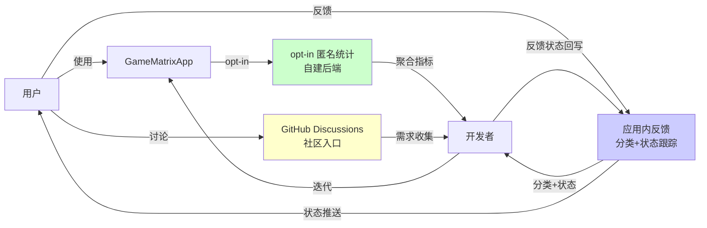
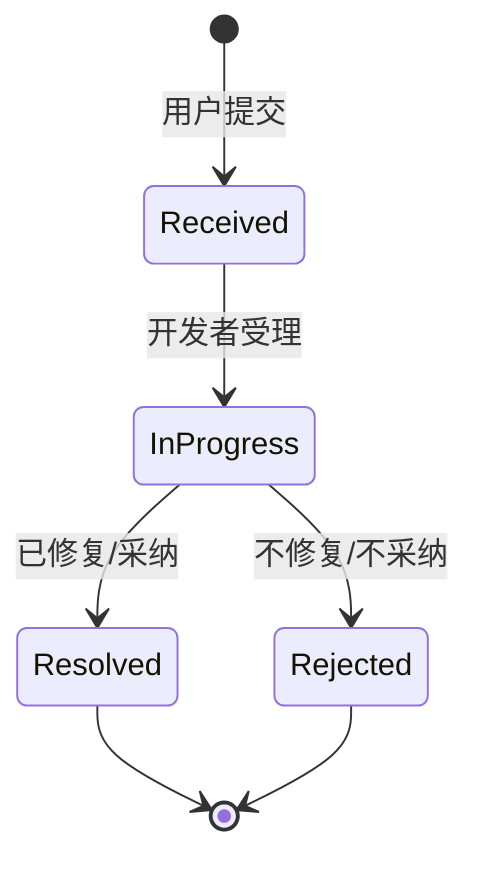
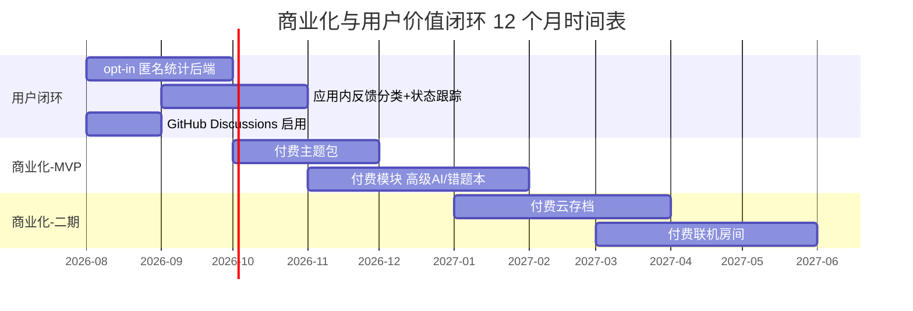

# 用户价值闭环与商业化探索路线图

> **文档编号**：ROADMAP-BIZ-001
> **覆盖改进项**：P3-10（用户价值闭环）、P3-11（商业化探索）
> **版本**：v1.0
> **编制日期**：2026-07-19
> **基线版本**：versionCode=587 / versionName=1.4.1
> **GitHub**：https://github.com/3571949306/GameMatrixApp
> **关联文档**：`docs/SPEC.md` §1 产品定义、`docs/RENOVATION_MASTER_PLAN.md` §1.3 用户体验维度 G2 反馈通道、`docs/项目改进建议书.md` §5.1 功能扩展、`server/wrongbook-service/README.md`

---

## 1. 背景

GameMatrixApp 当前定位为"无广告、隐私不出端、离线可用"的 Android 模块化游戏中心。这一哲学在产品层面带来差异化护城河，但也带来两个长期可持续性挑战：

1. **零变现**：项目已迭代至 vc587，9 轮加法升级 + 24 轮循环修复，开发投入持续，但收入为零。Spec §2 明确"不做广告/变现系统——与隐私优先定位冲突"。
2. **用户反馈无闭环**：用户使用行为无量化（不知道哪些游戏被玩得最多、哪些功能被使用），反馈无状态跟踪（用户提了反馈后不知道是否被采纳），社区入口缺失（GitHub Issues 不适合普通用户）。

本路线图回答：在不破坏"无广告、隐私优先"定位的前提下，如何建立与用户价值兼容的商业化路径，以及如何闭合用户价值反馈循环。

---

## 2. 现状

### 2.1 商业化现状

| 维度 | 现状 |
|------|------|
| 广告 | ❌ 无（Spec §2 明确排除） |
| 内购 | ❌ 无 |
| 订阅 | ❌ 无 |
| 付费主题 | ❌ 无（`THEME_SWITCHER` Feature Flag 已实现主题切换，但全部免费） |
| 付费模块 | ❌ 无（所有模块免费下载） |
| 云存档 | ❌ 无（Spec 二期 API 已规划，未实现） |
| 联机房间 | ❌ 无（三模联机全部免费） |
| **总收入** | **¥0** |

### 2.2 长期维护成本分析

| 成本项 | 月成本（估） | 年成本（估） | 说明 |
|--------|-------------|-------------|------|
| HK VPS | ¥40 | ¥480 | 4 核 4G，承载更新分发 + Relay + 错题本后端 |
| 域名 | ¥1 | ¥12 | 1 个域名 + 多个子域 |
| 百度 OCR API | ¥0~30 | ¥0~360 | 错题本调用，按用量计费 |
| 智谱 GLM API | ¥0~50 | ¥0~600 | 错题本 AI 解题，按 token 计费 |
| 阿里云 OSS（规划中） | ¥5 | ¥60 | APK 更新第三源（见 `ROADMAP_SERVER_HA.md`） |
| Cloudflare Workers（规划中） | ¥0~35 | ¥0~420 | Relay 第二节点 |
| 开发时间 | ~80 小时 | ~960 小时 | 24 轮循环 + 9 轮加法升级的实际投入 |
| **总计（年）** | — | **~¥1500 + 960 小时** | 不含开发时间的硬成本 ~¥1500/年 |

> **结论**：硬成本 ~¥1500/年可由开发者个人承担，但 960 小时/年的开发投入若无任何变现，长期可持续性存疑。

### 2.3 用户反馈现状

| 渠道 | 现状 | 问题 |
|------|------|------|
| GitHub Issues | ✅ 可用 | 普通用户不会用；无状态跟踪；无分类 |
| 应用内反馈 | 🟡 Spec 二期 G2 规划中（`feedback.url` 已配置） | 未实现反馈分类与状态跟踪 |
| 使用统计 | ❌ 无 | 完全不知道用户使用哪些功能 |
| 社区 | ❌ 无 | GitHub Discussions 未启用；无用户交流入口 |

### 2.4 Spec 二期 API 中已规划但未实现的商业化相关端点

来源：`docs/SPEC.md` §4

| Method | Path | 商业化潜力 |
|--------|------|-----------|
| POST | `/api/v1/saves/sync` | 付费云存档 |
| GET | `/api/v1/saves/:slot_key` | 付费云存档 |
| POST | `/api/v1/share/cards` | 付费战绩卡（高级模板） |
| GET | `/api/v1/achievements` | 免费（成就目录） |
| POST | `/api/v1/achievements/progress` | 免费（进度上报） |
| POST | `/api/v1/wrongbook/items` | 付费错题本（高级功能） |

---

## 3. 目标

### 3.1 总体目标

- **G1**：建立与"隐私优先"兼容的变现路径，硬成本自给自足（~¥2000/年）。
- **G2**：建立 opt-in 匿名使用统计机制（自建后端，不出端）。
- **G3**：建立应用内反馈分类与状态跟踪机制。
- **G4**：建立社区入口（GitHub Discussions）。
- **G5**：Spec 二期商业化 API（云存档/付费模块）落地。

### 3.2 量化目标

| 指标 | 当前 | 6-12 个月目标 |
|------|------|--------------|
| 年收入 | ¥0 | ≥¥2000（覆盖硬成本） |
| 付费用户数 | 0 | ≥50（年付费） |
| opt-in 使用统计覆盖率 | 0% | ≥30%（opt-in 用户中） |
| 反馈分类数 | 0 | 5（bug / 功能建议 / 体验 / 翻译 / 其他） |
| 反馈状态跟踪 | 无 | 4 状态（已收到 / 处理中 / 已解决 / 已拒绝） |
| 社区入口 | 无 | GitHub Discussions 启用 |

---

## 4. 方案

### 4.1 与"隐私优先"兼容的变现方式

#### 4.1.1 付费主题包

| 项 | 说明 |
|----|------|
| 定位 | 个性化外观，不影响功能 |
| 价格 | ¥6~12/主题包 |
| 实现路径 | 复用 `THEME_SWITCHER` Feature Flag；新增主题市场页；主题资源作为动态模块分发 |
| 隐私兼容 | ✅ 完全本地；不涉及数据上报 |
| 预期收入 | ¥500/年（保守估计 50 用户 × ¥10） |
| 风险 | 主题资源被提取破解（可接受，不强制 DRM） |

#### 4.1.2 付费模块（高级 AI 模型 / 高级错题本功能）

| 项 | 说明 |
|----|------|
| 定位 | 高级功能付费，基础功能免费 |
| 价格 | ¥18~30/模块 |
| 候选模块 | 高级 AI 模型（GPT-4 级别云端模型，按 token 计费转嫁）/ 高级错题本（多科目同步、PDF 导出、间隔重复算法增强） |
| 实现路径 | 模块商店新增"高级"分类；购买后服务器签发一次性许可证；客户端校验签名 |
| 隐私兼容 | ✅ 用户主动选择；不涉及行为追踪 |
| 预期收入 | ¥800/年（30 用户 × ¥25） |
| 风险 | API 成本波动（百度 OCR / 智谱 GLM 涨价）；需设上限保护 |

#### 4.1.3 付费云存档（Spec 二期 API 已规划）

| 项 | 说明 |
|----|------|
| 定位 | 跨设备同步，免费用户给 1 个 slot，付费用户 10 个 slot |
| 价格 | ¥12/年 |
| 实现路径 | Spec §4 已规划 `/api/v1/saves/sync`；新增 `slot_quota` 字段；付费用户配额提升 |
| 隐私兼容 | ✅ 端到端加密（密钥经 Android Keystore）；服务器看不到明文 |
| 预期收入 | ¥300/年（25 用户 × ¥12） |
| 风险 | 服务器存储成本（slot 数据加加密后体积可控，~1MB/用户） |

#### 4.1.4 付费联机房间（高级特性）

| 项 | 说明 |
|----|------|
| 定位 | 免费用户 4 人房间；付费用户支持 8 人房间 + 自定义规则 + 私密房密码 |
| 价格 | ¥6/年 |
| 实现路径 | Relay 服务端校验房间规模；客户端配置项解锁高级 UI |
| 隐私兼容 | ✅ 仅房间元数据上报；游戏内容仍端到端 |
| 预期收入 | ¥200/年（30 用户 × ¥6） |
| 风险 | 用户感知"基础功能被砍"（需明确"4 人房间永久免费"） |

#### 4.1.5 变现方式汇总

| 方式 | 年收入（估） | 隐私兼容 | 实现难度 | 月份 |
|------|-------------|---------|---------|------|
| 付费主题包 | ¥500 | ✅ | 🟢 低 | M3-M4 |
| 付费模块 | ¥800 | ✅ | 🟠 中 | M4-M6 |
| 付费云存档 | ¥300 | ✅ | 🟠 中 | M6-M9 |
| 付费联机房间 | ¥200 | ✅ | 🟡 中低 | M9-M12 |
| **总计** | **¥1800** | — | — | 6-12 个月 |

> ¥1800 接近硬成本 ¥1500/年目标；若付费用户数翻倍可达 ¥3600。

### 4.2 用户价值闭环

#### 4.2.1 opt-in 匿名使用统计（自建后端）

| 维度 | 方案 |
|------|------|
| 触发 | 首次启动弹窗请求授权；默认关闭 |
| 数据维度 | 游戏启动次数 / 模块下载次数 / 功能使用次数 / 崩溃堆栈（脱敏） |
| 上传方式 | 每日批量上传到自建后端（HK VPS）；不上传任何用户标识 |
| 匿名性 | 设备指纹 = `SHA-256(ANDROID_ID + app_salt)`；不可逆推原始 ID |
| 后端 | 复用 `update_server.py` 或独立 `stats_server.py`；聚合后只存计数 |
| 用户控制 | 设置页可随时关闭 / 清除已上传数据（前端发请求，后端软删） |
| 隐私兼容 | ✅ 完全 opt-in；不上传个人内容；符合"隐私不出端"哲学（用户授权后出端的是计数，不是内容） |

#### 4.2.2 反馈分类与状态跟踪

| 反馈类型 | 标签 | 处理 SLA |
|---------|------|---------|
| Bug | `bug` | 48 小时内响应 |
| 功能建议 | `feature-request` | 7 天内响应 |
| 体验问题 | `ux` | 7 天内响应 |
| 翻译问题 | `i18n` | 14 天内响应 |
| 其他 | `other` | 14 天内响应 |

反馈状态机：

| 状态 | 用户可见文案 |
|------|------------|
| Received | "已收到，等待处理" |
| InProgress | "处理中" |
| Resolved | "已解决（版本 vX.X.X）" |
| Rejected | "暂不处理（原因：...）" |

#### 4.2.3 GitHub Discussions 社区入口

| 维度 | 方案 |
|------|------|
| 启用 | GitHub 仓库 Settings → Features → Discussions 勾选 |
| 分类 | Announcements / Ideas / Q&A / Show and tell |
| 应用内入口 | 设置-关于页新增"加入社区"按钮（`SETTINGS_ABOUT_PAGE` Feature Flag 已存在） |
| 链接 | `https://github.com/3571949306/GameMatrixApp/discussions` |
| 维护 | 开发者每周查看一次；高赞 idea 转入 Spec 变更流程 |

### 4.3 商业化时间表

---

## 5. 时间表（6-12 个月）

### 5.1 6 个月计划（用户闭环 + 商业化 MVP）

| 月份 | 阶段 | 主要工作 | 交付物 |
|------|------|---------|--------|
| **M1**（2026-08） | 用户闭环 - 社区 | GitHub Discussions 启用；应用内入口接入 | 用户可从设置页跳转社区 |
| **M2**（2026-08 ~ 09） | 用户闭环 - 统计后端 | opt-in 弹窗 + `stats_server.py` + 设备指纹脱敏 | opt-in 用户使用数据上报 |
| **M3**（2026-09 ~ 10） | 用户闭环 - 反馈 | 应用内反馈页 + 5 分类 + 4 状态机 + 后端表 | 反馈可提交可跟踪 |
| **M4**（2026-10 ~ 11） | 商业化 - 主题包 | 主题市场页 + 4 套付费主题 + 签发许可证 | 付费主题可购买 |
| **M5**（2026-11 ~ 12） | 商业化 - 高级 AI 模块 | 高级 AI 模型调用配额 + 模块商店"高级"分类 | 付费 AI 模块可购买 |
| **M6**（2026-12） | 商业化 - 高级错题本 | 多科目同步 + PDF 导出 + 间隔重复增强 | 付费错题本可购买 |

### 5.2 12 个月计划（商业化二期）

| 月份 | 阶段 | 主要工作 | 交付物 |
|------|------|---------|--------|
| **M7-M9**（2027-01 ~ 03） | 商业化 - 云存档 | Spec `/api/v1/saves/sync` 实现；端到端加密；slot 配额 | 付费云存档可购买 |
| **M10-M12**（2027-04 ~ 06） | 商业化 - 联机房间 | Relay 服务端房间规模校验；客户端高级 UI | 付费联机房间可购买 |

### 5.3 收入预期

| 阶段 | 累计年收入（估） | 覆盖硬成本比例 |
|------|-----------------|---------------|
| M6 末 | ¥1300 | 87%（¥1500 目标） |
| M9 末 | ¥1600 | 107% |
| M12 末 | ¥1800 | 120% |

---

## 6. 风险

| 编号 | 风险 | 级别 | 缓解措施 |
|------|------|------|---------|
| R1 | 付费用户数远低于预期（<10 人） | 🟠 高 | 付费前先做 opt-in 调研；M4 主题包试水后再扩大投入 |
| R2 | opt-in 使用统计被用户视为"违背隐私优先" | 🟠 高 | 默认关闭；首次弹窗明确说明"仅计数，不上传内容"；可随时关闭并清除 |
| R3 | 付费模块被破解分发 | 🟡 中 | 不强制 DRM；签名校验保证正版用户权益；破解版无更新无云存档 |
| R4 | 百度 OCR / 智谱 GLM API 涨价导致高级错题本亏损 | 🟠 高 | 设用户月度 token 上限；超出后降级到本地 OCR；提价时同步调整模块售价 |
| R5 | 应用内反馈被滥用（垃圾内容） | 🟡 中 | 反馈频率限制（每设备每日 3 条）；关键词过滤；后端审核 |
| R6 | GitHub Discussions 维护成本高 | 🟡 低 | 每周固定时间查看；高赞 idea 转入 Spec 流程 |
| R7 | 云存档数据丢失风险 | 🟠 高 | 服务器每日备份；客户端保留本地副本；Spec §5 cloud_save_snapshots 含 `deleted_at` 软删 |
| R8 | 支付渠道限制（国内无法用 Google Play Billing） | 🟠 高 | 评估微信支付 / 支付宝当面付；或用 GitHub Sponsors 赞助制 |
| R9 | 商业化导致"无广告"叙事破裂 | 🟡 中 | 明确"永远无广告"；付费均为可选高级功能；基础功能永久免费 |

---

## 7. 验收标准

### 7.1 用户价值闭环

| 编号 | Given | When | Then |
|------|-------|------|------|
| V-LOOP-1 | 首次启动 | 弹窗请求 opt-in 统计授权 | 默认关闭；用户可明确选择 |
| V-LOOP-2 | opt-in 用户 | 使用应用 | 每日批量上传计数；不上传用户标识或内容 |
| V-LOOP-3 | 设置页 | 查看统计开关 | 可随时关闭；可清除已上传数据 |
| V-LOOP-4 | 应用内反馈页 | 提交反馈 | 5 分类可选；提交后状态为 "Received" |
| V-LOOP-5 | 反馈状态 | 开发者处理 | 状态可流转到 InProgress/Resolved/Rejected |
| V-LOOP-6 | 用户查看反馈 | 进入"我的反馈"页 | 可见所有提交的反馈及当前状态 |
| V-LOOP-7 | 设置-关于页 | 点击"加入社区" | 跳转到 GitHub Discussions |

### 7.2 商业化

| 编号 | Given | When | Then |
|------|-------|------|------|
| V-BIZ-1 | 主题市场页 | 浏览 | 显示 4+ 套付费主题；价格清晰 |
| V-BIZ-2 | 用户购买主题 | 支付完成 | 服务器签发许可证；客户端下载主题资源并应用 |
| V-BIZ-3 | 付费模块 | 模块商店"高级"分类 | 显示付费模块；价格清晰 |
| V-BIZ-4 | 用户购买模块 | 支付完成 | 许可证签发；模块解锁高级功能 |
| V-BIZ-5 | 云存档（二期） | opt-in 用户 | 免费用户 1 slot；付费用户 10 slot |
| V-BIZ-6 | 联机房间（二期） | 创建房间 | 免费用户 4 人上限；付费用户 8 人上限 |

### 7.3 隐私兼容性

| 编号 | Given | When | Then |
|------|-------|------|------|
| V-PRIV-1 | opt-in 统计 | 检查上传数据 | 仅含计数；无用户标识；无游戏内容 |
| V-PRIV-2 | 反馈提交 | 检查 | 用户可选择匿名；不强制登录 |
| V-PRIV-3 | 云存档 | 检查 | 端到端加密；服务器看不到明文 |
| V-PRIV-4 | 付费模块 | 检查 | 不强制追踪用户行为；许可证本地校验 |

---

## 8. 边界与约束

- 本路线图**不引入广告**；Spec §2 明确排除，且与"隐私优先"定位冲突。
- 本路线图**不强制登录**；所有付费基于设备指纹 + 一次性许可证签名。
- 本路线图**不引入 DRM**；破解版无更新无云存档即视为合理的"软性反盗版"。
- opt-in 统计**不上传游戏内容、聊天内容、错题本内容**；仅上传计数。
- 商业化 MVP（M4-M6）**先做主题包**（最低风险），再扩展到模块 / 云存档 / 联机。
- 所有改动遵循 `AGENTS.md` Prime Directive 与 `docs/SECURITY.md`；密钥管理遵循 `docs/DONT_DO_THIS.md`。

---

## 9. 变更记录

| 日期 | 变更内容 | 原因 | 影响范围 |
|------|---------|------|---------|
| 2026-07-19 | 初版生成 | P3-10 用户价值闭环 + P3-11 商业化探索；当前零变现，硬成本 ~¥1500/年，开发投入 960 小时/年 | opt-in 统计、反馈分类、社区入口、付费主题/模块/云存档/联机房间 |

---

[🔙 返回文档索引](/docs/DOCUMENTATION_INDEX.md)
