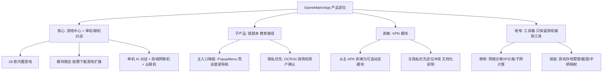
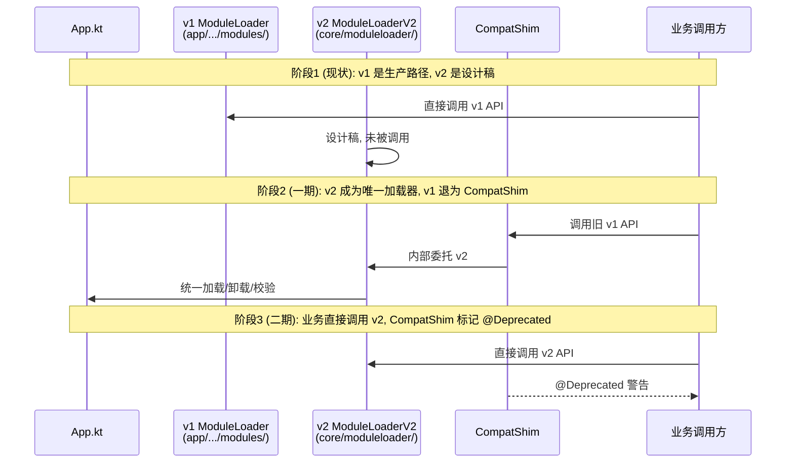

<!-- flutter-store-doc-sync: 2026-07-22 -->
> **Flutter-first production sync:** The Flutter module-store UI and customizable host navigation are live in stable vc595; Android remains authoritative for catalog trust, download, install, rollback, and runtime lifecycle. Production completion: 100%. See `/docs/flutter-store/MIGRATION_STATUS.md`.

# MVP 收敛与产品定位收束路线图

> **文档编号**：ROADMAP-MVP-001
> **覆盖改进项**：P0-1（双层模块框架并存收敛）、P1-4（产品定位漂移）
> **版本**：v1.0
> **编制日期**：2026-07-19
> **基线版本**：versionCode=587 / versionName=1.4.1；上次稳定版 vc465 / v1.4.0
> **GitHub**：https://github.com/3571949306/GameMatrixApp
> **关联文档**：`docs/SPEC.md`、`docs/RENOVATION_MASTER_PLAN.md`、`docs/项目改进建议书.md`、`docs/AI_CONTEXT.md`

---

## 1. 背景

GameMatrixApp 项目自 2026-05 启动模块化改造以来，已完成 24 轮循环修复 + 9 轮加法升级（37 个 Feature Flag）。当前 versionCode=587 / versionName=1.4.1，技术债务已大幅清理，但产品定位出现明显漂移：

- **初心**：Android 模块化游戏中心，主打"无广告、隐私不出端、离线可用"。
- **漂移**：9 轮加法升级后，应用从"游戏中心"逐步变为"全能工具箱"——错题本、VPN、浏览器、AI 助手、签到、成就、横幅轮播、桌面快捷方式、随机游戏、评分、备份恢复、启动耗时显示等 37 个 Feature Flag 同时在线，单 APK 体积与启动耗时压力上升。
- **Spec v1.0** 已锁定 MVP 三件事（A1 暗色修复 / S1 签名校验 / A2 设计 Token），但本路线图需要回答：MVP 之后，产品定位如何收束？哪些加法升级应当停止或剥离？

本文档不替代 `SPEC.md` 与 `RENOVATION_MASTER_PLAN.md`，只回答"产品定位如何收束、加法升级何时停"的方向性问题。

---

## 2. 现状

### 2.1 产品定位漂移诊断

| 维度 | 初心（v1.3.x） | 当前（v1.4.1，9 轮加法升级后） | 偏离度 |
|------|---------------|--------------------------------|--------|
| 主入口 | 游戏大厅 | 游戏大厅 + 个人中心 + 通知中心 + 签到 + 通知按钮 | 中 |
| 主张 | 无广告、隐私优先、离线可用 | 同上 + 主题切换 + 桌面快捷方式 + 数据备份 | 强 |
| 子产品边界 | 模块商店（按需下载游戏/工具） | 模块商店 + 错题本（已下沉到导航）+ VPN（与隐私优先冲突）+ 浏览器 | 强 |
| 工具箱定位 | 游戏辅助工具集合 | 通用工具集合（含网络诊断、IP 分类、子网计算等非游戏工具） | 中 |
| 加法升级节奏 | — | 9 轮共 37 个 Feature Flag，每轮 4 个，全部默认开启 | — |

### 2.2 Spec v1.0 锁定的 MVP 三件事真实完成度评估

| 项 | Spec 验收标准摘要 | 真实完成度（基于 vc587 工作区） | 缺口 |
|----|-------------------|-------------------------------|------|
| **A1 暗色冲突修复** | 切换暗色无 `values/colors.xml` 与 `values-night/colors.xml` 同名冲突取错值；主色迁移 `#3D5AFE`；自定义 View 走 `?attr/` | 🟡 部分：自循环 22 完成深色模式基础适配（24→49 个夜间颜色），但 P0-6 调色盘冲突未根除，主色仍是旧 Google Blue `#1A73E8`，自定义 View 仍存在硬编码色 | 主色迁移、调色盘去重、自定义 View 取色 |
| **S1 模块 APK 签名者强校验** | 除 SHA-256 外校验签名者证书（X509 DER），不匹配拒装 | 🔴 未启动：`ModuleLoader.kt` 仍只校验 SHA-256，未引入证书校验链 | 签名者证书钉扎逻辑 + 灰度双轨 + 拒装提示 |
| **A2 设计 Token 系统** | `color_tokens.xml` + `dimens_tokens.xml` + `shape_tokens.xml` 单源；明/暗通过 overlay；Lint 拦截硬编码 | 🔴 未启动：~80% layout 仍硬编码 dimens；P1-1 未推进 | Token 单源文件 + Lint 规则 + 既有 layout 分批迁移 |

> **结论**：Spec v1.0 锁定的 MVP 三件事**真实完成度均低于 50%**，A1 部分完成、S1/A2 未启动。这是产品定位漂移的根因——加法升级在跑，但 MVP 地基未夯实。

### 2.3 加法升级现状（9 轮 / 37 个 Feature Flag）

| 轮次 | 数量 | 代表 Feature Flag | 与"游戏中心"定位契合度 |
|------|------|-------------------|------------------------|
| 第一轮 | 4 | `ACHIEVEMENT_V2` / `SETTINGS_ENHANCE` / `HOME_REVAMP` / `VISUAL_REFRESH` | ✅ 高 |
| 第二轮 | 4 | `HOME_CARD_ENHANCE` / `GAME_STATS_DASHBOARD` / `THEME_SWITCHER` / `SPLASH_ANIMATION_ENHANCE` | ✅ 高 |
| 第三轮 | 5 | `DAILY_CHECKIN` / `NOTIFICATIONS_CENTER` / `PROFILE_FRAGMENT` / `HOME_DAILY_CARDS` / `NAV_ACTIVE_ANIM` | 🟡 中（签到/通知/个人中心偏离游戏核心） |
| 第四轮 | 4 | `GAME_DETAIL_SHEET` / `ANIM_SHIMMER_LOADING` / `EMPTY_STATE_ILLUSTRATION` / `SETTINGS_ABOUT_PAGE` | ✅ 高 |
| 第五轮 | 4 | `SEARCH_HISTORY_CHIPS` / `CARD_TILT_ANIM` / `ACHIEVEMENT_TOAST` / `HOME_HERO_BANNER` | 🟡 中（横幅轮播过度电商化） |
| 第六轮 | 4 | `GAME_LONG_PRESS_MENU` / `HOME_PULL_REFRESH` / `ACHIEVEMENT_DETAIL_PAGE` / `NAV_BADGE_UNREAD` | ✅ 高 |
| 第七轮 | 4 | `HOME_QUICK_STATS_BAR` / `HOME_GAME_OF_DAY` / `RANDOM_GAME_FAB` / `ACHIEVEMENT_PROGRESS_RING` | ✅ 高 |
| 第八轮 | 4 | `GAME_RATING_SYSTEM` / `DATA_BACKUP_RESTORE` / `HOME_PLAYTIME_REMINDER` / `GAME_FAVORITE_REORDER` | ✅ 高 |
| 第九轮 | 4 | `HOME_RESUME_GAME_CARD` / `ACHIEVEMENT_RECENT_UNLOCKED_BANNER` / `GAME_PLAY_TIME_BADGE` / `APP_LAUNCH_TIME_DISPLAY` | ✅ 高 |

> **观察**：37 个 Feature Flag 中约 70% 与游戏中心定位契合，30% 偏向"工具箱/平台化"（签到、通知中心、个人中心、横幅轮播）。第三/第五轮是漂移最严重的两轮。

### 2.4 双层模块框架并存（P0-1）现状

| 框架 | 路径 | 角色 | 状态 |
|------|------|------|------|
| v1 | `app/src/main/java/com/gamecenter/app/modules/` | 生产路径，业务调用方 | ✅ 唯一被业务调用 |
| v2 | `core/moduleloader/` | 设计稿 + `ModuleContextHelper.kt`（循环 23 新增） | 🔴 设计稿未被业务调用，存在双轨漂移 |

---

## 3. 目标

### 3.1 总体目标

- **G1**：完成 Spec v1.0 锁定的 MVP 三件事（A1/S1/A2），将真实完成度从 <50% 推到 100%。
- **G2**：收束产品定位，明确"核心 / 子产品 / 剥离 / 收窄"四类边界。
- **G3**：建立"加法升级停止准则"，停止低 ROI 加法升级，回到 Spec 驱动。
- **G4**：完成 P0-1 双层模块框架收敛，v2 `moduleloader` 成为唯一加载器，v1 退为 CompatShim。

### 3.2 量化目标

| 指标 | 当前 | 6 个月目标 |
|------|------|-----------|
| Spec MVP 三件事完成度 | <50% | 100% |
| 双层模块框架 | v1+v2 并存 | v2 唯一 + v1 CompatShim 过渡 |
| Feature Flag 数量 | 37（全部默认开启） | 37（30% 默认关闭、归档为可选） |
| 主 APK 体积 | ~70MB | ≤65MB（剥离 VPN 后） |
| 错题本入口层级 | 已下沉到 GamesFragment PopupMenu | 维持在子菜单（不回主入口） |
| VPN 模块状态 | 内置在主 APK 资源中 | 剥离为可选动态模块（按需下载） |
| 工具箱范围 | 通用工具集合 | 收窄为游戏辅助工具集合 |

---

## 4. 方案

### 4.1 加法升级停止准则

后续加法升级需满足以下**全部条件**才允许立项，否则一律拒收：

| 编号 | 准则 | 说明 |
|------|------|------|
| C1 | 必须先完成 Spec MVP 三件事 | A1/S1/A2 完成度 100% 前，不接受任何新加法升级 |
| C2 | 必须与"游戏中心"核心定位契合 | 与游戏发现/启动/进度/成就无关的"平台化"功能（社区、动态、签到、通知）原则上拒收 |
| C3 | 必须有 Feature Flag 默认关闭 | 新增 Feature Flag 默认 `false`，灰度验证后再开启 |
| C4 | 必须不增加主 APK 体积 | 若实现以独立动态模块形式分发，可放宽 |
| C5 | 必须不与既有 Feature Flag 功能重叠 | 与既有 Flag 行为重叠 >30% 拒收 |
| C6 | 必须通过 Lint + 145 UI 用例 + 14 单测回归 | 不回退质量基线 |
| C7 | 必须更新 `docs/AI_CONTEXT.md` Feature Flag 清单与 `CHANGELOG.md` | 单一事实源 |

### 4.2 产品定位收束方案



#### 4.2.1 核心：游戏中心 + 单机/联机对战（保留 + 强化）

- 28 款内置游戏保留。
- 模块商店保留游戏扩展类别（hall/chinesechess/game2048/klotski/tts）。
- 单机 AI 对战（五子棋/象棋/围棋/斗地主）保留并继续优化。
- 三模联机（TCP + HTTP Relay + WebSocket）保留，继续推进 `OnlineRoomManager` 组合式复用。

#### 4.2.2 子产品：错题本（保留 + 主入口降级）

- **保留原因**：错题本是面向 P-B 学生/家长用户的差异化卖点（PRD 中占 25% 用户画像），且后端已投入（FastAPI + 百度 OCR + 智谱 GLM）。
- **主入口降级**：因 BottomNavigationView 6 item 限制，错题本入口已下沉到 GamesFragment 头像 PopupMenu（id=7）。**不恢复到底部导航**，维持子菜单层级。
- **隐私优先约束**：所有云端 OCR/AI 调用必须显式用户确认；本地 OCR 路径（`OcrEngine` 接口）作为离线降级方案。

#### 4.2.3 剥离：VPN 模块（从主 APK 资源剥离）

- **剥离原因**：VPN 模块（VMess/VLESS/Trojan/Shadowsocks）与"隐私优先、无追踪"定位存在叙事冲突——虽然 VPN 本身保护隐私，但 4 协议代理客户端的存在会让用户怀疑应用是否在收集网络流量。
- **剥离方案**：
  1. 将 `feature/vpn/` 从 `app/src/main/assets/modules/feature_vpn_v100.apk` 改为按需下载（`builtIn=false`）。
  2. 主 APK 不再预装 VPN 模块，仅在模块商店显示为"可下载"。
  3. 在模块详情页加免责声明："本模块仅用于网络访问，应用本身不收集任何网络流量数据"。
- **不删除代码**：保留 `feature/vpn/` 源码与 `VpnServiceProxy.kt`，仅改变分发方式。

#### 4.2.4 收窄：工具箱只保留游戏辅助工具

- **移除**：网络诊断（`NetworkDiagHelper`）、IP 分类（`IpClassifier`）、子网计算（`SubnetCalculator`）等通用网络工具——这些与游戏中心定位无关，应剥离到独立项目或归档。
- **保留**：游戏存档管理、截图分享、手柄按键映射等游戏辅助工具。
- **迁移路径**：被移除的工具可单独发布为 `GameMatrixTools` 独立应用，不在主应用内承载。

### 4.3 P0-1 双层模块框架收敛方案



| 阶段 | 工作 | 验收 |
|------|------|------|
| 阶段 1（现状） | v1 是生产路径；v2 是设计稿 + `ModuleContextHelper.kt` | — |
| 阶段 2（一期） | v2 成为唯一加载器；v1 退为 `CompatShim` 委托给 v2；S1 签名校验在 v2 内实现 | 业务调用方零改动；v2 加载成功率 = v1 |
| 阶段 3（二期） | 业务直接调用 v2 API；`CompatShim` 标记 `@Deprecated`；Lint 拦截新调用 v1 | v1 调用点 0；`CompatShim` 仅保留向后兼容 |

### 4.4 Spec MVP 三件事补完方案

| 项 | 缺口 | 工作量 | 关键文件 |
|----|------|--------|---------|
| A1 暗色修复 | 主色迁移 `#1A73E8`→`#3D5AFE`；`values/colors.xml` 与 `values-night/colors.xml` 同名冲突去重；自定义 View 改 `?attr/` | 2 人周 | `res/values/colors.xml`、`res/values-night/colors.xml`、`themes.xml`、自定义 View |
| S1 签名校验 | `ModuleLoaderV2` 新增签名者证书（X509 DER）校验；不匹配拒装；灰度双轨 | 4 人周 | `core/moduleloader/.../ModuleLoaderV2.java`、`ModuleManager.kt` |
| A2 设计 Token | 新建 `color_tokens.xml` + `dimens_tokens.xml` + `shape_tokens.xml`；明/暗 overlay；Lint 拦截硬编码；既有 layout 分批迁移 | 6 人周 | `core/common/res/values/`、`app/build.gradle`（Lint 规则） |

---

## 5. 时间表（6 个月）

| 月份 | 阶段 | 主要工作 | 交付物 |
|------|------|---------|--------|
| **M1**（2026-08） | Spec MVP 补完 - A1 | 主色迁移；调色盘去重；自定义 View 改 `?attr/` | `themes.xml` / `colors.xml` 收敛；Lint 0 冲突告警 |
| **M2**（2026-08 ~ 09） | Spec MVP 补完 - S1 | `ModuleLoaderV2` 签名校验；灰度双轨；拒装提示 | S1-1~S1-5 验收标准全过 |
| **M3**（2026-09 ~ 10） | Spec MVP 补完 - A2 | Token 单源；Lint 拦截硬编码；首批 layout 迁移 | A2-1~A2-5 验收标准全过 |
| **M4**（2026-10） | P0-1 框架收敛 | v2 成为唯一加载器；v1 退为 `CompatShim` | v1 调用点不变；v2 加载成功率 = v1 |
| **M5**（2026-11） | 产品定位收束 - 剥离与收窄 | VPN 模块剥离为按需下载；工具箱收窄为游戏辅助 | 主 APK 体积 ≤65MB；模块商店 VPN 标记可选 |
| **M6**（2026-12） | 加法升级停止准则落地 | 准则写入 `docs/SPEC.md` 与 `docs/AI_CODING_STANDARDS.md`；Feature Flag 30% 默认关闭 | 准则文档化；37 个 Flag 中 11 个默认关闭 |

> **甘特图（Mermaid）**：
> ```mermaid
> gantt
>     title MVP 收敛与产品定位收束 6 个月时间表
>     dateFormat YYYY-MM
>     axisFormat %Y-%m
>     section MVP补完
>     A1 暗色修复           :a1, 2026-08, 1M
>     S1 签名校验           :s1, 2026-08, 2M
>     A2 设计Token         :a2, 2026-09, 2M
>     section 框架收敛
>     P0-1 v2唯一加载器    :p1, 2026-10, 1M
>     section 定位收束
>     VPN剥离              :vpn, 2026-11, 1M
>     工具箱收窄            :tool, 2026-11, 1M
>     section 准则落地
>     加法升级停止准则      :stop, 2026-12, 1M
> ```

---

## 6. 风险

| 编号 | 风险 | 级别 | 缓解措施 |
|------|------|------|---------|
| R1 | A1 主色迁移导致品牌识别断裂（用户已习惯旧 Google Blue） | 🟡 中 | 一次性迁移 + CHANGELOG 说明；主题切换器保留旧色作为可选主题 |
| R2 | S1 灰度双轨期间签名校验失败用户感知差 | 🟠 高 | 灰度期仅告警不阻断；S1-5 验收标准要求"过渡期不阻断" |
| R3 | A2 Token 迁移影响 ~80% layout，回归面大 | 🟠 高 | 分批迁移（每次 ≤20 个 layout）；145 UI 用例 + 14 单测全过为门禁 |
| R4 | VPN 剥离后老用户找不到入口 | 🟡 中 | 模块商店保留 VPN 入口；CHANGELOG 说明；首次启动弹窗引导 |
| R5 | 工具箱收窄移除网络诊断工具，影响高级用户 | 🟡 中 | 移除前发布 `GameMatrixTools` 独立应用；CHANGELOG 引导 |
| R6 | P0-1 v2 加载器与 v1 行为不一致，导致模块加载失败 | 🟠 高 | 阶段 2 灰度双轨；v2 加载成功率必须 = v1 才进入阶段 3 |
| R7 | 加法升级停止准则被业务压力突破 | 🟡 中 | 准则写入 `docs/SPEC.md` 与 `docs/AI_CODING_STANDARDS.md`；任何例外需 Spec 变更记录 |
| R8 | 错题本入口下沉到 PopupMenu 影响发现性 | 🟡 中 | 首次启动引导提示；模块商店分类保留教育类入口 |

---

## 7. 验收标准

### 7.1 Spec MVP 三件事补完

| 编号 | Given | When | Then |
|------|-------|------|------|
| V-MVP-1 | 开发者查看 `colors.xml` | 检查主色 | `colorPrimary = #3D5AFE`；`values` 与 `values-night` 无同名冲突 |
| V-MVP-2 | 用户下载动态模块 APK | 安装前校验 | 除 SHA-256 外校验签名者证书；不匹配拒装并提示 |
| V-MVP-3 | 开发者新增 layout | 提交 | 尺寸引用 `gm_spacing_*` token；颜色引用 `?attr/colorXxx`；Lint 拦截硬编码 |
| V-MVP-4 | 145 UI 用例 + 14 单测 | 全部执行 | 全过，不回退质量基线 |
| V-MVP-5 | CI 构建 | 运行 Lint | 无 `values`/`values-night` 同名冲突告警；硬编码 dimens 告警 ≤20% |

### 7.2 P0-1 双层模块框架收敛

| 编号 | Given | When | Then |
|------|-------|------|------|
| V-FRAME-1 | 业务调用方代码 | 检查调用点 | 全部走 v2 或 `CompatShim`；无直接调用 v1 内部 API |
| V-FRAME-2 | 模块加载成功率 | v2 vs v1 对比 | v2 加载成功率 = v1；不引入回归 |
| V-FRAME-3 | `ModuleLoaderV2` 加载模块 | 校验流程 | S1 签名校验在 v2 内实现；不匹配拒装 |

### 7.3 产品定位收束

| 编号 | Given | When | Then |
|------|-------|------|------|
| V-POS-1 | 主 APK 体积 | VPN 剥离后 | ≤65MB |
| V-POS-2 | 模块商店 | 查看 VPN 模块 | 标记为"可下载"（非预装）；详情页含免责声明 |
| V-POS-3 | 工具箱 | 查看工具列表 | 不含网络诊断/IP 分类/子网计算；仅含游戏辅助工具 |
| V-POS-4 | 错题本入口 | 检查导航 | 不在底部导航；位于 GamesFragment PopupMenu |

### 7.4 加法升级停止准则落地

| 编号 | Given | When | Then |
|------|-------|------|------|
| V-STOP-1 | 新增 Feature Flag | 立项评审 | 必须满足 C1~C7 全部条件 |
| V-STOP-2 | 既有 37 个 Feature Flag | 默认值审计 | ≥30%（约 11 个）默认关闭，归档为可选 |
| V-STOP-3 | 准则文档 | 检查 | 写入 `docs/SPEC.md` 第 9 节边界与约束 + `docs/AI_CODING_STANDARDS.md` |

---

## 8. 边界与约束

- 本路线图**不替代** `SPEC.md` 与 `RENOVATION_MASTER_PLAN.md`，只回答"产品定位如何收束、加法升级何时停"。
- 任何与本路线图冲突的新需求，需走 Spec 变更流程（`docs/SPEC.md` 第 10 节）。
- 本路线图不引入新的 API 端点或数据库表，仅涉及客户端资源、模块加载、Feature Flag 默认值。
- 所有改动遵循 `AGENTS.md` Prime Directive 与 `docs/DONT_DO_THIS.md`。

---

## 9. 变更记录

| 日期 | 变更内容 | 原因 | 影响范围 |
|------|---------|------|---------|
| 2026-07-19 | 初版生成 | 9 轮加法升级后产品定位漂移诊断 + Spec MVP 真实完成度评估 | 全部 |

---

[🔙 返回文档索引](/docs/DOCUMENTATION_INDEX.md)