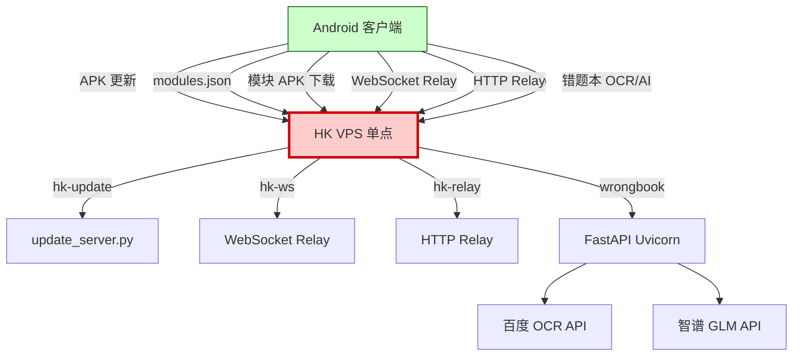
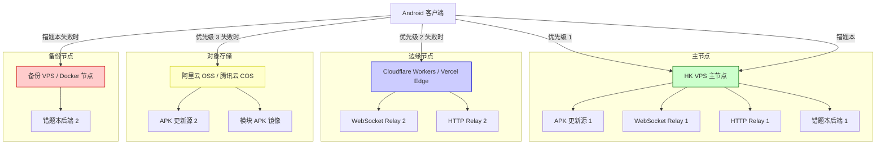
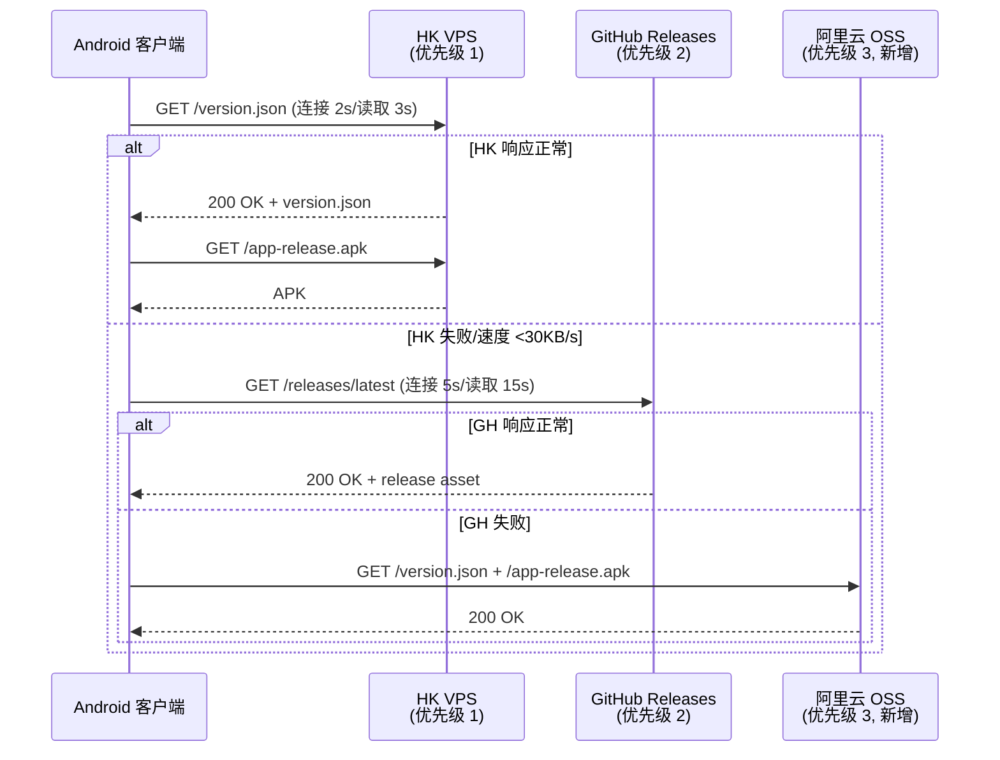

# 服务端高可用方案路线图

> **历史路线图快照（编制：2026-07-19，基线：vc587）**  
> 本文记录当时的服务端拓扑、风险和容灾方案。域名、节点、回退源和线上可用性需要按当前部署与真实探测复核；客户端当前实现与发布门槛见 [`CURRENT_STATE.md`](CURRENT_STATE.md)。

> **文档编号**：ROADMAP-SERVER-HA-001
> **覆盖改进项**：P1-5（服务端单点风险）
> **版本**：v1.0
> **编制日期**：2026-07-19
> **基线版本**：versionCode=587 / versionName=1.4.1
> **GitHub**：https://github.com/3571949306/GameMatrixApp
> **关联文档**：`docs/AI_CONTEXT.md` §3 服务器架构、`docs/NETWORK_LAYER.md`、`docs/SECURITY.md`、`server/wrongbook-service/README.md`

---

## 1. 背景

GameMatrixApp 当前服务端架构为**单点 HK VPS**，承载以下 4 类核心服务：

1. **APK 更新分发**（`hk-update.<DOMAIN>`）：应用自更新、模块清单 `modules.json`、模块 APK 下载。
2. **WebSocket Relay**（`hk-ws.<DOMAIN>/ddz-ws`）：斗地主三模联机的 WebSocket 中继。
3. **HTTP Relay**（`hk-relay.<DOMAIN>/api/ddz-relay`）：斗地主三模联机的 HTTP 中继。
4. **错题本后端**（FastAPI + Uvicorn + 百度 OCR + 智谱 GLM）：错题本模块的云端 OCR 与 AI 解题服务，位于 `server/wrongbook-service/`。

美国 VPS 已于 2026-06-19 下线，残留配置已清理。当前**无任何异地容灾或多活备份**，HK VPS 宕机将导致：

- 应用自更新失效（用户无法获取新版本）
- 模块商店下载失效（用户无法下载动态模块）
- 云联机失效（仅 TCP 局域网联机可用）
- 错题本云端 OCR/AI 失效（仅本地降级路径可用）

本路线图目标是将服务端从"单点"演进为"主备 + 边缘 + 多源"，在不显著增加运维成本的前提下，将单点故障影响范围从"全应用不可用"降到"特定功能降级"。

---

## 2. 现状

### 2.1 服务端架构拓扑



### 2.2 服务清单与单点风险评估

| 服务 | 域名 | 端口 | 进程 | 单点风险 | 影响范围 |
|------|------|------|------|---------|---------|
| APK 更新分发 | `hk-update.<DOMAIN>` | 443 (HTTPS) | `update_server.py`（Python） | 🔴 高 | 应用自更新、模块清单、模块 APK 下载全部失效 |
| WebSocket Relay | `hk-ws.<DOMAIN>/ddz-ws` | 443 (WSS) | Netty 4.1.135.Final（Java） | 🟡 中 | 仅斗地主云联机失效；TCP/局域网联机不受影响 |
| HTTP Relay | `hk-relay.<DOMAIN>/api/ddz-relay` | 443 (HTTPS) | Netty 4.1.135.Final（Java） | 🟡 中 | 仅斗地主云联机 HTTP 模式失效 |
| 错题本后端 | `<DOMAIN>` | 8080 | FastAPI + Uvicorn（Python） | 🟡 中 | 错题本云端 OCR/AI 失效；本地降级路径可用 |

### 2.3 健康检查现状

- HK VPS **已有** `/health` 端点（错题本后端，返回 200 OK）。
- WebSocket Relay / HTTP Relay / APK 更新源**无健康检查端点**。
- **无监控告警**：宕机依赖用户反馈发现。
- **无自动切换**：客户端 `local.properties` 中 `server.url` 为单一硬编码值。

### 2.4 已有备份机制

| 维度 | 现状 | 评估 |
|------|------|------|
| APK 更新源备份 | GitHub Releases 作为优先级 2 备份源（HTTPS API） | ✅ 已有，但仅覆盖 stable 通道，beta 通道无备份 |
| 模块清单备份 | 无 | 🔴 单点 |
| WebSocket/HTTP Relay 备份 | 无 | 🔴 单点 |
| 错题本后端备份 | 无 | 🔴 单点 |
| 数据库备份 | Room 数据库在客户端；错题本后端无持久化数据库 | ✅ 客户端有备份 |

---

## 3. 目标

### 3.1 总体目标

- **G1**：HK VPS 增加全服务健康检查脚本，宕机 5 分钟内告警。
- **G2**：联机 Relay 增加第二节点（Cloudflare Workers / Vercel Edge），主备自动切换。
- **G3**：错题本后端容器化（Docker），支持一键部署到任意节点。
- **G4**：APK 更新源增加第三源（阿里云 OSS / 腾讯云 COS），客户端配置多源自动切换。

### 3.2 量化目标

| 指标 | 当前 | 6 个月目标 |
|------|------|-----------|
| 健康检查覆盖率 | 25%（仅错题本 `/health`） | 100%（4 个服务全覆盖） |
| Relay 备用节点数 | 0 | 1（Cloudflare Workers 或 Vercel Edge） |
| APK 更新源数 | 2（HK VPS + GitHub Releases） | 3（+ 阿里云 OSS 或腾讯云 COS） |
| 错题本后端部署方式 | 裸机 Python + Uvicorn | Docker 容器化 + `docker-compose` |
| 宕机发现时间 | 用户反馈（小时级） | 监控告警（分钟级，≤5 分钟） |
| RTO（恢复时间目标） | 不可估（依赖人工介入） | ≤30 分钟（自动切换 + 人工确认） |

---

## 4. 方案

### 4.1 改造方案总览



### 4.2 HK VPS 健康检查脚本

#### 4.2.1 健康检查端点补全

| 服务 | 端点 | 响应 | 实现 |
|------|------|------|------|
| 错题本后端 | `GET /health` | `{"status":"ok","service":"wrongbook"}` | ✅ 已有 |
| APK 更新源 | `GET /health` | `{"status":"ok","service":"update","version":<server_version>}` | 新增 |
| WebSocket Relay | `GET /health`（HTTP 探针） | `{"status":"ok","service":"ws-relay"}` | 新增 |
| HTTP Relay | `GET /health` | `{"status":"ok","service":"http-relay"}` | 新增 |

#### 4.2.2 健康检查脚本示例（Python，每 60s 执行）

```python
# health_check.py（示例方向，非生产代码）
import requests
import subprocess
import logging
from datetime import datetime

ENDPOINTS = {
    "wrongbook": "https://hk-<DOMAIN>/health",
    "update":    "https://hk-update.<DOMAIN>/health",
    "ws-relay":  "https://hk-ws.<DOMAIN>/health",
    "http-relay":"https://hk-relay.<DOMAIN>/health",
}

TIMEOUT = 5
ALERT_WEBHOOK = "https://<monitoring-webhook>"  # Bark / Telegram Bot / 飞书

def check(name: str, url: str) -> bool:
    try:
        r = requests.get(url, timeout=TIMEOUT)
        ok = r.status_code == 200 and r.json().get("status") == "ok"
        if not ok:
            logging.warning(f"{name} unhealthy: {r.status_code} {r.text[:200]}")
        return ok
    except Exception as e:
        logging.error(f"{name} unreachable: {e}")
        return False

def alert(name: str, msg: str):
    requests.post(ALERT_WEBHOOK, json={
        "service": name,
        "message": msg,
        "timestamp": datetime.utcnow().isoformat(),
    }, timeout=5)

def main():
    for name, url in ENDPOINTS.items():
        if not check(name, url):
            alert(name, f"{name} health check failed at {url}")

if __name__ == "__main__":
    main()
```

#### 4.2.3 Shell 版本（cron 调度，最小依赖）

```bash
#!/bin/bash
# health_check.sh
ENDPOINTS=(
  "wrongbook|https://hk-<DOMAIN>/health"
  "update|https://hk-update.<DOMAIN>/health"
  "ws-relay|https://hk-ws.<DOMAIN>/health"
  "http-relay|https://hk-relay.<DOMAIN>/health"
)
ALERT_WEBHOOK="https://<monitoring-webhook>"

for entry in "${ENDPOINTS[@]}"; do
  name="${entry%%|*}"
  url="${entry##*|}"
  if ! curl -sf --max-time 5 "$url" >/dev/null; then
    curl -sf -X POST "$ALERT_WEBHOOK" -H "Content-Type: application/json" \
      -d "{\"service\":\"$name\",\"message\":\"unhealthy\",\"url\":\"$url\"}"
  fi
done
```

> 调度方式：HK VPS 上 `crontab -e` 添加 `* * * * * /opt/health_check/health_check.sh`，每分钟执行一次。

### 4.3 联机 Relay 第二节点（Cloudflare Workers / Vercel Edge）

#### 4.3.1 选型对比

| 维度 | Cloudflare Workers | Vercel Edge | 自建第二 VPS |
|------|-------------------|-------------|---------------|
| 全球延迟 | ✅ 300+ 边缘节点 | ✅ 100+ 边缘节点 | 🔴 单点 |
| WebSocket 支持 | ✅ Durable Objects | ⚠️ 部分支持 | ✅ 完全支持 |
| 月成本（10 万请求） | ~$5 | 免费（Hobby）+ $20（Pro） | $5~10 |
| 部署复杂度 | 🟢 低 | 🟢 低 | 🟠 中 |
| 与现有 Java Netty Relay 兼容 | 🔴 需用 JS/TS 重写 | 🔴 需用 JS/TS 重写 | ✅ 直接迁移 |

**推荐方案**：

- **一期**：Cloudflare Workers 作为 WebSocket Relay 第二节点，用 TypeScript 重写最小化 Relay 协议（仅 JOIN/SYNC_STATE/STATE_ACK 三个核心消息）。
- **二期**：若 Cloudflare Workers 成本或延迟不达预期，再评估自建第二 VPS。

#### 4.3.2 Cloudflare Workers Relay 草案方向

```typescript
// worker.ts（示例方向，非生产代码）
// 最小化 Relay：仅支持房间创建/加入/状态同步，不支持聊天
interface RoomState {
  hostClientId: string;
  guestClientIds: string[];
  state: string; // 序列化的游戏状态
  lastUpdated: number;
}

const ROOMS = new Map<string, RoomState>(); // Durable Object 持久化

export default {
  async fetch(request: Request, env: any): Promise<Response> {
    const url = new URL(request.url);
    if (url.pathname === "/health") {
      return new Response(JSON.stringify({ status: "ok", service: "cf-worker-relay" }));
    }
    // JOIN / SYNC_STATE / STATE_ACK 路由
    // 详细协议见 docs/archive/network/联机架构说明.md
    return new Response("Not Found", { status: 404 });
  },
};
```

### 4.4 错题本后端容器化（Docker）

#### 4.4.1 Dockerfile 草案

```dockerfile
# server/wrongbook-service/Dockerfile（示例方向）
FROM python:3.12-slim

WORKDIR /app

# 系统依赖（Pillow 需要）
RUN apt-get update && apt-get install -y --no-install-recommends \
    build-essential libjpeg-dev zlib1g-dev \
    && rm -rf /var/lib/apt/lists/*

# Python 依赖
COPY requirements.txt .
RUN pip install --no-cache-dir -r requirements.txt

# 应用代码
COPY . .

# 健康检查
HEALTHCHECK --interval=60s --timeout=5s --retries=3 \
    CMD curl -sf http://localhost:8080/health || exit 1

EXPOSE 8080
CMD ["uvicorn", "main:app", "--host", "0.0.0.0", "--port", "8080", "--workers", "4"]
```

#### 4.4.2 docker-compose 草案

```yaml
# docker-compose.yml（示例方向）
version: "3.9"

services:
  wrongbook:
    build: ./server/wrongbook-service
    container_name: wrongbook-service
    restart: unless-stopped
    ports:
      - "8080:8080"
    env_file:
      - ./server/wrongbook-service/.env
    healthcheck:
      test: ["CMD", "curl", "-sf", "http://localhost:8080/health"]
      interval: 60s
      timeout: 5s
      retries: 3
    logging:
      driver: json-file
      options:
        max-size: "10m"
        max-file: "3"
```

#### 4.4.3 容器化收益

| 维度 | 裸机部署 | 容器化部署 |
|------|---------|-----------|
| 部署到新节点 | 手动装 Python + 依赖 | `docker-compose up -d` |
| 版本一致性 | 依赖运维记录 | 镜像 tag 锁定 |
| 回滚 | 手动 git checkout + restart | `docker-compose down && docker-compose up` 旧 tag |
| 健康检查 | 需外部脚本 | Docker `HEALTHCHECK` 内建 |

### 4.5 APK 更新源第三源（阿里云 OSS / 腾讯云 COS）

#### 4.5.1 选型对比

| 维度 | 阿里云 OSS | 腾讯云 COS | GitHub Releases |
|------|-----------|-----------|-----------------|
| 国内速度 | ✅ 极快 | ✅ 极快 | 🟡 较慢（需代理） |
| 海外速度 | 🟡 一般 | 🟡 一般 | ✅ 全球 CDN |
| 月成本（10GB 流量） | ~¥5 | ~¥5 | 免费 |
| API 兼容性 | S3 兼容 | S3 兼容 | 自有 API |
| 自动上传脚本改造 | ✅ 简单 | ✅ 简单 | 已有 |

**推荐方案**：阿里云 OSS（与 HK VPS 形成地理冗余；S3 兼容 API 便于后续切换到 AWS S3）。

#### 4.5.2 客户端多源切换流程



### 4.6 切换流程

#### 4.6.1 DNS 切换（适用于域名级故障）

| 步骤 | 操作 | 责任人 | 预期时间 |
|------|------|--------|---------|
| 1 | 健康检查脚本告警 | 自动 | 1 分钟 |
| 2 | 运维确认故障范围 | 人工 | 5 分钟 |
| 3 | DNS 解析切换：`hk-ws.<DOMAIN>` → Cloudflare Workers 域名 | 人工 | 5 分钟 |
| 4 | DNS TTL 传播 | 自动 | ≤10 分钟（TTL=600） |
| 5 | 客户端自动重连新节点 | 自动 | 下一轮联机 |

#### 4.6.2 客户端配置切换（适用于单服务故障）

`local.properties` 增加多源配置：

```properties
# 现有
server.url=https://hk-update.<DOMAIN>
ws.url=wss://hk-ws.<DOMAIN>/ddz-ws
relay.url=https://hk-relay.<DOMAIN>/api/ddz-relay
feedback.url=https://<DOMAIN>/api/feedback

# 新增（一期落地）
server.url.fallback.2=https://github.com/3571949306/GameMatrixApp/releases/latest
server.url.fallback.3=https://<oss-bucket>.<region>.aliyuncs.com/update
ws.url.fallback=wss://<cf-worker>.workers.dev/ddz-ws
wrongbook.url.fallback=https://<backup-host>/api/wrongbook
```

客户端 `UpdateChecker.java` 增加多源轮询逻辑（已有优先级 1→2，需扩展到 1→2→3）。

---

## 5. 时间表（6 个月）

| 月份 | 阶段 | 主要工作 | 交付物 |
|------|------|---------|--------|
| **M1**（2026-08） | 健康检查补全 | 4 个服务 `/health` 端点补全；Shell 脚本 + cron 上线；告警 webhook 配置 | HK VPS 宕机 5 分钟内告警 |
| **M2**（2026-08 ~ 09） | 错题本容器化 | `Dockerfile` + `docker-compose.yml`；HK VPS 试点容器化部署 | `docker-compose up -d` 一键部署 |
| **M3**（2026-09 ~ 10） | APK 更新第三源 | 阿里云 OSS bucket 创建；上传脚本改造；客户端多源轮询逻辑 | OSS 镜像 HK VPS 更新源 |
| **M4**（2026-10 ~ 11） | Relay 第二节点 - 协议设计 | Cloudflare Workers Relay 协议设计；TypeScript 最小化实现 | Workers 部署 + 协议兼容性测试 |
| **M5**（2026-11 ~ 12） | Relay 第二节点 - 客户端切换 | 客户端 `ws.url.fallback` 配置；自动切换逻辑；端到端测试 | 主备自动切换可用 |
| **M6**（2026-12） | 容灾演练 + 文档化 | 模拟 HK VPS 宕机演练；切换 SOP 文档化；运维手册归档 | RTO ≤30 分钟达成 |

> **甘特图（Mermaid）**：
> ```mermaid
> gantt
>     title 服务端高可用 6 个月时间表
>     dateFormat YYYY-MM
>     axisFormat %Y-%m
>     section 健康检查
>     /health 端点补全       :a1, 2026-08, 1M
>     cron + 告警 webhook    :a2, 2026-08, 1M
>     section 容器化
>     错题本 Dockerfile      :b1, 2026-08, 2M
>     docker-compose 试点   :b2, 2026-09, 1M
>     section 多源
>     阿里云 OSS 第三源      :c1, 2026-09, 2M
>     客户端多源轮询         :c2, 2026-10, 1M
>     section Relay 第二节点
>     CF Workers 协议设计   :d1, 2026-10, 2M
>     客户端 fallback 切换  :d2, 2026-11, 2M
>     section 演练
>     容灾演练 + 文档化     :e1, 2026-12, 1M
> ```

---

## 6. 风险

| 编号 | 风险 | 级别 | 缓解措施 |
|------|------|------|---------|
| R1 | Cloudflare Workers 与 Java Netty Relay 协议不完全兼容 | 🟠 高 | 一期只实现最小化协议（JOIN/SYNC_STATE/STATE_ACK）；聊天等非核心消息仍走主节点 |
| R2 | 阿里云 OSS 上传失败导致镜像源缺失 | 🟡 中 | 上传脚本加 SHA-256 校验 + 重试；CI 流水线监控上传成功率 |
| R3 | Docker 容器化后 `.env` 密钥管理风险 | 🟠 高 | `.env` 不进 Git；用 Docker secrets 或运行时环境变量注入 |
| R4 | DNS 切换 TTL 导致部分客户端长时间无法恢复 | 🟡 中 | TTL 设为 600s；客户端配置层 fallback 优先于 DNS 切换 |
| R5 | 健康检查脚本本身故障导致误报/漏报 | 🟡 中 | 脚本部署在第三方监控（如 UptimeRobot / 阿里云监控）作为冗余 |
| R6 | 容灾演练影响线上用户 | 🟠 高 | 演练在低峰期（凌晨 2-4 点）进行；提前 24 小时公告 |
| R7 | Cloudflare Workers 免费额度耗尽 | 🟡 低 | 监控请求量；超阈值时升级到付费计划 |
| R8 | 错题本后端容器化后百度 OCR / 智谱 GLM 调用受限 | 🟡 中 | 容器网络出口与裸机一致；保留裸机部署作为回退方案 |

---

## 7. 验收标准

### 7.1 健康检查

| 编号 | Given | When | Then |
|------|-------|------|------|
| V-HA-1 | 4 个服务正常运行 | 调用 `/health` | 全部返回 200 OK + `{"status":"ok"}` |
| V-HA-2 | 任一服务宕机 | 健康检查脚本执行 | 5 分钟内告警 webhook 收到通知 |
| V-HA-3 | cron 调度 | 检查频率 | 每分钟执行一次，无漏报 |

### 7.2 容器化

| 编号 | Given | When | Then |
|------|-------|------|------|
| V-DOCKER-1 | 任意 Linux 节点 | 执行 `docker-compose up -d` | 错题本后端 5 分钟内启动并响应 `/health` |
| V-DOCKER-2 | 容器运行中 | 调用 `/api/wrongbook/ocr` 等 4 个核心接口 | 行为与裸机部署一致 |
| V-DOCKER-3 | 容器健康检查 | `docker ps` | `STATUS` 显示 `healthy` |

### 7.3 多源切换

| 编号 | Given | When | Then |
|------|-------|------|------|
| V-SRC-1 | HK VPS 宕机 | 客户端检查更新 | 优先级 1 失败后自动切换到 GitHub Releases（优先级 2）或 OSS（优先级 3） |
| V-SRC-2 | OSS 镜像源 | 上传后 | SHA-256 与 HK VPS 一致 |
| V-SRC-3 | 客户端 `local.properties` | 检查配置 | 包含 `server.url.fallback.2` 与 `server.url.fallback.3` |

### 7.4 Relay 第二节点

| 编号 | Given | When | Then |
|------|-------|------|------|
| V-RELAY-1 | HK VPS WebSocket Relay 宕机 | 客户端重连 | 自动切换到 Cloudflare Workers Relay；联机不中断 |
| V-RELAY-2 | Cloudflare Workers Relay | 协议测试 | 支持 JOIN/SYNC_STATE/STATE_ACK 三核心消息 |
| V-RELAY-3 | 主备切换 | 端到端测试 | RTO ≤30 分钟 |

### 7.5 容灾演练

| 编号 | Given | When | Then |
|------|-------|------|------|
| V-DRILL-1 | 模拟 HK VPS 宕机 | 演练 | 4 个服务全部能在 30 分钟内切换到备用节点 |
| V-DRILL-2 | 演练后 | 检查 | 切换 SOP 文档归档；运维手册更新 |

---

## 8. 边界与约束

- 本路线图**不涉及**错题本后端的数据库迁移（当前无持久化数据库）；若后续引入 Postgres，需补充数据库主备方案。
- 本路线图**不引入**新的客户端功能；客户端改动仅限 `local.properties` 多源配置与 `UpdateChecker` 轮询逻辑。
- Cloudflare Workers 一期**仅覆盖最小化 Relay 协议**；完整聊天/重连状态机仍走主节点。
- 容器化部署**不改变**错题本后端的 API 契约（`/api/wrongbook/*` 端点保持兼容）。
- 所有改动遵循 `AGENTS.md` Prime Directive 与 `docs/SECURITY.md`；密钥管理遵循 `docs/DONT_DO_THIS.md`。

---

## 9. 变更记录

| 日期 | 变更内容 | 原因 | 影响范围 |
|------|---------|------|---------|
| 2026-07-19 | 初版生成 | P1-5 服务端单点风险；HK VPS 单点承载 4 个核心服务 | 服务端架构、客户端更新检查逻辑 |

---

[🔙 返回文档索引](/docs/DOCUMENTATION_INDEX.md)