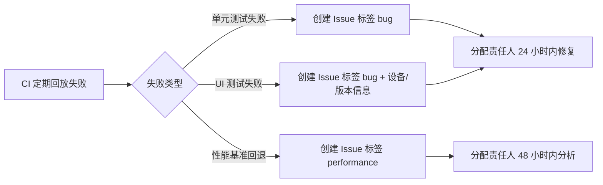
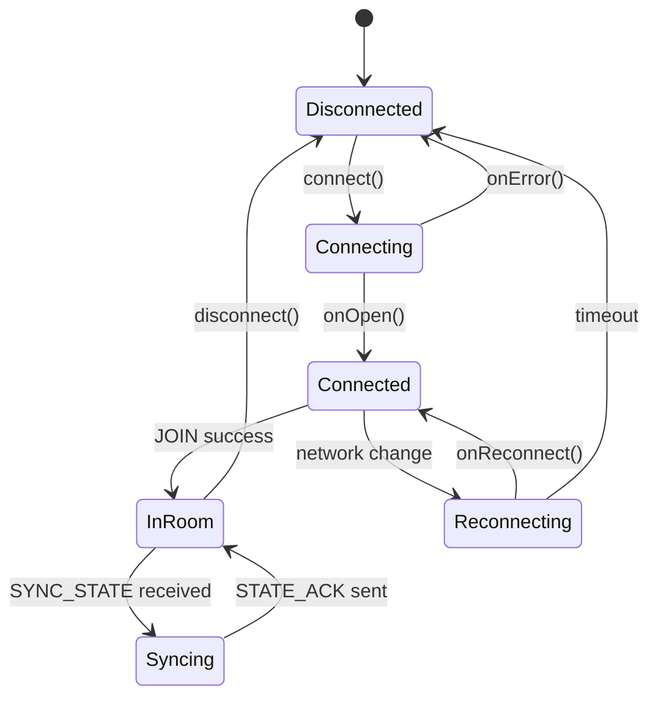

<!-- flutter-store-doc-sync: 2026-07-22 -->
> **Flutter-first production sync:** The Flutter module-store UI and customizable host navigation are live in stable vc595; Android remains authoritative for catalog trust, download, install, rollback, and runtime lifecycle. Production completion: 100%. See `/docs/flutter-store/MIGRATION_STATUS.md`.

# 测试体系升级路线图

> **文档编号**：ROADMAP-TEST-001
> **覆盖改进项**：P2-7（测试体系升级）
> **版本**：v1.0
> **编制日期**：2026-07-19
> **基线版本**：versionCode=587 / versionName=1.4.1
> **GitHub**：https://github.com/3571949306/GameMatrixApp
> **关联文档**：`docs/PROJECT_STATUS.md` §5 测试结果、`docs/AI_CONTEXT.md` §2.4 测试状态、`docs/BASELINE_PROFILE.md`、`.github/workflows/android_ci.yml`

---

## 1. 背景

GameMatrixApp 当前测试体系已具备相当规模：14 个单元测试文件 + 47 个 UI 测试文件 + 145 个 UI 自动化用例，全部通过（耗时 ~22 分钟）。但测试体系仍存在以下结构性问题：

1. **真机覆盖单一**：仅小米 ares (M2012K10C, Android 11) 一台设备，无法覆盖 Android 14/15 系统行为差异（如预测返回、Edge-to-Edge 强制、前台服务限制）。
2. **单元测试覆盖率无门禁**：jacoco 已配置但无 threshold，无法防止覆盖率回退。
3. **UI 测试无定期回放**：145 个用例依赖人工触发，无 CI 定期回放机制。
4. **性能测试缺失**：无启动耗时 / 内存 / 帧率的自动化基准测试，U1（冷启动 <2s）目标无量化验证。
5. **测试质量参差**：`项目改进建议书.md` §3.2 指出部分测试复制生产逻辑或只测字面量，存在假阳性。

本路线图目标是将测试体系从"数量可观"升级为"能防回归 + 量化门禁 + 多设备覆盖 + 性能基准"。

---

## 2. 现状

### 2.1 测试规模

| 类别 | 文件数 | 用例数 | 通过率 | 耗时 |
|------|--------|--------|--------|------|
| 单元测试（`app/src/test/`） | 14 | — | ✅ 100% | <1 分钟 |
| UI 自动化测试（`app/src/androidTest/`） | 47 | 145 | ✅ 100% | ~22 分钟 |
| **总计** | **61** | **145+** | **100%** | **~23 分钟** |

### 2.2 UI 测试模块分布

| 模块 | 文件数 | 用例数 | 耗时 |
|------|--------|--------|------|
| 主页导航（`home/`） | 1 | 10 | — |
| 经典类游戏（`games/classics/`） | 8 | 32 | — |
| 益智类游戏（`games/puzzle/`） | 10 | 40 | 426.9s |
| 休闲类游戏（`games/casual/`） | 9 | 36 | 315.8s |
| 功能模块（`features/`） | 5 | 27 | 572.6s |
| 测试基础设施 | 2（`EmulatorTestBase.kt` + `GameTestHelper.kt`） | — | — |

### 2.3 每个游戏的标准测试用例

| 用例编号 | 名称 | 验证目标 |
|---------|------|---------|
| test_001 | `launchGame` | 启动游戏，验证不崩溃 |
| test_002 | `clickAllButtons` | 遍历点击所有可见元素 |
| test_003 | `gameInteraction` | 模拟游戏交互 |
| test_004 | `exitGame` | 退出返回大厅 |

### 2.4 真机测试矩阵

| 设备 | 型号 | Android 版本 | ABI | 连接方式 | 用途 |
|------|------|-------------|-----|---------|------|
| 小米 ares | M2012K10C | 11 | arm64-v8a | 无线 adb `192.168.10.50:44535` | UI 自动化 + Monkey |

> **缺口**：无 Android 14/15 设备，无法覆盖：
> - Android 14+ `registerReceiver` export 标志强制
> - Android 15+ Edge-to-Edge 强制
> - Android 16+ 屏幕方向锁定
> - 预测返回手势（Predictive Back）

### 2.5 CI 测试现状

- `.github/workflows/android_ci.yml` 已上线（循环 23），跑 lint/test/gitleaks。
- **未跑 UI 自动化测试**（无 Android 模拟器环境）。
- **未跑 jacoco 覆盖率报告**（jacoco 已配置但未在 CI 中产出报告）。
- **未跑 Macrobenchmark**（未引入）。

### 2.6 测试质量已知问题

来源：`docs/项目改进建议书.md` §3.2

| 文件 | 问题 | 状态 |
|------|------|------|
| `UpdateManagerLogicTest` | 内部复制 `trimTrailingSlash`/`isBeta`/`resolveRelativeUrl`/`formatFileSize` 逻辑 | ✅ 已重写 |
| `UpdateInfoBasicTest` | 测试字面量比较，不调用 `UpdateInfo` | ✅ 已删除 |
| `AiTaskRouterTest` | `executeTask()` 是私有异步方法，核心路由链路缺端到端入口 | 🔴 待处理 |
| 网络层 MockWebServer | `AiApiClient`/`RelayHttpClient` 缺可控 Mock 测试 | 🟡 部分覆盖 |
| 联机协议状态机 | 缺 JVM 级协议测试，依赖 Android 设备 | 🔴 待处理 |

---

## 3. 目标

### 3.1 总体目标

- **G1**：单元测试覆盖率接入 CI，jacoco threshold 50%。
- **G2**：真机测试矩阵扩展到 Android 11 + Android 14 + Android 15。
- **G3**：自动化 UI 测试定期回放（CI 每日或每周回放）。
- **G4**：性能测试落地（启动耗时 / 内存 / 帧率），量化验证 U1 冷启动 <2s。
- **G5**：测试质量提升，删除/改写假阳性测试，所有测试直接验证生产代码。

### 3.2 量化目标

| 指标 | 当前 | 6 个月目标 |
|------|------|-----------|
| 单元测试文件数 | 14 | 25+ |
| UI 测试文件数 | 47 | 50（不追求数量增长） |
| UI 测试用例数 | 145 | 150（精炼而非堆量） |
| 单元测试覆盖率（jacoco） | 未量化 | ≥50% |
| 真机/模拟器设备数 | 1（小米 ares Android 11） | 3（+ Android 14 + Android 15） |
| CI UI 测试回放频率 | 无 | 每周一次（周末低峰期） |
| 性能基准测试 | 无 | Macrobenchmark + Baseline Profile |
| 冷启动耗时量化 | 无 | P50 <2s / P95 <3s（arm64 中端机） |

---

## 4. 方案

### 4.1 工具选型

| 维度 | 工具 | 选型理由 |
|------|------|---------|
| 单元测试覆盖率 | **Jacoco** | 已配置；与 Gradle 集成成熟；支持 threshold |
| 性能基准测试 | **Macrobenchmark** | AndroidX 官方；支持启动/帧率/内存；与 Baseline Profile 集成 |
| UI 自动化测试 | **AndroidX Test + UiAutomator 2.3.0** | 已使用；保持稳定 |
| 真机矩阵编排 | **GitHub Actions matrix + Android Emulator Runner** | 与现有 CI 一致；无需额外服务 |
| 测试报告 | **JUnit XML + GitHub Actions Test Report** | 原生支持；可视化 |
| 模拟器 | **Android Emulator（arm64-v8a）** | 与目标 ABI 一致；Apple Silicon 加速 |
| 静态分析 | **Detekt + Ktlint + Lint** | 已配置；保持稳定 |

### 4.2 单元测试覆盖率接入 CI

#### 4.2.1 Jacoco 配置现状与补强

| 维度 | 现状 | 补强 |
|------|------|------|
| Gradle 插件 | ✅ 已应用 `jacoco` | 无需改动 |
| 报告生成 | 🟡 未在 CI 中产出 | CI 添加 `jacocoTestReport` 任务 |
| Threshold 门禁 | 🔴 无 | 添加 `jacocoCoverageVerification`，最低 50% |
| 报告上传 | 🔴 无 | 上传到 GitHub Actions Artifact + Codecov（可选） |

#### 4.2.2 门禁规则草案

```groovy
// app/build.gradle（示例方向，非生产代码）
jacocoTestCoverageVerification {
    violationRules {
        rule {
            limit {
                counter = 'LINE'
                value    = 'COVEREDRATIO'
                minimum  = 0.50  // 50% 行覆盖率
            }
            limit {
                counter = 'BRANCH'
                value    = 'COVEREDRATIO'
                minimum  = 0.40  // 40% 分支覆盖率
            }
        }
    }
}
```

> 门禁策略：一期 threshold 设为 50%（保守），后续每季度提升 5%，目标 6 个月后达到 65%。

### 4.3 真机测试矩阵

#### 4.3.1 矩阵设计

| 设备/模拟器 | Android 版本 | API Level | ABI | 用途 | 接入方式 |
|------------|-------------|-----------|-----|------|---------|
| 小米 ares | Android 11 | 30 | arm64-v8a | 真机回归 | 无线 adb（现有） |
| 模拟器 A | Android 14 | 34 | arm64-v8a | 系统行为覆盖 | GitHub Actions Emulator Runner |
| 模拟器 B | Android 15 | 35 | arm64-v8a | 最新版覆盖 | GitHub Actions Emulator Runner |

#### 4.3.2 矩阵覆盖目标

| 系统行为 | Android 11 | Android 14 | Android 15 |
|---------|-----------|-----------|-----------|
| `registerReceiver` export 标志 | — | ✅ | ✅ |
| Edge-to-Edge 强制 | — | — | ✅ |
| 屏幕方向锁定 | — | — | ✅ |
| 预测返回手势 | — | — | ✅ |
| 前台服务限制 | — | ✅ | ✅ |
| POST_NOTIFICATIONS | — | ✅ | ✅ |
| SplashScreen API | — | ✅ | ✅ |

#### 4.3.3 CI 模拟器配置示例

```yaml
# .github/workflows/android_ci.yml（示例方向）
jobs:
  ui-test:
    strategy:
      matrix:
        api-level: [30, 34, 35]
        include:
          - api-level: 30
            target: google_apis
          - api-level: 34
            target: google_apis
          - api-level: 35
            target: google_apis
    runs-on: ubuntu-latest
    steps:
      - uses: actions/checkout@v4
      - uses: reactivecircus/android-emulator-runner@v2
        with:
          api-level: ${{ matrix.api-level }}
          arch: arm64-v8a
          script: ./gradlew connectedAndroidTest
```

### 4.4 自动化 UI 测试定期回放

#### 4.4.1 回放策略

| 频率 | 范围 | 触发方式 | 通知方式 |
|------|------|---------|---------|
| 每次推送（PR） | 单元测试 + Lint | GitHub Actions push trigger | PR 评论 |
| 每天凌晨 | 单元测试 + Lint + Jacoco | GitHub Actions schedule | Issue（仅失败时） |
| 每周日凌晨 | UI 自动化测试（145 用例） | GitHub Actions schedule | Issue（仅失败时） |
| 每月 1 日 | 全量真机矩阵（3 设备） | GitHub Actions schedule | Issue + 邮件 |

#### 4.4.2 失败处理流程



### 4.5 性能测试（Macrobenchmark + Baseline Profile）

#### 4.5.1 测试维度

| 维度 | 指标 | 工具 | 目标 |
|------|------|------|------|
| 冷启动 | `StartupTimingMetric` | Macrobenchmark `ColdStartupBenchmark` | P50 <2s / P95 <3s |
| 温启动 | `StartupTimingMetric` | Macrobenchmark `HotStartupBenchmark` | P50 <500ms |
| 帧率 | `FrameTimingMetric` | Macrobenchmark `ScrollBenchmarks` | P90 帧延迟 <16ms |
| 内存 | `MemoryUsageMetric` | Macrobenchmark `MemoryBenchmarks` | PSS 峰值 ≤200MB |

#### 4.5.2 Baseline Profile 集成

- `docs/BASELINE_PROFILE.md` 已存在，需补完 `:baseline-profile` 模块。
- Macrobenchmark 与 Baseline Profile 协同：先生成 profile，再 benchmark 验证收益。
- Baseline Profile 必须打包到 Release APK（Spec §9 边界：HK VPS + GitHub Releases 分发，须打包内置）。

#### 4.5.3 性能基准回归门禁

| 指标 | 基线 | 回退门禁 |
|------|------|---------|
| 冷启动 P50 | 2.0s | >2.2s（+10%）CI 失败 |
| 冷启动 P95 | 3.0s | >3.3s（+10%）CI 失败 |
| 帧率 P90 | 16ms | >20ms（+25%）CI 失败 |

### 4.6 测试质量提升

#### 4.6.1 假阳性测试清理清单

| 文件 | 问题 | 处理方式 |
|------|------|---------|
| `AiTaskRouterTest` | 私有异步方法 `executeTask()` 不可测 | 重构暴露可测试入口，或删除该测试 |
| `RemoteP2PUtilTest` | 部分用例复制生产逻辑 | 改为调用生产类方法 |
| `RelayHttpClientTest` | 缺 MockWebServer | 引入 MockWebServer 覆盖 |
| `GameSocketClientTest` | 缺协议状态机测试 | 抽出 `TcpClientHelper` 后补 JVM 级测试 |

#### 4.6.2 联机协议状态机测试



JVM 级协议测试覆盖：

- 房间码解析与生成（`RoomCode.parse()/encode()`）
- JOIN/WELCOME/SYNC_STATE/STATE_ACK 消息序列
- 断线重连状态机迁移
- 消息缓冲上限（防 OOM）
- 重复消息过滤（防重放）

---

## 5. 时间表（6 个月）

| 月份 | 阶段 | 主要工作 | 交付物 |
|------|------|---------|--------|
| **M1**（2026-08） | 单测覆盖率门禁 | Jacoco threshold 50%；CI 产出报告；删除假阳性测试 | CI 失败时阻塞合并 |
| **M2**（2026-08 ~ 09） | 真机矩阵扩展 - Android 14 | GitHub Actions Emulator Runner 接入；Android 14 模拟器跑 145 UI 用例 | 矩阵 2 设备全过 |
| **M3**（2026-09 ~ 10） | 真机矩阵扩展 - Android 15 | Android 15 模拟器接入；系统行为差异用例补充 | 矩阵 3 设备全过 |
| **M4**（2026-10 ~ 11） | 性能测试落地 | Macrobenchmark 模块；冷启动/帧率/内存基准；Baseline Profile 生成 | 性能基准报告 |
| **M5**（2026-11 ~ 12） | CI 定期回放 | 每日单元测试 + 每周 UI 测试 + 每月全量矩阵；失败 Issue 自动创建 | CI schedule 上线 |
| **M6**（2026-12） | 测试质量提升 | 联机协议状态机 JVM 测试；网络层 MockWebServer 覆盖；删除剩余假阳性 | 测试质量报告 |

> **甘特图（Mermaid）**：
> ```mermaid
> gantt
>     title 测试体系升级 6 个月时间表
>     dateFormat YYYY-MM
>     axisFormat %Y-%m
>     section 覆盖率门禁
>     Jacoco threshold 50%      :a1, 2026-08, 1M
>     section 真机矩阵
>     Android 14 模拟器接入    :b1, 2026-08, 2M
>     Android 15 模拟器接入    :b2, 2026-09, 2M
>     section 性能测试
>     Macrobenchmark 模块       :c1, 2026-10, 2M
>     Baseline Profile 生成    :c2, 2026-11, 1M
>     section CI 回放
>     每日单测 + 每周 UI        :d1, 2026-11, 2M
>     每月全量矩阵             :d2, 2026-12, 1M
>     section 测试质量
>     联机协议 JVM 测试        :e1, 2026-12, 1M
>     MockWebServer 覆盖       :e2, 2026-12, 1M
> ```

---

## 6. 风险

| 编号 | 风险 | 级别 | 缓解措施 |
|------|------|------|---------|
| R1 | Jacoco 50% threshold 短期无法达成，阻塞合并 | 🟠 高 | 一期 threshold 设为 30%，每季度提升 5%；老代码不强制 |
| R2 | GitHub Actions 模拟器跑 UI 测试不稳定（启动慢/超时） | 🟠 高 | 增加重试机制；UI 测试拆分为多个 job 并行 |
| R3 | Macrobenchmark 在 CI 环境噪声大，基准不稳定 | 🟡 中 | 在专用 runner 上跑；多轮取 P50/P95；不阻塞 PR |
| R4 | Android 15 模拟器跑 arm64-v8a 性能差（无硬件加速） | 🟡 中 | 评估 x86_64 模拟器 + ABI splits 临时关闭 |
| R5 | 每周 UI 回放耗时长（~22 分钟 × 3 设备 = 66 分钟） | 🟡 中 | 周末低峰期执行；失败时再触发全量 |
| R6 | 联机协议 JVM 测试需要抽出 `TcpClientHelper`，依赖架构改造 | 🟡 中 | 与 P4 `GameSocketClient` TCP helper 拆分协同推进 |
| R7 | Baseline Profile 生成需要 Release APK，依赖签名配置 | 🟡 中 | CI 配置 release keystore（secrets 管理） |
| R8 | 性能基准回退门禁误报（环境噪声） | 🟡 中 | 门禁放宽到 +10%~25%；多轮采样取中位数 |

---

## 7. 验收标准

### 7.1 单元测试覆盖率门禁

| 编号 | Given | When | Then |
|------|-------|------|------|
| V-COV-1 | PR 提交 | CI 运行 `jacocoTestCoverageVerification` | LINE 覆盖率 <50% 时 CI 失败 |
| V-COV-2 | CI 运行 | `jacocoTestReport` 任务 | 产出 HTML 报告并上传 Artifact |
| V-COV-3 | 覆盖率回退 | 检查 | 相对基线下降 >2% 时 CI 警告 |

### 7.2 真机测试矩阵

| 编号 | Given | When | Then |
|------|-------|------|------|
| V-DEV-1 | GitHub Actions 触发 | matrix api-level=30/34/35 | 3 个模拟器全部启动并跑 UI 测试 |
| V-DEV-2 | Android 14 模拟器 | 跑 145 UI 用例 | 通过率 ≥95%（允许 5% 环境噪声失败） |
| V-DEV-3 | Android 15 模拟器 | 跑 145 UI 用例 | 通过率 ≥95% |

### 7.3 CI 定期回放

| 编号 | Given | When | Then |
|------|-------|------|------|
| V-CI-1 | 每日凌晨 | schedule trigger | 单元测试 + Lint 自动执行 |
| V-CI-2 | 每周日 | schedule trigger | UI 自动化测试（145 用例）执行 |
| V-CI-3 | 测试失败 | 自动创建 | GitHub Issue 自动创建，标签 `bug` + 设备/版本信息 |

### 7.4 性能测试

| 编号 | Given | When | Then |
|------|-------|------|------|
| V-PERF-1 | Macrobenchmark 模块 | 运行 `ColdStartupBenchmark` | 产出 P50/P95/P99 冷启动耗时 |
| V-PERF-2 | 冷启动 P50 | 检查 | <2s（arm64 中端机） |
| V-PERF-3 | 帧率 P90 | 检查 | <16ms |
| V-PERF-4 | Baseline Profile | 生成后打包到 Release APK | 冷启动 P50 提升 ≥15% |

### 7.5 测试质量

| 编号 | Given | When | Then |
|------|-------|------|------|
| V-QUALITY-1 | 联机协议状态机 | JVM 级测试 | 覆盖 JOIN/SYNC_STATE/STATE_ACK/断线重连 |
| V-QUALITY-2 | 网络层 | MockWebServer 测试 | `AiApiClient`/`RelayHttpClient`/更新 JSON 解析全覆盖 |
| V-QUALITY-3 | 假阳性测试 | 审计 | 所有测试直接调用生产代码，不复制逻辑 |

---

## 8. 边界与约束

- 本路线图**不要求**单元测试覆盖率一次提升到 80%；保守起步 50%，季度提升 5%。
- 本路线图**不引入**新的测试框架（如 Espresso Compose）；保持 AndroidX Test + UiAutomator 稳定。
- 性能基准测试**不阻塞 PR**；仅作为监控和趋势分析，门禁仅对明确回退（>10%）触发。
- 真机矩阵扩展**不替换**小米 ares；ares 仍是主真机，模拟器作为补充。
- 所有改动遵循 `AGENTS.md` Prime Directive 与 `docs/AI_CODING_STANDARDS.md`。

---

## 9. 变更记录

| 日期 | 变更内容 | 原因 | 影响范围 |
|------|---------|------|---------|
| 2026-07-19 | 初版生成 | P2-7 测试体系升级；当前仅 1 台真机，覆盖率无门禁，性能测试缺失 | CI 配置、测试模块、Macrobenchmark 模块 |

---

[🔙 返回文档索引](/docs/DOCUMENTATION_INDEX.md)