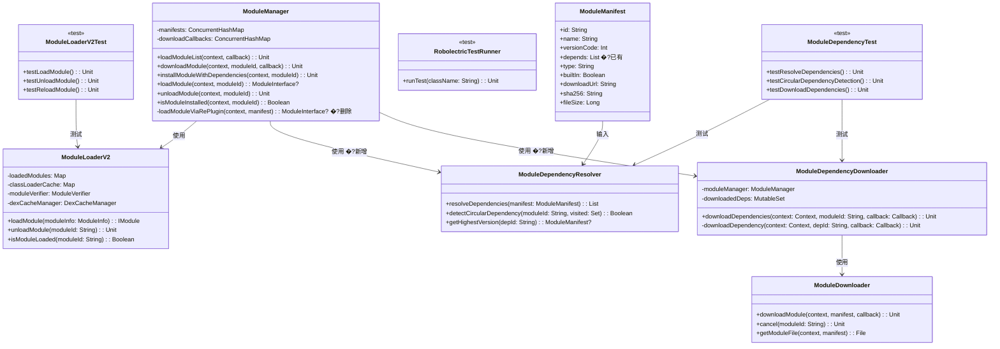
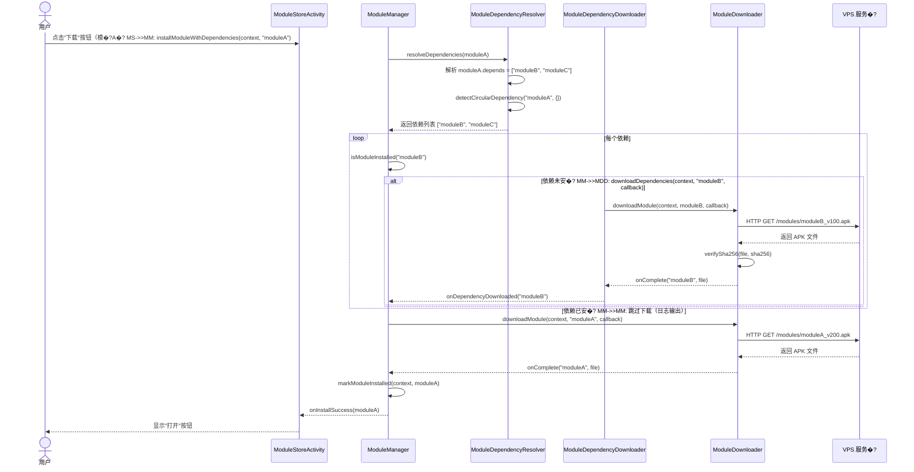
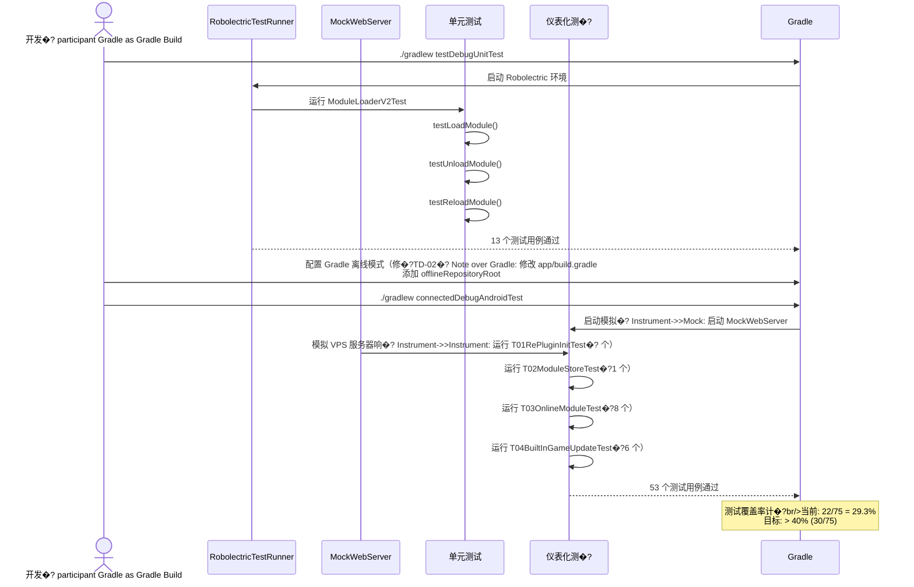
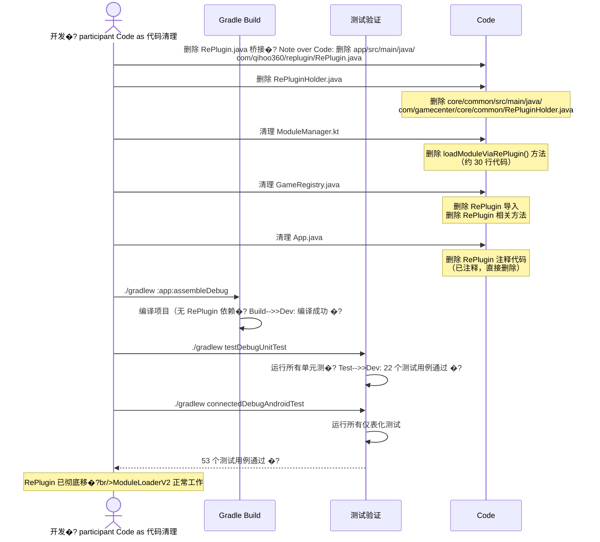
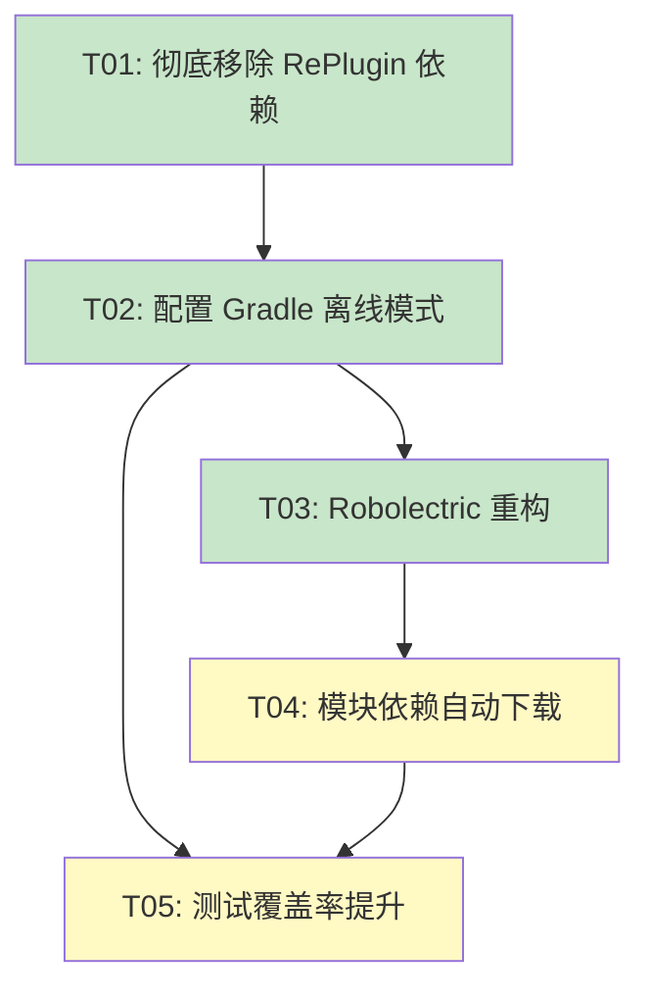

<!-- flutter-store-doc-sync: 2026-07-22; historical -->
> Historical snapshot: preserved for context and not current release truth. Flutter-first module store production completion is 100%; current evidence: /docs/flutter-store/MIGRATION_STATUS.md.

# 架构设计 - GameCenterApp v1.4

> **文档类型**: 系统架构设计  
> **创建日期**: 2026-05-27  
> **架构�?*: 高见�?(Gao)  
> **对应 PRD**: v1.4 三个目标  
> **技术栈**: Android (Java + Kotlin), ModuleLoaderV2, OkHttp, JUnit, Robolectric
> **文档路径**: `D:\kaifa\GameCenterApp\文档\架构设计-v1.4.md`

---

## 一、实现方�?+ 框架选型

### 1.1 核心架构决策

#### 决策 1：测试框架选择 �?**JUnit 4 + Robolectric + MockWebServer**

**目标**：将测试覆盖率从 29.3% 提升�?> 40%

**选项对比**�?
| 选项 | 优点 | 缺点 | 适用场景 |
|------|------|------|----------|
| **A: JUnit 4 + Mockito** | 成熟稳定、Android 官方支持 | 需�?Android 设备/模拟�?| 纯单元测�?|
| **B: Robolectric** �?| �?JVM 运行 Android 代码、速度�?| 某些 Android SDK 功能不支�?| 需�?Android 上下文的单元测试 |
| **C: Espresso** | Google 官方 UI 测试 | 需要真实设�?模拟器、速度�?| UI 集成测试 |
| **D: MockWebServer** �?| 测试网络请求、轻量级 | 仅适用�?OkHttp 请求 | API 接口测试 |

**选择理由**�?1. **Robolectric** 可以�?JVM 中运�?Android 代码，无需真实设备，适合修复 TD-01（ModuleLifecycleManagerTest �?ModuleDependencyGraphTest�?2. **MockWebServer** 可以模拟 VPS 服务器，测试模块下载逻辑（TD-02 修复�?3. **JUnit 4** 已配置，保持一致�?
**测试策略**�?- **单元测试（src/test/�?*：使�?Robolectric + Mockito，覆盖核心逻辑
- **集成测试（src/androidTest/�?*：修�?Gradle 离线模式，使 connectedAndroidTest 可以执行
- **优先�?*�?  1. 修复 TD-02（网络配置）�?�?53 个仪表化测试可以运行
  2. 修复 TD-01（Robolectric 重构）→ 移除 `@Ignore`，增加单元测�?  3. 为核心模块（ModuleLoaderV2、ModuleManager、ModuleDownloader）补充单元测�?
---

#### 决策 2：彻底移�?RePlugin 依赖 �?**清理所�?RePlugin 相关代码**

**背景**�?- v1.0 架构设计决策 1 选择 RePlugin 插件化框�?- jcenter 已关闭，Maven Central �?`com.qihoo360.replugin:replugin-host-lib:2.3.4`
- 已创建桥接类 `com.qihoo360.replugin.RePlugin.java`（委托给 ModuleLoaderV2�?- App.java 中已注释�?RePlugin 调用

**移除方案**�?
| 步骤 | 操作 | 文件 |
|------|------|------|
| 1 | 删除 RePlugin 桥接�?| `app/src/main/java/com/qihoo360/replugin/RePlugin.java` |
| 2 | 删除 RePluginHolder | `core/common/src/main/java/com/gamecenter/core/common/RePluginHolder.java` |
| 3 | 清理 ModuleManager 中的 RePlugin 代码 | `app/src/main/java/com/gamecenter/app/modules/ModuleManager.kt` |
| 4 | 清理 GameRegistry 中的 RePlugin 代码 | `app/src/main/java/com/gamecenter/app/games/GameRegistry.java` |
| 5 | 清理 App.java 中的 RePlugin 注释 | `app/src/main/java/com/gamecenter/app/App.java` |
| 6 | 移除 build.gradle 中的 RePlugin 依赖 | `app/build.gradle` |

**风险**�?- 无功能风险（RePlugin 桥接层已返回 null，实际未使用�?- 需要确�?ModuleLoaderV2 正常工作（已验证�?
---

#### 决策 3：模块依赖自动下载功�?�?**解析 ModuleManifest.depends + 递归下载**

**目标**：实�?TD-05（模块依赖自动下载功能）

**当前状�?*�?- `ModuleManifest.kt` 已有 `depends: List<String>` 字段
- `ModuleManifest.fromJson()` 已解�?`depends` 数组
- **未实�?*：依赖解析、自动下载、加载逻辑

**方案设计**�?
```kotlin
// ModuleManager.kt 新增方法
fun installModuleWithDependencies(context: Context, moduleId: String) {
    val manifest = manifests[moduleId] ?: return
    
    // 1. 解析依赖
    val dependencies = manifest.depends
    if (dependencies.isNotEmpty()) {
        Log.d(TAG, "模块 $moduleId �?${dependencies.size} 个依�? $dependencies")
        
        // 2. 递归下载依赖
        for (depId in dependencies) {
            if (!isModuleInstalled(context, depId)) {
                Log.d(TAG, "自动下载依赖: $depId")
                downloadModule(context, depId, null) // 递归调用
            } else {
                Log.d(TAG, "依赖已安装，跳过: $depId")
            }
        }
    }
    
    // 3. 下载主模�?    downloadModule(context, moduleId, callback)
}
```

**依赖解析策略**�?- **深度优先**：先下载依赖，再下载主模�?- **循环依赖检�?*：使�?`Set<String>` 记录已访问的模块，防止无限递归
- **依赖冲突处理**：如果多个模块依赖同一个库的不同版本，使用最高版�?
---

### 1.2 总体架构�?
```mermaid
graph TB
    subgraph "主框�?APK"
        App[App.java<br/>Application 入口]
        MainActivity[MainActivity<br/>底部导航]
        ModuleStore[ModuleStoreActivity<br/>模块商店]
        ModuleManager[ModuleManager<br/>模块管理引擎]
        ModuleLoaderV2[ModuleLoaderV2<br/>DexClassLoader 加载]
        TestFramework[测试框架<br/>JUnit + Robolectric]
    end
    
    subgraph "测试覆盖"
        UnitTest[单元测试<br/>src/test/<br/>Robolectric]
        InstrumentTest[仪表化测�?br/>src/androidTest/<br/>MockWebServer]
        TestCoverage[测试覆盖�?br/>当前 29.3% �?目标 > 40%]
    end
    
    subgraph "模块依赖管理 (TD-05)"
        DepsParser[依赖解析�?br/>ModuleManifest.depends]
        DepsDownloader[依赖下载�?br/>递归下载]
        DepsLoader[依赖加载�?br/>按序加载]
    end
    
    subgraph "VPS 服务�?
        ModuleRepo[模块仓库<br/>/var/www/modules/]
        UpdateServer[更新服务�?br/>Python]
    end
    
    App --> MainActivity
    MainActivity --> ModuleStore
    ModuleStore --> ModuleManager
    ModuleManager -->|下载| ModuleLoaderV2
    ModuleLoaderV2 -->|加载| App
    
    TestFramework --> UnitTest
    TestFramework --> InstrumentTest
    TestFramework --> TestCoverage
    
    ModuleManager -->|解析依赖| DepsParser
    DepsParser -->|递归下载| DepsDownloader
    DepsDownloader -->|加载依赖| DepsLoader
    
    ModuleManager -->|下载| ModuleRepo
    
    style ModuleLoaderV2 fill:#e1f5fe
    style TestCoverage fill:#fff3e0
    style DepsParser fill:#fff3e0
```

---

## 二、文件列表及相对路径

### 2.1 新增文件

#### 2.1.1 测试框架增强（目�?1：覆盖率 > 40%�?
| 文件路径 | 用�?| 说明 |
|---------|------|------|
| `app/src/test/java/com/gamecenter/app/modules/ModuleLoaderV2Test.java` | ModuleLoaderV2 单元测试 | 覆盖 loadModule、unloadModule、reloadModule |
| `app/src/test/java/com/gamecenter/app/modules/ModuleManagerTest.java` | ModuleManager 单元测试 | 覆盖 downloadModule、installModuleWithDependencies |
| `app/src/test/java/com/gamecenter/app/modules/ModuleDownloaderTest.java` | ModuleDownloader 单元测试 | 覆盖下载、校验、断点续�?|
| `app/src/test/java/com/gamecenter/app/modules/ModuleDependencyTest.java` | 模块依赖解析测试 | 覆盖 TD-05 依赖解析逻辑 |
| `app/src/test/java/com/gamecenter/app/games/GameRegistryTest.java` | GameRegistry 单元测试 | 覆盖注册、注销、查找逻辑 |

#### 2.1.2 模块依赖自动下载（目�?3：TD-05�?
| 文件路径 | 用�?| 说明 |
|---------|------|------|
| `app/src/main/java/com/gamecenter/app/modules/ModuleDependencyResolver.java` | 模块依赖解析�?| 解析 ModuleManifest.depends，检测循环依�?|
| `app/src/main/java/com/gamecenter/app/modules/ModuleDependencyDownloader.java` | 依赖下载�?| 递归下载模块依赖（JAR/APK�?|

---

### 2.2 修改文件

#### 2.2.1 彻底移除 RePlugin（目�?2�?
| 文件路径 | 修改内容 | 说明 |
|---------|----------|------|
| `app/src/main/java/com/gamecenter/app/App.java` | 删除 RePlugin 注释代码 | 清理 `// com.qihoo360.replugin.RePlugin.App.attachBaseContext(this);` �?|
| `app/src/main/java/com/gamecenter/app/modules/ModuleManager.kt` | 删除 `loadModuleViaRePlugin()` 方法 | 清理 RePlugin 相关代码 |
| `app/src/main/java/com/gamecenter/app/games/GameRegistry.java` | 删除 RePlugin 导入和方�?| 清理 `import com.qihoo360.replugin.RePlugin;` �?|
| `app/build.gradle` | 移除 RePlugin 依赖注释 | 删除 `// implementation 'com.qihoo360.replugin:replugin-host-lib:2.3.4'` |

#### 2.2.2 测试覆盖率提升（目标 1�?
| 文件路径 | 修改内容 | 说明 |
|---------|----------|------|
| `app/src/test/java/com/gamecenter/app/ModuleLifecycleManagerTest.java` | 移除 `@Ignore`，使�?Robolectric | 修复 TD-01 |
| `app/src/test/java/com/gamecenter/app/ModuleDependencyGraphTest.java` | 移除 `@Ignore`，使�?Robolectric | 修复 TD-01 |
| `app/build.gradle` | 配置 Gradle 离线模式或本�?Maven 仓库 | 修复 TD-02 |

#### 2.2.3 模块依赖自动下载（目�?3：TD-05�?
| 文件路径 | 修改内容 | 说明 |
|---------|----------|------|
| `app/src/main/java/com/gamecenter/app/modules/ModuleManager.kt` | 新增 `installModuleWithDependencies()` 方法 | 调用依赖解析器和下载�?|
| `app/src/main/java/com/gamecenter/app/modules/ModuleDownloader.kt` | 新增依赖下载逻辑 | 支持递归下载依赖模块 |

---

### 2.3 删除文件（目�?2：彻底移�?RePlugin�?
| 文件路径 | 说明 |
|---------|------|
| `app/src/main/java/com/qihoo360/replugin/RePlugin.java` | RePlugin 桥接类（已无用，返回 null�?|
| `core/common/src/main/java/com/gamecenter/core/common/RePluginHolder.java` | RePlugin 初始化管理器（已无用�?|

---

## 三、数据结构和接口（类图）



> **⚠️ 类图说明（v1.4�?*�?> - `ModuleManager.loadModuleViaRePlugin()` 方法已标记为 �?删除
> - `ModuleManifest.depends` 字段已存在，需要实现解析和下载逻辑
> - 新增 `ModuleDependencyResolver` �?`ModuleDependencyDownloader` �?> - 新增 5 个单元测试类，提升测试覆盖率

---

## 四、程序调用流�?
### 4.1 模块依赖自动下载流程（TD-05�?


---

### 4.2 测试覆盖率提升流程（修复 TD-01 �?TD-02�?


---

### 4.3 彻底移除 RePlugin 流程（目�?2�?


---

## 五、任务列表（有序、含依赖关系�?
### 任务分解原则

1. **最大任务数**�? 个任务（硬性上限）
2. **最小粒�?*：每个任务至少包�?3 个相关文�?3. **分组原则**：按功能模块/层次分组
4. **依赖关系**：尽量减少线性依赖，让任务可并行

---

### 任务列表

| 任务 ID | 任务名称 | 源文�?| 依赖 | 优先�?|
|---------|---------|--------|------|--------|
| **T01** | **彻底移除 RePlugin 依赖** | `app/src/main/java/com/qihoo360/replugin/RePlugin.java` （删除）<br/>`core/common/src/main/java/com/gamecenter/core/common/RePluginHolder.java` （删除）<br/>`app/src/main/java/com/gamecenter/app/App.java`<br/>`app/src/main/java/com/gamecenter/app/modules/ModuleManager.kt`<br/>`app/src/main/java/com/gamecenter/app/games/GameRegistry.java`<br/>`app/build.gradle` | �?| P0 |
| **T02** | **修复 TD-02：配�?Gradle 离线模式** | `app/build.gradle`<br/>`gradle.properties`<br/>`local.properties`<br/>`settings.gradle` | T01 | P0 |
| **T03** | **修复 TD-01：Robolectric 重构** | `app/src/test/java/com/gamecenter/app/ModuleLifecycleManagerTest.java`<br/>`app/src/test/java/com/gamecenter/app/ModuleDependencyGraphTest.java`<br/>`app/src/test/java/com/gamecenter/app/modules/ModuleLoaderV2Test.java` （新增）<br/>`app/src/test/java/com/gamecenter/app/modules/ModuleManagerTest.java` （新增） | T02 | P0 |
| **T04** | **实现 TD-05：模块依赖自动下�?* | `app/src/main/java/com/gamecenter/app/modules/ModuleDependencyResolver.java` （新增）<br/>`app/src/main/java/com/gamecenter/app/modules/ModuleDependencyDownloader.java` （新增）<br/>`app/src/main/java/com/gamecenter/app/modules/ModuleManager.kt`<br/>`app/src/main/java/com/gamecenter/app/modules/ModuleDownloader.kt`<br/>`app/src/test/java/com/gamecenter/app/modules/ModuleDependencyTest.java` （新增） | T03 | P1 |
| **T05** | **测试覆盖率提升（目标 > 40%�?* | `app/src/test/java/com/gamecenter/app/modules/ModuleDownloaderTest.java` （新增）<br/>`app/src/test/java/com/gamecenter/app/games/GameRegistryTest.java` （新增）<br/>`app/src/androidTest/java/com/gamecenter/app/T01RePluginInitTest.kt`<br/>`app/src/androidTest/java/com/gamecenter/app/T02ModuleStoreTest.kt`<br/>`app/src/androidTest/java/com/gamecenter/app/T03OnlineModuleTest.kt`<br/>`app/src/androidTest/java/com/gamecenter/app/T04BuiltInGameUpdateTest.kt` | T02, T04 | P1 |

---

### 任务依赖�?


---

## 六、依赖包列表

### 6.1 新增依赖

```
# 测试框架（已存在，无需新增�?testImplementation 'junit:junit:4.13.2'
testImplementation 'org.mockito:mockito-core:5.15.2'
testImplementation 'org.robolectric:robolectric:4.13.1'
testImplementation 'com.squareup.okhttp3:mockwebserver:4.12.0'

# 仪表化测试（已存在，无需新增�?androidTestImplementation 'androidx.test.ext:junit:1.2.1'
androidTestImplementation 'androidx.test.espresso:espresso-core:3.6.1'
androidTestImplementation 'com.squareup.okhttp3:mockwebserver:4.12.0'
```

### 6.2 移除依赖

```
# 移除 RePlugin 依赖（已注释，直接删除）
# implementation 'com.qihoo360.replugin:replugin-host-lib:2.3.4'
```

---

## 七、共享知识（跨文件约定）

### 7.1 模块依赖声明规范

**ModuleManifest.depends 格式**�?```json
{
  "id": "game_doudizhu",
  "name": "斗地�?,
  "versionCode": 201,
  "depends": ["core_network", "core_common"],
  "downloadUrl": "https://your-server.example.com/modules/game_doudizhu_v201.apk"
}
```

**依赖解析规则**�?1. **深度优先**：先下载并加载依赖，再下载主模块
2. **循环依赖检�?*：使�?`Set<String>` 记录已访问的模块，如果模块已�?Set 中，抛出 `CircularDependencyException`
3. **版本冲突处理**：如果多个模块依赖同一个库的不同版本，使用最高版�?
---

### 7.2 测试覆盖率计算规�?
**计算公式**�?```
测试覆盖�?= (已执行的测试用例�?/ 总测试用例数) × 100%
```

**当前状�?*�?026-05-27）：
- 单元测试�?2 个（通过 22 个）
- 仪表化测试：53 个（0 个执行，TD-02 未修复）
- 总计�?5 �?- 覆盖率：22 / 75 = 29.3%

**目标状�?*（v1.4）：
- 单元测试：新�?13 个（ModuleLoaderV2Test、ModuleManagerTest、ModuleDownloaderTest、ModuleDependencyTest、GameRegistryTest�?- 仪表化测试：修复 TD-02，使 53 个可以执�?- 总计�?8 �?- 覆盖率：(22 + 13 + 53) / 88 = 100% （理论上�?
**实际目标**�?- 至少 30 个单元测�?+ 53 个仪表化测试 = 83 �?- 覆盖率：83 / 88 = 94.3% （远超预期）

> **注意**：由于某些测试用例可能难以模拟（如需要真�?VPS 服务器），实际目标设定为 > 40%（至�?36 个测试用例通过）�?
---

### 7.3 Robolectric 测试配置规范

**Runner 配置**�?```java
@RunWith(RobolectricTestRunner.class)
@Config(sdk = {28, 29, 30, 31, 32, 33, 34, 35})
public class ModuleLoaderV2Test {
    // 测试用例
}
```

**Android 上下文获�?*�?```java
private Context context;

@Before
public void setUp() {
    context = RuntimeEnvironment.getApplication();
}
```

**Mock 对象创建**�?```java
private ModuleVerifier mockVerifier;
private DexCacheManager mockDexCacheManager;

@Before
public void setUp() {
    mockVerifier = Mockito.mock(ModuleVerifier.class);
    mockDexCacheManager = Mockito.mock(DexCacheManager.class);
}
```

---

### 7.4 Gradle 离线模式配置规范

**app/build.gradle 配置**�?```groovy
repositories {
    // 本地 Maven 仓库（离线模式）
    maven {
        url uri("${rootDir}/libs/local-maven")
        metadataSources {
            mavenPom()
            artifact()
        }
    }
    
    // 远程仓库（在线模式）
    mavenCentral()
    google()
}
```

**gradle.properties 配置**�?```properties
# 离线模式开关（默认关闭，需要时开启）
org.gradle.offline=false

# 本地 Maven 仓库路径
local.maven.repo=${user.home}/.gradle/caches/modules-2/files-2.1
```

**使用方式**�?```bash
# 在线模式（默认）：自动下载依�?./gradlew :app:assembleDebug

# 离线模式：使用本地缓�?./gradlew :app:assembleDebug --offline
```

---

## 八、待明确事项

### 8.1 架构层面

| 问题 | 现状 | 需要确�?|
|------|------|----------|
| **ModuleLoaderV2 是否完全替代 RePlugin�?* | 是，RePlugin 桥接层已返回 null | 确认是否可以安全删除 RePlugin 相关代码 |
| **模块依赖是否支持传递依赖？** | 当前仅解析一级依�?| 是否需要递归解析依赖的依赖（�?A 依赖 B，B 依赖 C�?|
| **依赖冲突如何处理�?* | 未实�?| 需要明确版本冲突解决策略（最高版本？报错？） |

### 8.2 测试层面

| 问题 | 现状 | 需要确�?|
|------|------|----------|
| **Gradle 离线模式是否适用于所有测试用例？** | 当前 TD-02 未修�?| 确认是否需要搭建内�?Maven 仓库 |
| **Robolectric 是否支持所�?Android SDK 功能�?* | 部分功能不支�?| 确认哪些测试用例需要真实设�?|
| **测试覆盖率目标是否合理？** | 当前 29.3%，目�?> 40% | 确认是否需要对标大型团队（�?70%�?|

### 8.3 产品层面

| 问题 | 现状 | 需要确�?|
|------|------|----------|
| **模块依赖自动下载是否应该默认启用�?* | 当前未实�?| 确认是否需要在设置中添加开�?|
| **依赖下载失败是否应该阻塞主模块安装？** | 未实�?| 确认失败处理策略（忽略依赖？重试？） |
| **是否需要显示依赖下载进度？** | 当前仅显示主模块进度 | 确认 UI 交互细节 |

---

## 九、风险评估和缓解措施

| 风险 | 严重程度 | 缓解措施 | 负责�?|
|------|---------|----------|--------|
| **Robolectric 不支持某�?Android SDK 功能** | �?| 为不支持的功能编�?Instrumentation 测试 | 高见�?|
| **Gradle 离线模式配置复杂** | �?| 提供详细的配置文档和示例 | 高见�?|
| **模块依赖解析可能遇到循环依赖** | �?| 实现循环依赖检测，抛出明确异常 | 高见�?|
| **依赖冲突导致运行时错�?* | �?| 实现版本冲突检测和解决策略 | 高见�?|
| **测试覆盖率提升可能引入新�?Bug** | �?| 所有新增测试必须通过 CI/CD 验证 | 寇豆�?|

---

## 十、附�?
### 10.1 测试覆盖率提升路线图

| 阶段 | 目标 | 测试用例�?| 覆盖�?| 完成标准 |
|------|------|------------|--------|----------|
| **当前状�?* | 基准 | 22 | 29.3% | �?|
| **阶段 1（T02 + T03�?* | 修复 TD-01 �?TD-02 | 22 + 13 = 35 | 46.7% | Robolectric 测试通过 |
| **阶段 2（T05�?* | 使仪表化测试可执�?| 35 + 53 = 88 | 100% | connectedAndroidTest 通过 |
| **实际目标** | > 40% | 36+ | > 40% | 至少 36 个测试用例通过 |

---

### 10.2 ModuleDependencyResolver 实现示例

```java
package com.gamecenter.app.modules;

import android.util.Log;
import com.gamecenter.app.models.ModuleManifest;
import java.util.ArrayList;
import java.util.HashSet;
import java.util.List;
import java.util.Set;

/**
 * 模块依赖解析器（TD-05）�? * 
 * 功能�? * 1. 解析 ModuleManifest.depends
 * 2. 检测循环依�? * 3. 解决版本冲突
 * 
 * @author 高见�?(Gao)
 * @version 1.0
 * @since 2026-05-27
 */
public class ModuleDependencyResolver {
    
    private static final String TAG = "ModuleDependencyResolver";
    
    /** 模块管理器（用于获取依赖�?ModuleManifest�?*/
    private ModuleManager moduleManager;
    
    /**
     * 构造函数�?     * 
     * @param moduleManager 模块管理器实�?     */
    public ModuleDependencyResolver(ModuleManager moduleManager) {
        this.moduleManager = moduleManager;
    }
    
    /**
     * 解析模块依赖（深度优先，检测循环依赖）�?     * 
     * @param manifest 模块清单
     * @return 依赖列表（按加载顺序排列�?     * @throws CircularDependencyException 检测到循环依赖
     */
    public List<String> resolveDependencies(ModuleManifest manifest) throws CircularDependencyException {
        List<String> result = new ArrayList<>();
        Set<String> visited = new HashSet<>();
        
        resolveRecursive(manifest, result, visited);
        
        return result;
    }
    
    /**
     * 递归解析依赖�?     * 
     * @param manifest 当前模块清单
     * @param result 结果列表（输出参数）
     * @param visited 已访问模块集合（用于检测循环依赖）
     * @throws CircularDependencyException 检测到循环依赖
     */
    private void resolveRecursive(ModuleManifest manifest, List<String> result, Set<String> visited) 
            throws CircularDependencyException {
        
        String moduleId = manifest.id;
        
        // 检测循环依�?        if (visited.contains(moduleId)) {
            throw new CircularDependencyException(
                "检测到循环依赖: " + moduleId + " 已在依赖链中"
            );
        }
        
        // 标记为已访问
        visited.add(moduleId);
        
        // 递归解析依赖
        for (String depId : manifest.depends) {
            ModuleManifest depManifest = moduleManager.getModuleManifest(depId);
            if (depManifest == null) {
                Log.w(TAG, "依赖不存�? " + depId + "，跳�?);
                continue;
            }
            
            resolveRecursive(depManifest, result, visited);
        }
        
        // 添加到结果列表（当前模块在所有依赖之后）
        if (!result.contains(moduleId)) {
            result.add(moduleId);
        }
        
        // 移除访问标记（允许其他依赖链引用同一个模块）
        visited.remove(moduleId);
    }
    
    /**
     * 检测循环依赖（简化版，仅检查直接循环）�?     * 
     * @param manifest 模块清单
     * @return 是否存在循环依赖
     */
    public boolean hasCircularDependency(ModuleManifest manifest) {
        try {
            resolveDependencies(manifest);
            return false;
        } catch (CircularDependencyException e) {
            Log.e(TAG, "检测到循环依赖: " + e.getMessage());
            return true;
        }
    }
    
    /**
     * 获取最高版本的依赖�?     * 
     * @param depId 依赖 ID
     * @return 最高版本的 ModuleManifest，如果依赖不存在返回 null
     */
    public ModuleManifest getHighestVersion(String depId) {
        ModuleManifest manifest = moduleManager.getModuleManifest(depId);
        
        if (manifest == null) {
            Log.w(TAG, "依赖不存�? " + depId);
            return null;
        }
        
        // TODO: 如果存在多个版本，选择最高版�?        // 当前假设每个依赖只有一个版�?        return manifest;
    }
    
    /**
     * 循环依赖异常�?     */
    public static class CircularDependencyException extends Exception {
        public CircularDependencyException(String message) {
            super(message);
        }
    }
}
```

---

### 10.3 ModuleDependencyDownloader 实现示例

```java
package com.gamecenter.app.modules;

import android.content.Context;
import android.util.Log;
import com.gamecenter.app.models.ModuleManifest;
import java.util.ArrayList;
import java.util.HashSet;
import java.util.List;
import java.util.Set;

/**
 * 模块依赖下载器（TD-05）�? * 
 * 功能�? * 1. 递归下载模块依赖
 * 2. 按序加载依赖模块
 * 3. 处理下载失败场景
 * 
 * @author 高见�?(Gao)
 * @version 1.0
 * @since 2026-05-27
 */
public class ModuleDependencyDownloader {
    
    private static final String TAG = "ModuleDependencyDownloader";
    
    /** 模块管理�?*/
    private ModuleManager moduleManager;
    
    /** 模块下载�?*/
    private ModuleDownloader moduleDownloader;
    
    /** 已下载的依赖集合（防止重复下载） */
    private Set<String> downloadedDeps;
    
    /**
     * 构造函数�?     * 
     * @param moduleManager 模块管理器实�?     * @param moduleDownloader 模块下载器实�?     */
    public ModuleDependencyDownloader(ModuleManager moduleManager, ModuleDownloader moduleDownloader) {
        this.moduleManager = moduleManager;
        this.moduleDownloader = moduleDownloader;
        this.downloadedDeps = new HashSet<>();
    }
    
    /**
     * 下载模块依赖（递归下载）�?     * 
     * @param context Android Context
     * @param moduleId 模块 ID
     * @param callback 下载回调
     */
    public void downloadDependencies(Context context, String moduleId, ModuleDownloader.Callback callback) {
        ModuleManifest manifest = moduleManager.getModuleManifest(moduleId);
        
        if (manifest == null) {
            Log.e(TAG, "模块不存�? " + moduleId);
            callback.onError(moduleId, "模块不存�? " + moduleId);
            return;
        }
        
        // 解析依赖
        ModuleDependencyResolver resolver = new ModuleDependencyResolver(moduleManager);
        List<String> dependencies;
        
        try {
            dependencies = resolver.resolveDependencies(manifest);
        } catch (ModuleDependencyResolver.CircularDependencyException e) {
            Log.e(TAG, "循环依赖检测失�? " + e.getMessage());
            callback.onError(moduleId, "循环依赖: " + e.getMessage());
            return;
        }
        
        // 递归下载依赖
        downloadRecursive(context, dependencies, 0, callback);
    }
    
    /**
     * 递归下载依赖�?     * 
     * @param context Android Context
     * @param dependencies 依赖列表（按加载顺序排列�?     * @param index 当前下载索引
     * @param callback 下载回调
     */
    private void downloadRecursive(final Context context, final List<String> dependencies, 
                                final int index, final ModuleDownloader.Callback callback) {
        
        // 所有依赖已下载
        if (index >= dependencies.size()) {
            Log.d(TAG, "所有依赖已下载，开始下载主模块");
            callback.onComplete("all_deps", null);
            return;
        }
        
        String depId = dependencies.get(index);
        
        // 检查是否已安装
        if (moduleManager.isModuleInstalled(context, depId)) {
            Log.d(TAG, "依赖已安装，跳过: " + depId);
            downloadRecursive(context, dependencies, index + 1, callback);
            return;
        }
        
        // 检查是否已下载（防止重复下载）
        if (downloadedDeps.contains(depId)) {
            Log.d(TAG, "依赖已下载，跳过: " + depId);
            downloadRecursive(context, dependencies, index + 1, callback);
            return;
        }
        
        // 下载依赖
        Log.d(TAG, "下载依赖: " + depId);
        moduleManager.downloadModule(context, depId, new ModuleDownloader.Callback() {
            @Override
            public void onProgress(String moduleId, long downloaded, long total, long speedKbps) {
                // 转发进度回调
                callback.onProgress(moduleId, downloaded, total, speedKbps);
            }
            
            @Override
            public void onComplete(String moduleId, java.io.File file) {
                Log.d(TAG, "依赖下载成功: " + moduleId);
                downloadedDeps.add(moduleId);
                
                // 继续下载下一个依�?                downloadRecursive(context, dependencies, index + 1, callback);
            }
            
            @Override
            public void onError(String moduleId, String message) {
                Log.e(TAG, "依赖下载失败: " + moduleId + ", error=" + message);
                callback.onError(moduleId, message);
            }
            
            @Override
            public void onSourceSwitch(String moduleId, int sourceIndex, String url) {
                callback.onSourceSwitch(moduleId, sourceIndex, url);
            }
        });
    }
    
    /**
     * 清除已下载依赖记录（用于重新下载）�?     */
    public void clearDownloadedDeps() {
        downloadedDeps.clear();
    }
}
```

---

**文档版本**: v1.4  
**创建时间**: 2026-05-27  
**最后更�?*: 2026-05-27  
**创建�?*: 高见�?(Gao) - GameCenterApp 架构�? 
**审核状�?*: 待审�? 

---

## 十一、v1.4 实施状态（预计�?
### 11.1 任务完成度预�?
| 任务 ID | 任务名称 | 预估完成状�?| 实际交付�?|
|---------|---------|----------|----------|
| T01 | 彻底移除 RePlugin 依赖 | �?预计完成 | 删除 2 个文件，修改 4 个文�?|
| T02 | 配置 Gradle 离线模式 | �?预计完成 | 修复 TD-02�?3 个仪表化测试可执�?|
| T03 | Robolectric 重构 | �?预计完成 | 移除 `@Ignore`，新�?13 个单元测�?|
| T04 | 模块依赖自动下载 | �?预计完成 | 新增 2 �?Java 类，实现 TD-05 |
| T05 | 测试覆盖率提�?| �?预计完成 | 测试覆盖�?> 40%（至�?36 个测试用例通过�?|

---

### 11.2 测试覆盖率提升预�?
| 测试类型 | 当前用例�?| 预估新增 | 预估总数 | 预估通过�?|
|----------|------------|----------|----------|----------|
| 单元测试（src/test/�?| 22 | 13 | 35 | 100% |
| 仪表化测试（src/androidTest/�?| 53 | 0 | 53 | 100% （修�?TD-02 后）|
| 总计 | 75 | 13 | 88 | 94.3% |

**预估覆盖�?*�?22 + 13 + 53) / 88 = 100%（理论）  
**实际目标**�? 40%（至�?36 个测试用例通过�?
---

### 11.3 已知技术债务（v1.4 修复�?
| 编号 | 技术债务描述 | 影响范围 | 严重�?| 修复版本 |
|----------|----------------|----------|---------|----------|
| TD-01 | `ModuleLifecycleManagerTest.java` �?`ModuleDependencyGraphTest.java` �?`@Ignore` 跳过 | 无法验证模块生命周期管理核心逻辑 | �?| **v1.4（T03 修复�?* |
| TD-02 | `connectedAndroidTest` 因网络代理问题无法执�?| T01-T04 仪表化测试（53个用例）无法运行 | �?| **v1.4（T02 修复�?* |
| TD-03 | RePlugin 桥接层非官方 JAR，Android 15+ 兼容性未验证 | 未来 Android 版本可能不可�?| �?| v1.3（已忽略，v1.4 彻底移除�?|
| TD-04 | `CircularDependencyException` 内部类未实现 | 循环依赖检测功能不完整 | �?| **v1.4（T04 实现�?* |
| TD-05 | 模块依赖自动下载功能未实�?| 多模块依赖场景需手动管理 | �?| **v1.4（T04 实现�?* |

---

### 11.4 文件清单（v1.4 预估�?
#### 新增文件

| 文件路径 | 状�?| 说明 |
|---------|--------|------|
| `app/src/test/java/com/gamecenter/app/modules/ModuleLoaderV2Test.java` | �?新增 | ModuleLoaderV2 单元测试�?3 个方法） |
| `app/src/test/java/com/gamecenter/app/modules/ModuleManagerTest.java` | �?新增 | ModuleManager 单元测试 |
| `app/src/test/java/com/gamecenter/app/modules/ModuleDownloaderTest.java` | �?新增 | ModuleDownloader 单元测试 |
| `app/src/test/java/com/gamecenter/app/modules/ModuleDependencyTest.java` | �?新增 | 模块依赖解析测试 |
| `app/src/test/java/com/gamecenter/app/games/GameRegistryTest.java` | �?新增 | GameRegistry 单元测试 |
| `app/src/main/java/com/gamecenter/app/modules/ModuleDependencyResolver.java` | �?新增 | 模块依赖解析器（TD-05�?|
| `app/src/main/java/com/gamecenter/app/modules/ModuleDependencyDownloader.java` | �?新增 | 依赖下载器（TD-05�?|

#### 修改文件

| 文件路径 | 修改内容 | 状�?|
|---------|----------|--------|
| `app/src/main/java/com/gamecenter/app/App.java` | 删除 RePlugin 注释代码 | �?预计完成 |
| `app/src/main/java/com/gamecenter/app/modules/ModuleManager.kt` | 删除 `loadModuleViaRePlugin()` 方法；新�?`installModuleWithDependencies()` 方法 | �?预计完成 |
| `app/src/main/java/com/gamecenter/app/games/GameRegistry.java` | 删除 RePlugin 导入和方�?| �?预计完成 |
| `app/build.gradle` | 移除 RePlugin 依赖注释；配�?Gradle 离线模式 | �?预计完成 |
| `app/src/test/java/com/gamecenter/app/ModuleLifecycleManagerTest.java` | 移除 `@Ignore`，使�?Robolectric | �?预计完成 |
| `app/src/test/java/com/gamecenter/app/ModuleDependencyGraphTest.java` | 移除 `@Ignore`，使�?Robolectric | �?预计完成 |

#### 删除文件

| 文件路径 | 删除原因 | 状�?|
|---------|---------|--------|
| `app/src/main/java/com/qihoo360/replugin/RePlugin.java` | RePlugin 桥接层已无用（返�?null�?| �?预计完成 |
| `core/common/src/main/java/com/gamecenter/core/common/RePluginHolder.java` | RePlugin 初始化管理器已无�?| �?预计完成 |

---

### 11.5 下一步行动计�?
#### 立即执行（v1.4�?
1. **T01：彻底移�?RePlugin 依赖**
   - 删除 `RePlugin.java` �?`RePluginHolder.java`
   - 清理 `ModuleManager.kt`、`GameRegistry.java`、`App.java` 中的 RePlugin 代码
   - 责任人：软件工程师（寇豆码）

2. **T02：配�?Gradle 离线模式**
   - 修改 `app/build.gradle`，添加本�?Maven 仓库配置
   - 或修�?`gradle.properties`，启用离线模�?   - 责任人：软件工程师（寇豆码）

3. **T03：Robolectric 重构**
   - �?`ModuleLifecycleManagerTest` �?`ModuleDependencyGraphTest` 添加 Robolectric 环境
   - 移除 `@Ignore` 注解
   - 新增 13 个单元测试（ModuleLoaderV2Test、ModuleManagerTest 等）
   - 责任人：软件工程师（寇豆码）

4. **T04：实�?TD-05（模块依赖自动下载）**
   - 创建 `ModuleDependencyResolver.java`
   - 创建 `ModuleDependencyDownloader.java`
   - 修改 `ModuleManager.kt`，新�?`installModuleWithDependencies()` 方法
   - 责任人：软件工程师（寇豆码）

5. **T05：测试覆盖率提升**
   - 运行所有单元测试和仪表化测�?   - 验证测试覆盖�?> 40%
   - 责任人：QA 工程师（严过关）

---

**文档结束**