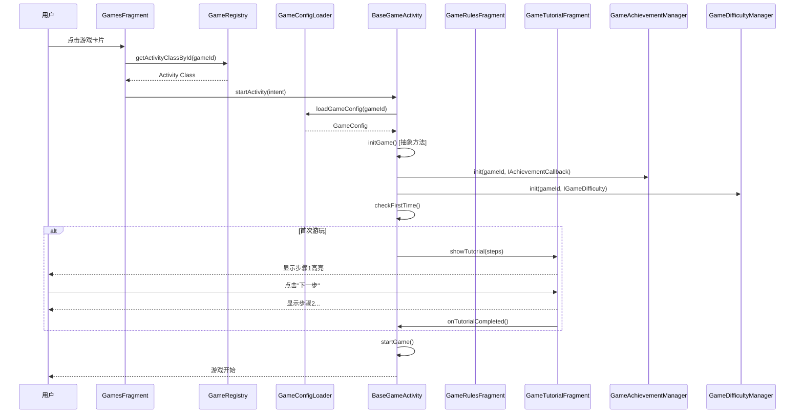
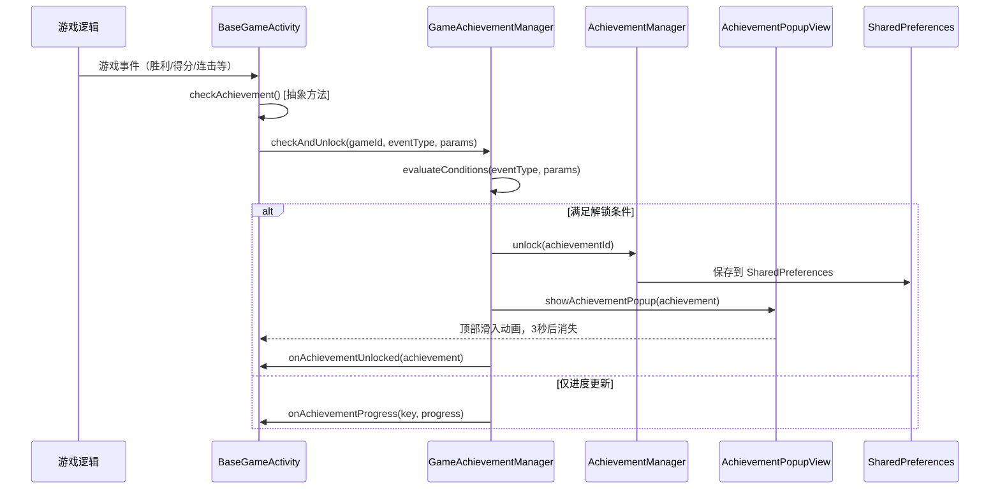
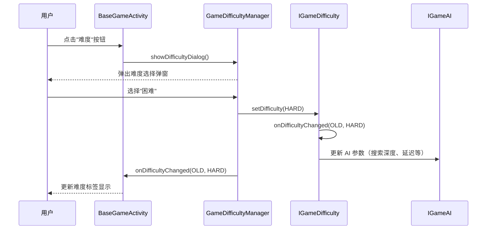
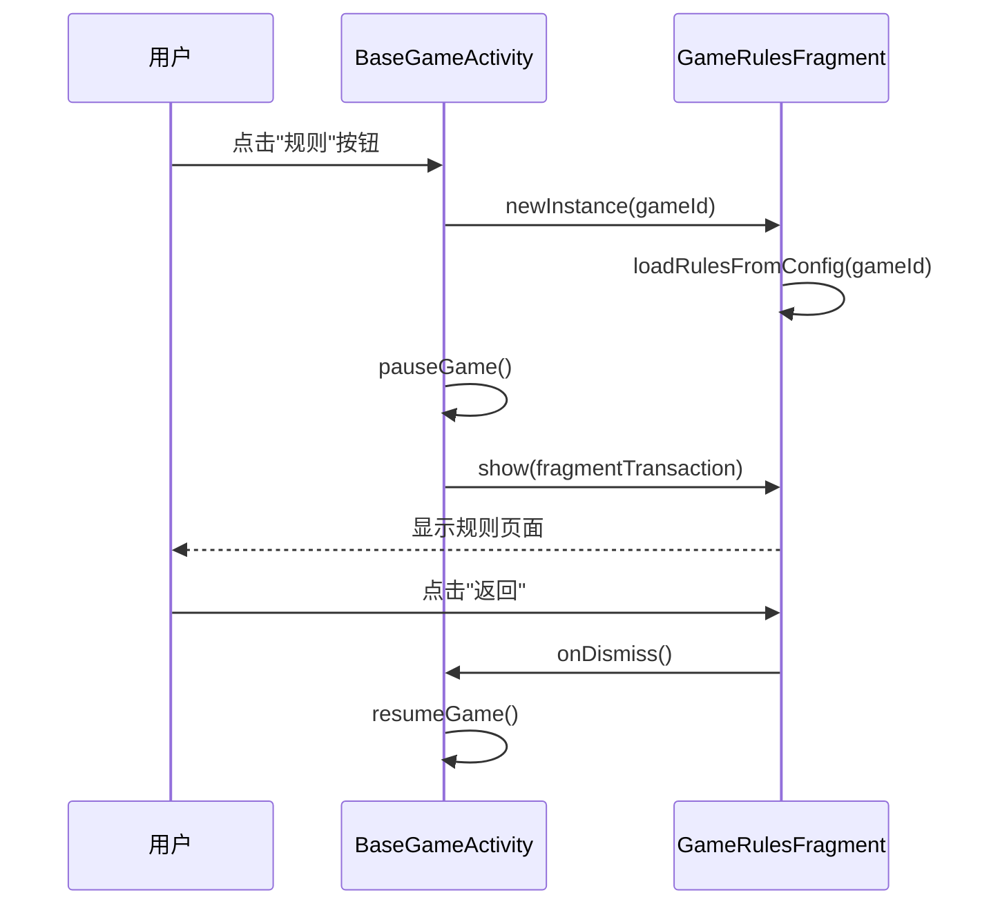
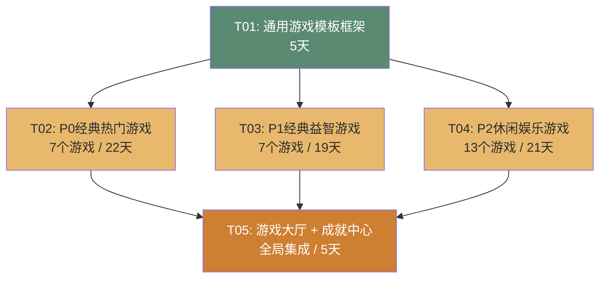

# GameCenterApp 游戏内容改造 — 架构设计文档 v1.0

**架构师**：高见远（Gao）  
**基于 PRD**：PRD-游戏内容改造-v1.0  
**创建日期**：2026-06-19  
**版本**：v1.0

---

## 第一部分：系统架构设计

### 1. 实现方案分析

#### 1.1 核心技术挑战

| 挑战 | 分析 | 解决方案 |
|------|------|----------|
| **27 个游戏统一管理** | 每个游戏有独立的规则、教程、成就、难度系统，需要统一模板 | 设计 `BaseGameActivity` 基类 + 4 个可组合的 Manager/Fragment |
| **成就系统跨游戏复用** | 已有 `AchievementManager` 单例，需扩展支持游戏级成就 | 在现有 `AchievementManager` 基础上新增 `GameAchievementManager`，通过 `AchievementType` 枚举注册各游戏成就 |
| **交互式教程系统** | 需要高亮、动画、步骤指示等交互，当前只有简单 AlertDialog | 设计 `GameTutorialFragment` 使用 `ViewOverlay` + `HighlightView` 实现 |
| **AI 难度多级控制** | 不同游戏的 AI 算法差异大（棋类用 Minimax、纸牌用规则引擎） | 设计 `GameDifficultyManager` 统一管理难度级别，游戏 AI 策略通过接口注入 |
| **27 套图标资源** | 矢量 XML drawable，需统一风格 | 使用 `ic_game_{game_id}.xml` 命名规范，集中管理 |

#### 1.2 架构模式

采用 **模板方法模式 + 策略模式 + 观察者模式** 的混合架构：

- **模板方法模式**：`BaseGameActivity` 定义游戏生命周期骨架，子类实现具体逻辑
- **策略模式**：难度调节、AI 策略通过接口注入，可运行时切换
- **观察者模式**：成就系统通过监听器通知 UI 层更新

#### 1.3 模块结构

```
app/src/main/java/com/gamecenter/app/
├── achievement/                          # 成就系统（已有，需扩展）
│   ├── AchievementManager.java           # [已有] 全局成就管理器单例
│   ├── AchievementType.java              # [已有] 成就类型枚举（需扩展游戏级成就）
│   └── AchievementData.java              # [新增] 成就数据模型
│
├── games/                                # 游戏模块
│   ├── base/                             # [新增] 通用游戏模板
│   │   ├── BaseGameActivity.java         # 游戏基类 Activity
│   │   ├── GameRulesFragment.java        # 规则说明 Fragment
│   │   ├── GameTutorialFragment.java     # 教程引导 Fragment
│   │   ├── GameAchievementManager.java   # 游戏级成就管理器
│   │   └── GameDifficultyManager.java    # 难度管理器
│   │
│   ├── model/                            # [新增] 数据模型
│   │   ├── GameConfig.java               # 游戏配置模型
│   │   ├── TutorialStep.java             # 教程步骤模型
│   │   ├── DifficultyLevel.java          # 难度级别模型
│   │   └── AchievementDef.java           # 游戏成就定义模型
│   │
│   ├── interface/                        # [新增] 接口定义
│   │   ├── IAchievementCallback.java     # 成就回调接口
│   │   ├── IGameTutorial.java            # 教程接口
│   │   ├── IGameDifficulty.java          # 难度接口
│   │   └── IGameAI.java                  # AI 策略接口
│   │
│   ├── config/                           # [新增] 游戏配置文件
│   │   ├── GameConfigLoader.java         # 配置加载器
│   │   └── game_configs.json             # 各游戏配置 JSON
│   │
│   ├── GameRegistry.java                 # [已有] 游戏注册中心（需扩展）
│   ├── GameTutorialHelper.java           # [已有] 教程帮助类（需重构）
│   ├── GameUsageStore.java               # [已有] 游戏使用统计
│   │
│   ├── gomoku/                           # [已有] 五子棋
│   ├── doudizhu/                         # [已有] 斗地主
│   ├── chinesechess/                     # [新增] 中国象棋
│   ├── game2048/                         # [新增] 2048
│   ├── snake/                            # [新增] 贪吃蛇
│   ├── tetris/                           # [新增] 俄罗斯方块
│   ├── minesweeper/                      # [新增] 扫雷
│   ├── klotski/                          # [新增] 华容道
│   ├── sudoku/                           # [新增] 数独
│   ├── sokoban/                          # [新增] 推箱子
│   ├── go/                               # [新增] 围棋
│   ├── checkers/                         # [新增] 跳棋
│   ├── tic/                              # [新增] 井字棋
│   ├── memory/                           # [新增] 记忆翻牌
│   ├── blackjack/                        # [新增] 21点
│   ├── breakout/                         # [新增] 打砖块
│   ├── flappy/                           # [新增] 飞翔的小鸟
│   ├── plane/                            # [新增] 飞机大战
│   ├── whack/                            # [新增] 打地鼠
│   ├── match/                            # [新增] 配对
│   ├── tiles/                            # [新增] 麻将连连看
│   ├── rock/                             # [新增] 猜拳
│   ├── dice/                             # [新增] 骰子
│   ├── guess/                            # [新增] 猜数字
│   ├── reaction/                         # [新增] 反应力
│   ├── pipeline/                         # [新增] 管道工
│   └── brotato/                          # [新增] 土豆兄弟
│
├── hall/                                 # [新增] 游戏大厅
│   ├── HallActivity.java                 # 游戏大厅主页面
│   ├── GameListAdapter.java              # 游戏列表适配器
│   └── AchievementCenterActivity.java    # 成就中心页面
│
└── views/                                # [新增] 通用游戏视图组件
    ├── HighlightOverlayView.java         # 高亮遮罩视图（教程用）
    ├── AchievementPopupView.java         # 成就弹窗视图
    └── ScoreBoardView.java               # 计分板视图
```

资源文件结构：
```
app/src/main/res/
├── drawable/
│   ├── ic_game_gomoku.xml                # 五子棋图标
│   ├── ic_game_doudizhu.xml              # 斗地主图标
│   ├── ic_game_chinesechess.xml          # 中国象棋图标
│   ├── ... (27 个游戏图标)
│   └── ic_achievement_*.xml              # 成就图标（铜/银/金/彩蛋）
│
├── layout/
│   ├── activity_base_game.xml            # 游戏基类布局
│   ├── fragment_game_rules.xml           # 规则页面布局
│   ├── fragment_game_tutorial.xml        # 教程页面布局
│   ├── dialog_difficulty_select.xml      # 难度选择弹窗
│   ├── popup_achievement.xml             # 成就弹窗布局
│   └── ... (各游戏具体布局)
│
├── anim/
│   ├── tutorial_highlight_pulse.xml      # 教程高亮脉冲动画
│   ├── achievement_slide_in.xml          # 成就弹窗滑入
│   └── achievement_slide_out.xml         # 成就弹窗滑出
│
├── values/
│   ├── strings_game_rules.xml            # 游戏规则字符串资源
│   ├── strings_game_tutorial.xml         # 教程字符串资源
│   └── strings_achievements.xml          # 成就字符串资源
│
└── raw/
    └── game_configs.json                 # 游戏配置 JSON
```

### 2. 关键数据结构

#### 2.1 Achievement（成就）数据模型

```java
/**
 * 成就数据模型 —— 存储单个成就的完整信息
 * 对应 SharedPreferences 中 JSON 数组的单个条目
 */
public class AchievementData {
    /** 成就唯一标识，格式：{game_id}_{achievement_key} */
    String id;
    
    /** 成就名称（显示用） */
    String name;
    
    /** 成就描述 */
    String description;
    
    /** 成就级别：BRONZE / SILVER / GOLD / EASTER_EGG */
    AchievementLevel level;
    
    /** 所属游戏 ID */
    String gameId;
    
    /** 是否已解锁 */
    boolean unlocked;
    
    /** 解锁时间（ISO 8601 UTC） */
    String unlockedAt;
    
    /** 解锁进度（0.0 ~ 1.0），用于展示进度条 */
    float progress;
}
```

#### 2.2 AchievementLevel（成就级别）枚举

```java
public enum AchievementLevel {
    BRONZE("铜牌", "#CD7F32", "入门"),
    SILVER("银牌", "#C0C0C0", "进阶"),
    GOLD("金牌", "#FFD700", "挑战"),
    EASTER_EGG("彩蛋", "#8B4513", "隐藏");
    
    String displayName;
    String colorHex;
    String difficultyLabel;
}
```

#### 2.3 GameConfig（游戏配置）数据模型

```java
/**
 * 游戏配置 —— 每个游戏的元信息和配置参数
 * 从 game_configs.json 加载
 */
public class GameConfig {
    /** 游戏唯一 ID（如 "gomoku"） */
    String gameId;
    
    /** 游戏显示名称 */
    String name;
    
    /** 游戏类型：BOARD / CARD / PUZZLE / CASUAL */
    GameType type;
    
    /** 优先级：P0 / P1 / P2 */
    Priority priority;
    
    /** 图标资源 ID */
    int iconResId;
    
    /** 是否支持 AI 对战 */
    boolean hasAI;
    
    /** 可用难度级别列表 */
    List<DifficultyLevel> difficultyLevels;
    
    /** 教程步骤列表 */
    List<TutorialStep> tutorialSteps;
    
    /** 成就定义列表 */
    List<AchievementDef> achievements;
    
    /** 规则说明资源 ID */
    int rulesResId;
    
    /** Activity 类名 */
    String activityClassName;
}
```

#### 2.4 TutorialStep（教程步骤）数据模型

```java
/**
 * 教程步骤 —— 交互式教程的单个步骤定义
 */
public class TutorialStep {
    /** 步骤序号（从 1 开始） */
    int stepNumber;
    
    /** 步骤标题 */
    String title;
    
    /** 步骤说明文字 */
    String description;
    
    /** 高亮区域类型：VIEW_ID / COORDINATES / NONE */
    HighlightType highlightType;
    
    /** 高亮目标 View 的资源 ID（当 highlightType == VIEW_ID 时） */
    int targetViewId;
    
    /** 高亮坐标区域（当 highlightType == COORDINATES 时） */
    Rect highlightArea;
    
    /** 高亮形状：CIRCLE / RECTANGLE / ROUNDED_RECT */
    HighlightShape shape;
    
    /** 指引箭头方向：UP / DOWN / LEFT / RIGHT / NONE */
    ArrowDirection arrowDirection;
    
    /** 步骤插图资源 ID（可选） */
    int illustrationResId;
    
    /** 是否需要用户操作后才能进入下一步 */
    boolean waitForAction;
}

public enum HighlightType { VIEW_ID, COORDINATES, NONE }
public enum HighlightShape { CIRCLE, RECTANGLE, ROUNDED_RECT }
public enum ArrowDirection { UP, DOWN, LEFT, RIGHT, NONE }
```

#### 2.5 DifficultyLevel（难度级别）数据模型

```java
/**
 * 难度级别 —— 定义游戏难度参数
 */
public class DifficultyLevel {
    /** 难度名称 */
    String name;
    
    /** 难度等级：1=简单, 2=普通, 3=困难 */
    int level;
    
    /** 难度描述 */
    String description;
    
    /** AI 搜索深度（棋类游戏用） */
    int aiSearchDepth;
    
    /** AI 响应延迟（毫秒，模拟思考时间） */
    long aiResponseDelayMs;
    
    /** 难度系数（0.0 ~ 1.0，用于游戏参数调节） */
    float difficultyFactor;
    
    /** 是否为默认难度 */
    boolean isDefault;
}
```

#### 2.6 AchievementDef（成就定义）数据模型

```java
/**
 * 成就定义 —— 声明式定义一个成就的条件
 * 用于注册到 GameAchievementManager
 */
public class AchievementDef {
    /** 成就 key（与 gameId 组合为唯一 ID） */
    String key;
    
    /** 成就名称资源 ID */
    int nameResId;
    
    /** 成就描述资源 ID */
    int descriptionResId;
    
    /** 成就级别 */
    AchievementLevel level;
    
    /** 解锁条件类型：WIN_COUNT / STREAK / SCORE / TIME / SPECIAL */
    ConditionType conditionType;
    
    /** 解锁条件阈值（如赢 10 局、得分 2048） */
    int threshold;
    
    /** 是否为隐藏成就 */
    boolean hidden;
}

public enum ConditionType { 
    WIN_COUNT,      // 胜利场次
    STREAK,         // 连胜次数
    SCORE,          // 分数阈值
    TIME,           // 时间限制
    SPECIAL         // 特殊条件（由游戏自行判断）
}
```

### 3. 接口设计

#### 3.1 IAchievementCallback（成就回调接口）

```java
/**
 * 成就回调接口 —— 游戏 Activity 实现此接口来响应成就事件
 * 
 * 使用方式：游戏 Activity 实现此接口，在 BaseGameActivity.onCreate 中注册到
 * GameAchievementManager，成就解锁时自动回调
 */
public interface IAchievementCallback {
    
    /**
     * 成就解锁回调
     * @param achievement 解锁的成就数据
     */
    void onAchievementUnlocked(AchievementData achievement);
    
    /**
     * 成就进度更新回调（用于进度型成就的 UI 展示）
     * @param achievementKey 成就 key
     * @param progress 进度 (0.0 ~ 1.0)
     */
    void onAchievementProgress(String achievementKey, float progress);
    
    /**
     * 获取当前游戏 ID
     * @return 游戏 ID 字符串
     */
    String getGameId();
}
```

#### 3.2 IGameTutorial（教程接口）

```java
/**
 * 教程接口 —— 游戏通过实现此接口提供教程内容
 * 
 * BaseGameActivity 通过此接口获取教程步骤并自动管理教程流程。
 * 游戏 Activity 可以：
 *   方式 1：重写 getTutorialSteps() 返回 TutorialStep 列表（推荐）
 *   方式 2：重写 showCustomTutorial() 提供完全自定义的教程
 */
public interface IGameTutorial {
    
    /**
     * 获取教程步骤列表
     * @return 有序的教程步骤列表，为空则不显示教程
     */
    List<TutorialStep> getTutorialSteps();
    
    /**
     * 教程开始前的准备工作（如暂停游戏、初始化演示状态）
     */
    default void onTutorialStart() {}
    
    /**
     * 教程步骤切换回调（可用于触发动画或音效）
     * @param stepIndex 当前步骤索引（从 0 开始）
     * @param step 步骤数据
     */
    default void onTutorialStepChanged(int stepIndex, TutorialStep step) {}
    
    /**
     * 教程完成回调
     * @param skipped 是否被跳过（true = 用户跳过了教程）
     */
    default void onTutorialCompleted(boolean skipped) {}
    
    /**
     * 是否显示自定义教程（返回 true 时 GameTutorialFragment 不会被使用）
     */
    default boolean showCustomTutorial() { return false; }
}
```

#### 3.3 IGameDifficulty（难度接口）

```java
/**
 * 难度接口 —— 游戏通过实现此接口定义和响应难度变化
 */
public interface IGameDifficulty {
    
    /**
     * 获取可用的难度级别列表
     * @return 难度级别列表，至少包含一个级别
     */
    List<DifficultyLevel> getDifficultyLevels();
    
    /**
     * 获取当前选中的难度级别
     * @return 当前难度级别
     */
    DifficultyLevel getCurrentDifficulty();
    
    /**
     * 切换难度级别
     * @param level 目标难度级别
     */
    void setDifficulty(DifficultyLevel level);
    
    /**
     * 难度变化回调（由 GameDifficultyManager 调用）
     * @param oldLevel 旧难度
     * @param newLevel 新难度
     */
    default void onDifficultyChanged(DifficultyLevel oldLevel, DifficultyLevel newLevel) {}
}
```

#### 3.4 IGameAI（AI 策略接口）

```java
/**
 * AI 策略接口 —— 定义游戏 AI 的通用行为
 * 
 * 棋类游戏（gomoku, chinesechess, go 等）实现此接口提供 AI 对手。
 * BaseGameActivity 通过此接口与 AI 交互，无需关心具体 AI 算法实现。
 */
public interface IGameAI {
    
    /**
     * AI 计算下一步（异步调用，结果通过回调返回）
     * @param gameState 当前游戏状态
     * @param difficulty 当前难度
     * @param callback 计算完成回调
     */
    void calculateNextMove(Object gameState, DifficultyLevel difficulty, AIMoveCallback callback);
    
    /**
     * 是否正在计算中
     */
    boolean isCalculating();
    
    /**
     * 取消当前计算
     */
    void cancelCalculation();
    
    /**
     * AI 计算结果回调
     */
    interface AIMoveCallback {
        void onMoveCalculated(Object move);
        void onCalculationFailed(String error);
    }
}
```

### 4. 程序调用流程

#### 4.1 游戏启动流程



#### 4.2 游戏成就检查流程



#### 4.3 难度切换流程



#### 4.4 规则查看流程



### 5. 不明确事项与假设

| 事项 | 假设 | 风险 |
|------|------|------|
| 游戏大厅是否需要改造 | PRD 中有游戏大厅方案，假设需要新建 `HallActivity` 替代现有 `GamesFragment` | 可能与现有导航架构冲突 |
| 模块商店游戏如何集成 | 假设 P2 游戏中的简单游戏（猜拳、骰子等）可作为模块商店游戏，以 APK 包形式独立加载 | 与现有 `ModuleLoaderV2` 集成需额外适配 |
| 图标设计由谁负责 | 假设图标由设计师提供矢量 XML，架构师仅定义命名规范和接入方式 | 设计产能可能成为瓶颈 |
| 现有游戏（gomoku、doudizhu）的改造范围 | 假设在现有代码基础上叠加新功能（规则页、教程、成就），不重写核心游戏逻辑 | 现有代码质量参差不齐 |
| AI 算法复杂度 | 棋类 AI 使用 Minimax + Alpha-Beta，纸牌使用规则引擎，休闲使用简单逻辑 | 高难度 AI 可能影响性能 |
| 护眼主题颜色是否全局生效 | 假设通过主题资源统一配置，游戏内可覆盖部分颜色 | 需要与现有 `ColorSchemeManager` 协调 |

---

## 第二部分：类图设计

### 核心类图

```mermaid
classDiagram
    class AppCompatActivity {
        <<Android Framework>>
        +onCreate(Bundle)
        +onPause()
        +onResume()
        +onDestroy()
    }

    class BaseGameActivity {
        <<abstract>>
        -String gameId
        -GameConfig gameConfig
        -GameAchievementManager achievementManager
        -GameDifficultyManager difficultyManager
        -GameUsageStore usageStore
        #TextView tvTitle
        #TextView tvScore
        #MaterialButton btnRules
        #MaterialButton btnTutorial
        #MaterialButton btnDifficulty
        +onCreate(Bundle)*
        #initGame()*
        #startGame()*
        #pauseGame()*
        #resumeGame()*
        #endGame()*
        #checkAchievement()*
        +showRules()
        +showTutorial()
        +showDifficultyDialog()
        +updateScore(int score)
        +showAchievementPopup(AchievementData)
        #getGameConfig() GameConfig
    }

    class GameRulesFragment {
        -String gameId
        -GameConfig gameConfig
        +newInstance(String gameId)$ GameRulesFragment
        +onCreateView() View
        -loadRules()
        -setupViewPager()
    }

    class GameTutorialFragment {
        -List~TutorialStep~ steps
        -int currentStep
        -HighlightOverlayView overlayView
        +newInstance(List steps)$ GameTutorialFragment
        +onCreateView() View
        +nextStep()
        +previousStep()
        +skipTutorial()
        -showHighlight(TutorialStep)
        -animateTransition()
    }

    class GameAchievementManager {
        -String gameId
        -AchievementManager globalManager
        -List~AchievementDef~ achievementDefs
        -Map~String, float~ progressMap
        +init(String gameId, List defs)
        +checkAndUnlock(String eventType, Map params)
        +updateProgress(String key, float progress)
        +getAchievements() List~AchievementData~
        +getUnlockedCount() int
        +getTotalCount() int
        -evaluateCondition(AchievementDef, Map) boolean
    }

    class GameDifficultyManager {
        -String gameId
        -List~DifficultyLevel~ levels
        -DifficultyLevel currentLevel
        -IGameDifficulty gameDifficulty
        +init(String gameId, IGameDifficulty)
        +showDifficultyDialog(Context)
        +getCurrentLevel() DifficultyLevel
        +setDifficulty(DifficultyLevel)
        +getDefaultDifficulty() DifficultyLevel
    }

    class AchievementManager {
        <<已有 单例>>
        +getInstance(Context) AchievementManager
        +unlock(String id)
        +isUnlocked(String id) boolean
        +getAllAchievements() List
        +addListener(OnAchievementUnlockedListener)
        +removeListener(OnAchievementUnlockedListener)
    }

    class GameConfig {
        -String gameId
        -String name
        -GameType type
        -Priority priority
        -int iconResId
        -boolean hasAI
        -List~DifficultyLevel~ difficultyLevels
        -List~TutorialStep~ tutorialSteps
        -List~AchievementDef~ achievements
        -int rulesResId
        -String activityClassName
    }

    class TutorialStep {
        -int stepNumber
        -String title
        -String description
        -HighlightType highlightType
        -int targetViewId
        -Rect highlightArea
        -HighlightShape shape
        -ArrowDirection arrowDirection
        -int illustrationResId
        -boolean waitForAction
    }

    class DifficultyLevel {
        -String name
        -int level
        -String description
        -int aiSearchDepth
        -long aiResponseDelayMs
        -float difficultyFactor
        -boolean isDefault
    }

    class AchievementDef {
        -String key
        -int nameResId
        -int descriptionResId
        -AchievementLevel level
        -ConditionType conditionType
        -int threshold
        -boolean hidden
    }

    class AchievementData {
        -String id
        -String name
        -String description
        -AchievementLevel level
        -String gameId
        -boolean unlocked
        -String unlockedAt
        -float progress
    }

    class AchievementLevel {
        <<enum>>
        BRONZE
        SILVER
        GOLD
        EASTER_EGG
    }

    class IAchievementCallback {
        <<interface>>
        +onAchievementUnlocked(AchievementData)
        +onAchievementProgress(String, float)
        +getGameId() String
    }

    class IGameTutorial {
        <<interface>>
        +getTutorialSteps() List~TutorialStep~
        +onTutorialStart()
        +onTutorialStepChanged(int, TutorialStep)
        +onTutorialCompleted(boolean)
        +showCustomTutorial() boolean
    }

    class IGameDifficulty {
        <<interface>>
        +getDifficultyLevels() List~DifficultyLevel~
        +getCurrentDifficulty() DifficultyLevel
        +setDifficulty(DifficultyLevel)
        +onDifficultyChanged(DifficultyLevel, DifficultyLevel)
    }

    class IGameAI {
        <<interface>>
        +calculateNextMove(Object, DifficultyLevel, AIMoveCallback)
        +isCalculating() boolean
        +cancelCalculation()
    }

    class HighlightOverlayView {
        -Rect targetArea
        -HighlightShape shape
        -Paint overlayPaint
        -Paint clearPaint
        +setHighlightArea(Rect, HighlightShape)
        +animateHighlight()
        +clearHighlight()
    }

    class AchievementPopupView {
        -AchievementData achievement
        +show(View parent, AchievementData)
        +dismiss()
        -animateSlideIn()
        -animateSlideOut()
    }

    class GameConfigLoader {
        +loadGameConfig(Context, String) GameConfig
        +loadAllConfigs(Context) List~GameConfig~
        -parseJson(String) GameConfig
    }

    AppCompatActivity <|-- BaseGameActivity
    BaseGameActivity --> GameAchievementManager : 拥有
    BaseGameActivity --> GameDifficultyManager : 拥有
    BaseGameActivity --> GameConfig : 使用
    BaseGameActivity --> GameUsageStore : 使用
    BaseGameActivity ..|> IAchievementCallback : 实现
    BaseGameActivity ..|> IGameTutorial : 实现
    BaseGameActivity ..|> IGameDifficulty : 实现

    GameAchievementManager --> AchievementManager : 委托
    GameAchievementManager --> AchievementDef : 管理
    GameAchievementManager --> AchievementData : 生成
    GameAchievementManager ..|> IAchievementCallback : 调用

    GameDifficultyManager --> DifficultyLevel : 管理
    GameDifficultyManager ..|> IGameDifficulty : 调用

    GameConfig --> DifficultyLevel : 包含
    GameConfig --> TutorialStep : 包含
    GameConfig --> AchievementDef : 包含

    GameRulesFragment --> GameConfig : 使用
    GameTutorialFragment --> TutorialStep : 管理
    GameTutorialFragment --> HighlightOverlayView : 使用

    AchievementDef --> AchievementLevel : 引用
    AchievementData --> AchievementLevel : 引用
```



---

## 第三部分：任务分解

### 1. 任务列表（按依赖顺序）

| 任务 ID | 任务名称 | 优先级 | 预估工作量 | 依赖 | 涉及文件 |
|---------|---------|--------|-----------|------|----------|
| T01 | 通用游戏模板框架 + 数据模型 + 接口 + 资源基础 | P0 | 5 天 | 无 | 见下方详表 |
| T02 | P0 经典热门游戏实现（7 个） | P0 | 22 天 | T01 | gomoku改造, doudizhu改造, chinesechess, game2048, snake, tetris, minesweeper |
| T03 | P1 经典益智游戏实现（7 个） | P1 | 19 天 | T01 | klotski, sudoku, sokoban, go, checkers, tic, memory |
| T04 | P2 休闲娱乐游戏实现（13 个） | P2 | 21 天 | T01 | blackjack, breakout, flappy, plane, whack, match, tiles, rock, dice, guess, reaction, pipeline, brotato |
| T05 | 游戏大厅 + 成就中心 + 全局集成 | P1 | 5 天 | T02, T03, T04 | HallActivity, AchievementCenterActivity, GameRegistry扩展 |

---

#### T01：通用游戏模板框架 + 数据模型 + 接口 + 资源基础

**预估工作量**：5 天  
**依赖**：无  
**优先级**：P0

**任务描述**：  
搭建所有游戏共用的基础设施。包括：
1. 创建 4 个核心数据模型类（GameConfig, TutorialStep, DifficultyLevel, AchievementDef）
2. 创建 4 个接口定义（IAchievementCallback, IGameTutorial, IGameDifficulty, IGameAI）
3. 创建 5 个模板类（BaseGameActivity, GameRulesFragment, GameTutorialFragment, GameAchievementManager, GameDifficultyManager）
4. 创建通用 UI 组件（HighlightOverlayView, AchievementPopupView, ScoreBoardView）
5. 创建 GameConfigLoader 和 game_configs.json 基础配置
6. 扩展 AchievementType 枚举，增加游戏级成就定义
7. 创建统一的布局文件和动画资源
8. 创建护眼主题的颜色和字体资源

**涉及文件**：

| 文件路径 | 操作 |
|---------|------|
| `app/src/main/java/com/gamecenter/app/games/model/GameConfig.java` | 新建 |
| `app/src/main/java/com/gamecenter/app/games/model/TutorialStep.java` | 新建 |
| `app/src/main/java/com/gamecenter/app/games/model/DifficultyLevel.java` | 新建 |
| `app/src/main/java/com/gamecenter/app/games/model/AchievementDef.java` | 新建 |
| `app/src/main/java/com/gamecenter/app/games/interface/IAchievementCallback.java` | 新建 |
| `app/src/main/java/com/gamecenter/app/games/interface/IGameTutorial.java` | 新建 |
| `app/src/main/java/com/gamecenter/app/games/interface/IGameDifficulty.java` | 新建 |
| `app/src/main/java/com/gamecenter/app/games/interface/IGameAI.java` | 新建 |
| `app/src/main/java/com/gamecenter/app/games/base/BaseGameActivity.java` | 新建 |
| `app/src/main/java/com/gamecenter/app/games/base/GameRulesFragment.java` | 新建 |
| `app/src/main/java/com/gamecenter/app/games/base/GameTutorialFragment.java` | 新建 |
| `app/src/main/java/com/gamecenter/app/games/base/GameAchievementManager.java` | 新建 |
| `app/src/main/java/com/gamecenter/app/games/base/GameDifficultyManager.java` | 新建 |
| `app/src/main/java/com/gamecenter/app/views/HighlightOverlayView.java` | 新建 |
| `app/src/main/java/com/gamecenter/app/views/AchievementPopupView.java` | 新建 |
| `app/src/main/java/com/gamecenter/app/views/ScoreBoardView.java` | 新建 |
| `app/src/main/java/com/gamecenter/app/games/config/GameConfigLoader.java` | 新建 |
| `app/src/main/res/raw/game_configs.json` | 新建 |
| `app/src/main/res/layout/activity_base_game.xml` | 新建 |
| `app/src/main/res/layout/fragment_game_rules.xml` | 新建 |
| `app/src/main/res/layout/fragment_game_tutorial.xml` | 新建 |
| `app/src/main/res/layout/dialog_difficulty_select.xml` | 新建 |
| `app/src/main/res/layout/popup_achievement.xml` | 新建 |
| `app/src/main/res/anim/tutorial_highlight_pulse.xml` | 新建 |
| `app/src/main/res/anim/achievement_slide_in.xml` | 新建 |
| `app/src/main/res/anim/achievement_slide_out.xml` | 新建 |
| `app/src/main/res/values/strings_game_rules.xml` | 新建 |
| `app/src/main/res/values/strings_game_tutorial.xml` | 新建 |
| `app/src/main/res/values/strings_achievements.xml` | 新建 |
| `app/src/main/java/com/gamecenter/app/achievement/AchievementType.java` | 修改（扩展游戏级成就） |

---

#### T02：P0 经典热门游戏实现（7 个）

**预估工作量**：22 天  
**依赖**：T01  
**优先级**：P0

**任务描述**：  
实现 PRD 中 7 个 P0 游戏的完整改造/新建。每个游戏需要：
1. 继承 `BaseGameActivity`，实现 `IGameTutorial` 和 `IGameDifficulty` 接口
2. 创建游戏图标（矢量 XML drawable）
3. 编写游戏规则配置（JSON + 字符串资源）
4. 设计 3-5 步教程步骤
5. 实现 AI/难度系统（棋类需 IGameAI，其他简单难度调节）
6. 注册成就定义（每个游戏 5-6 个成就）
7. 扩展 `GameConfigLoader` 中的配置

**具体游戏清单**：

| 序号 | 游戏 ID | 游戏名称 | 改造/新建 | 工期 | 特殊需求 |
|------|---------|----------|-----------|------|----------|
| 1 | gomoku | 五子棋 | 改造 | 3 天 | 继承 BaseGameActivity，整合现有 GomokuAI |
| 2 | doudizhu | 斗地主 | 改造 | 5 天 | 继承 BaseGameActivity，整合现有 AIBot |
| 3 | chinesechess | 中国象棋 | 新建 | 5 天 | Minimax AI，棋子走法规则 |
| 4 | game2048 | 2048 | 新建 | 2 天 | 滑动手势，动态难度（概率调节） |
| 5 | snake | 贪吃蛇 | 新建 | 2 天 | Canvas 绘制，定时器驱动 |
| 6 | tetris | 俄罗斯方块 | 新建 | 3 天 | Canvas 绘制，方块旋转算法 |
| 7 | minesweeper | 扫雷 | 新建 | 2 天 | 格子交互，递归展开算法 |

**涉及文件**（每个游戏的文件结构）：

```
app/src/main/java/com/gamecenter/app/games/{game_id}/
├── {GameName}Activity.java       # 继承 BaseGameActivity
├── {GameName}Game.java           # 游戏逻辑（棋盘/状态管理）
├── {GameName}View.java           # 自定义 View（绘制棋盘/游戏画面）
└── {GameName}AI.java             # AI 策略（仅棋类游戏需要）

app/src/main/res/drawable/
└── ic_game_{game_id}.xml         # 游戏图标
```

---

#### T03：P1 经典益智游戏实现（7 个）

**预估工作量**：19 天  
**依赖**：T01  
**优先级**：P1

**任务描述**：  
实现 7 个 P1 益智游戏。结构与 T02 相同，但这些游戏偏益智类，AI 需求较低。

| 序号 | 游戏 ID | 游戏名称 | 改造/新建 | 工期 | 特殊需求 |
|------|---------|----------|-----------|------|----------|
| 1 | klotski | 华容道 | 改造 | 2 天 | 拖拽交互，路径提示算法 |
| 2 | sudoku | 数独 | 新建 | 3 天 | 数字输入，校验算法，难度生成 |
| 3 | sokoban | 推箱子 | 新建 | 3 天 | 关卡系统，撤销/重做 |
| 4 | go | 围棋 | 新建 | 5 天 | Minimax AI，提子规则，计地 |
| 5 | checkers | 跳棋 | 新建 | 3 天 | 跳子规则，连跳逻辑 |
| 6 | tic | 井字棋 | 新建 | 1 天 | 简单 Minimax，即玩即走 |
| 7 | memory | 记忆翻牌 | 新建 | 2 天 | 卡片翻转动画，关卡递进 |

**涉及文件**：同 T02 结构。

---

#### T04：P2 休闲娱乐游戏实现（13 个）

**预估工作量**：21 天  
**依赖**：T01  
**优先级**：P2

**任务描述**：  
实现 13 个 P2 休闲游戏。这些游戏逻辑相对简单，工作量小。

| 序号 | 游戏 ID | 游戏名称 | 改造/新建 | 工期 | 特殊需求 |
|------|---------|----------|-----------|------|----------|
| 1 | blackjack | 21点 | 新建 | 2 天 | 牌面动画，庄家 AI |
| 2 | breakout | 打砖块 | 新建 | 2 天 | Canvas 渲染，物理碰撞 |
| 3 | flappy | 飞翔的小鸟 | 新建 | 2 天 | Canvas + 物理引擎 |
| 4 | plane | 飞机大战 | 新建 | 3 天 | Canvas 渲染，敌人波次 |
| 5 | whack | 打地鼠 | 新建 | 1 天 | 计时器 + 触摸检测 |
| 6 | match | 配对 | 新建 | 1 天 | 卡片翻转动画 |
| 7 | tiles | 麻将连连看 | 新建 | 2 天 | 路径检测算法 |
| 8 | rock | 猜拳 | 新建 | 0.5 天 | 简单随机 + 动画 |
| 9 | dice | 骰子 | 新建 | 0.5 天 | 骰子翻滚动画 |
| 10 | guess | 猜数字 | 新建 | 1 天 | 输入反馈 UI |
| 11 | reaction | 反应力 | 新建 | 1 天 | 精确计时器 |
| 12 | pipeline | 管道工 | 新建 | 2 天 | 旋转交互，连通检测 |
| 13 | brotato | 土豆兄弟 | 新建 | 3 天 | Canvas 渲染，敌人 AI |

**涉及文件**：同 T02 结构。

---

#### T05：游戏大厅 + 成就中心 + 全局集成

**预估工作量**：5 天  
**依赖**：T02, T03, T04  
**优先级**：P1

**任务描述**：  
在所有游戏实现完成后，构建游戏大厅入口和全局成就中心：
1. 创建 `HallActivity`：游戏列表、分类筛选、搜索
2. 创建 `AchievementCenterActivity`：全游戏成就汇总、统计、分享
3. 扩展 `GameRegistry`：注册所有 27 个游戏
4. 更新 `game_configs.json`：补全所有游戏配置
5. 集成测试：确保所有游戏可从大厅启动，成就系统正常工作
6. UI 统一调试：确保护眼主题在所有页面生效

**涉及文件**：

| 文件路径 | 操作 |
|---------|------|
| `app/src/main/java/com/gamecenter/app/hall/HallActivity.java` | 新建 |
| `app/src/main/java/com/gamecenter/app/hall/GameListAdapter.java` | 新建 |
| `app/src/main/java/com/gamecenter/app/hall/AchievementCenterActivity.java` | 新建 |
| `app/src/main/res/layout/activity_hall.xml` | 新建 |
| `app/src/main/res/layout/activity_achievement_center.xml` | 新建 |
| `app/src/main/res/layout/item_game_card.xml` | 新建 |
| `app/src/main/java/com/gamecenter/app/games/GameRegistry.java` | 修改 |
| `app/src/main/res/raw/game_configs.json` | 修改（补全） |
| `app/src/main/AndroidManifest.xml` | 修改（注册新 Activity） |

---

## 第四部分：依赖包列表

### 已有依赖（无需新增）

| 包名 | 版本 | 用途 |
|------|------|------|
| `androidx.appcompat:appcompat` | 1.7.1 | Activity/Fragment 基础 |
| `com.google.android.material:material` | 1.12.0 | Material Design 组件 |
| `androidx.constraintlayout:constraintlayout` | 2.2.1 | 布局 |
| `androidx.recyclerview:recyclerview` | 1.4.0 | 列表展示 |
| `com.google.code.gson:gson` | 2.11.0 | JSON 序列化 |
| `com.github.bumptech.glide:glide` | 4.16.0 | 图片加载 |

### 新增依赖（建议）

| 包名 | 版本 | 用途 | 是否必须 |
|------|------|------|----------|
| `com.airbnb.android:lottie` | 6.3.0 | Lottie 动画（成就弹窗、教程指引动画） | 推荐（可用 Android 原生动画替代） |
| `pl.droidsonroids.gif:android-gif-drawable` | 1.2.28 | GIF 动画支持（骰子、猜拳等动画） | 可选（可用帧动画替代） |

**说明**：本项目尽量使用 Android 原生 API 和已有依赖，不引入过多第三方库。Lottie 仅在教程动画需要复杂效果时引入。如不引入 Lottie，可使用 `AnimatedVectorDrawable` 实现类似效果。

---

## 第五部分：共享知识

### 命名规范

| 类别 | 规范 | 示例 |
|------|------|------|
| **游戏 ID** | 小写字母，单词间无分隔符 | `gomoku`, `chinesechess`, `game2048` |
| **Activity 类名** | `{GameName}Activity` | `GomokuActivity`, `ChineseChessActivity` |
| **View 类名** | `{GameName}View` | `GomokuView`, `ChineseChessView` |
| **Game 逻辑类** | `{GameName}Game` | `GomokuGame`, `ChineseChessGame` |
| **AI 类** | `{GameName}AI` | `GomokuAI`, `ChineseChessAI` |
| **图标资源** | `ic_game_{game_id}.xml` | `ic_game_gomoku.xml` |
| **布局资源** | `activity_{game_id}.xml` / `view_{game_id}.xml` | `activity_gomoku.xml` |
| **字符串资源** | `game_{game_id}_{用途}` | `game_gomoku_rules_title` |
| **成就 key** | `{game_id}_{achievement_key}` | `gomoku_first_win` |

### 目录结构约定

- 所有游戏代码放在 `com.gamecenter.app.games.{game_id}/` 包下
- 通用模板代码放在 `com.gamecenter.app.games.base/` 包下
- 数据模型放在 `com.gamecenter.app.games.model/` 包下
- 接口定义放在 `com.gamecenter.app.games.interface/` 包下
- 游戏大厅放在 `com.gamecenter.app.hall/` 包下
- 通用视图组件放在 `com.gamecenter.app.views/` 包下

### 护眼主题颜色常量

```java
// 所有游戏 UI 必须使用以下颜色值
public static final String COLOR_BACKGROUND = "#F5F0E8";  // 背景色（暖米色）
public static final String COLOR_CARD       = "#FBF9F6";  // 卡片色（米白色）
public static final String COLOR_PRIMARY    = "#5B8A72";  // 主题色（森林绿）
public static final String COLOR_ACCENT     = "#E8B86D";  // 强调色（暖金色）
public static final String COLOR_TEXT       = "#2D2D2D";  // 文字色（深灰）
public static final String COLOR_TEXT_SUB   = "#6B6B6B";  // 次要文字（中灰）
```

### 存储约定

- 所有游戏成就数据使用 `SharedPreferences`，文件名：`achievements`
- 游戏使用统计使用 `SharedPreferences`，文件名：`game_usage`
- 教程完成状态使用 `SharedPreferences`，键格式：`tutorial_completed_{game_id}`
- 难度偏好使用 `SharedPreferences`，键格式：`difficulty_{game_id}`
- 所有日期使用 ISO 8601 UTC 格式存储

### 代码风格约定

- 所有公开方法必须有 Javadoc 注释
- 所有类必须有类级别的中文注释说明职责
- 继承 `BaseGameActivity` 的游戏 Activity 必须实现所有抽象方法
- AI 计算必须在后台线程执行，通过 `Handler` 回传结果到主线程
- 使用 `Gson` 进行 JSON 序列化/反序列化

---

## 第六部分：任务依赖图



**说明**：
- T01 是所有游戏任务的基础，必须首先完成
- T02、T03、T04 相互独立，可以并行开发（由不同开发者或开发小组负责）
- T05 依赖所有游戏完成后才能进行最终集成
- 总工期估算：T01（5天）→ T02/T03/T04 并行（最长 22 天）→ T05（5天）= **约 32 个工作日**

---

**文档结束**
