# ��设计 - GameCenterApp 系统改�v1.0

> **文档类�**: 系统��设计  
> **创建日期**: 2026-05-25  
> **���*: 高��(Gao)  
> **对应 PRD**: `文档/PRD-系统改�v1.md`  
> **技术栈**: Android (Java + Kotlin), RePlugin, Hilt, OkHttp, WebSocket

---

## 一���方�+ 框�选�

### 1.1 核心��决策

#### 决策 1：模�格�选择 �**RePlugin �件化框�*

**选项对比**�
| 选项 | 优点 | 缺点 | 适用场景 |
|------|------|------|----------|
| **A: Dynamic Feature Modules** | 官方支��资�自动管�| �赖 Play Store�中国用户无法访�| Google Play 市场应用 |
| **B: 独立 APK** | 简�直��完全隔�| 用户体验差（跳转 APP）�无法共享数�| 完全独立应用 |
| **C: RePlugin** �| 完整 APK 加载�资�so 支���熟稳�| 需�适� Android 新版�| 国内 Android 应用 |
| **D: VirtualAPK** | 轻�级��程开�| 已�止维护�兼容性差 | ���|

**选择�由**�1. **完整 APK 支�**：RePlugin 支�加载包� Activity�Service�Receiver�Provider 的完�APK，满�下载完整游�"需�2. **资�加载能力**：当�dex 方案无法加载资�，RePlugin 支� R 资�访问
3. **�熟稳定**�60 公�开�，�50+ 款应用�数亿设备上验�
4. **���Play Store**：适�国内应用市场分�
5. **��兼容**：支�Android 4.0 - 14.0

**技术��*�- Android 15+ 适��能需�等待官方更�- �件化框�的学习�本和调试��度

---

#### 决策 2：内置游�更新策��**版本�判�+ ClassLoader 优先�*

**方案对比**�
| 方案 | �� | 优点 | 缺点 |
|------|------|------|------|
| **A: 版本�判�* | 比较内置版本 vs 商店版本，加载更高版�| 逻辑清晰�易调试 | 需�维护版本� |
| **B: ClassLoader 优先�* | 优先加载外置�件，失败�退内置 | 自动化�无需版本判断 | 调试困难�类冲��险 |

**选择：组�方�A + B**
- **主逻辑**：版本�判断（�确���）
- **兜底机制**：ClassLoader 优先级（防止版本判断失效�
**伪代���*�```kotlin
// ModuleManager.kt
fun loadGameModule(gameId: String): Boolean {
    val builtInVersion = getBuiltInVersion(gameId)  // �assets/modules.json 读�
    val storeModule = getInstalledModuleFromStore(gameId)  // �模�商店读�    
    return if (storeModule != null && storeModule.versionCode > builtInVersion) {
        // 优先加载商店下载的版�        loadExternalModule(storeModule)
    } else {
        // �退到内置版�        loadBuiltInModule(gameId)
    }
}

// ClassLoader 优先级（兜底�class GameModuleClassLoader(
    externalPath: String,
    parent: ClassLoader
) : DexClassLoader(externalPath, optimizedDir, libraryPath, parent) {
    
    override fun loadClass(name: String): Class<*> {
        // 1. 优先�外置�件加�        return try {
            super.loadClass(name)
        } catch (e: ClassNotFoundException) {
            // 2. 失败�退到内置类
            parent.loadClass(name)
        }
    }
}
```

---

#### 决策 3：�机功能模�化 �**独立公共 AAR 库（�被其他 App �赖调用�*

**用户需�*：模�商店下载的其他游��机功能，�以调用�一个公共�机模�；�时其他应用也能共�调用这个公共�机模��
**方案对比**�
| 方案 | 格� | 优点 | 缺点 |
|------|------|------|------|
| **A: AAR 公共�* �| `:core:online` (Android Library) | �被任何 App 通过 `implementation` �赖；支�跨 App 共享 | 需�作�AAR 分� |
| **B: RePlugin �件** | APK �件 | 支�动�下载安�| 其他 App 无法直��赖调用 |
| **C: AIDL 跨进�* | Service + AIDL | 真正�App 进程 | ��度高�性能开销 |

**选择�由**�1. **AAR �被任何 App �赖**：其�App �需 `implementation project(":core:online")` ��调用
2. **游�模�共用�一套�机逻辑**：斗地主�五�棋�未�其他游�都�赖 `:core:online`
3. **支�作为 RePlugin �件分�**：`feature/online-plugin` �是 `:core:online` 的包装层，真正的�机逻辑�AAR �4. **�App 调用**：其�App �以�赖�一�AAR，��到�一�Relay �务�
**模�边界**�```
:core:online (AAR 公共�
├── OnlineManager.java          # �机管�器（公共���├── RelayClient.java           # WebSocket Relay 客户�├── RoomManager.java          # 房间管�
└── �被以下模�/App �赖�    ├── :app (主框� �implementation project(":core:online")
    ├── game_doudizhu (斗地主模� �implementation project(":core:online")
    ├── game_gomoku (五�棋模� �implementation project(":core:online")
    └── 其他 App �implementation project(":core:online") 或下�AAR

�选：feature/online-plugin (RePlugin 包装�
└── �是 :core:online �RePlugin �装，方便模�商店分�```

---

#### 决策 4：对标大�团队的具体�施

| �施 | �施方案 | 优先�| 验收标准 |
|------|----------|--------|----------|
| **代�规范** | ktlint + detekt ��检�| P0 | CI �建 0 规范警告 |
| **CI/CD 完善** | GitHub Actions �加�元测试 + UI 测试 | P0 | 测试覆盖�> 40% |
| **性能监�** | 自研性能监�模� | P1 | �动时间 < 2s�内存��< 200MB |
| **错误上报** | Firebase Crashlytics + 自研 ErrorReporter | P0 | 崩溃�< 0.1% |
| **模�化��* | 按功能拆分为独立 Gradle Module | P0 | 模��赖关系清晰��独立编译 |
| **�赖注入** | Hilt 全�替�手动 DI | P1 | 所�Manager 类使�@Inject |
| **文档自动�* | Dokka 生� API 文档 + ��图自动生�| P2 | �次�建自动更新文档 |

---

### 1.2 总体���
```mermaid
graph TB
    subgraph "主框�APK (<15MB)"
        App[App.java<br/>Application 入�]
        MainActivity[MainActivity<br/>底部导航]
        ModuleStore[ModuleStoreActivity<br/>模�商店]
        ModuleManager[ModuleManager<br/>模�管�引�]
        BuiltInGames[内置游�<br/>斗地�+ 五�棋]
        LAN[局域网 P2P<br/>基础�机能力]
    end
    
    subgraph "�下载模�(RePlugin)"
        GameModules[游�模�<br/>APK 格�]
        OnlineRelay[云�机模�br/>WebSocket Relay]
        ToolsModule[工具箱模�]
        BrowserModule[�览器模�]
        AIModule[AI 助手模�]
        VPNModule[VPN 模�]
    end
    
    subgraph "VPS �务�
        ModuleRepo[模�仓库<br/>/var/www/modules/]
        RelayServer[WebSocket Relay<br/>Node.js]
        UpdateServer[更新�务�br/>Python]
    end
    
    App --> MainActivity
    MainActivity --> ModuleStore
    ModuleStore --> ModuleManager
    ModuleManager -->|下载| ModuleRepo
    ModuleManager -->|加载| GameModules
    ModuleManager -->|加载| OnlineRelay
    BuiltInGames -->|优先加载商店版本| GameModules
    OnlineRelay -->|WebSocket| RelayServer
    LAN -->|HTTP Relay| RelayServer
    
    style App fill:#e1f5fe
    style ModuleStore fill:#e1f5fe
    style ModuleManager fill:#e1f5fe
    style GameModules fill:#fff3e0
    style OnlineRelay fill:#fff3e0
```

---

## 二�文件列表�相对路径

### 2.1 新�文件

#### 2.1.1 �件化框�集�
| 文件路径 | 用�| 说� |
|---------|------|------|
| `app/libs/replugin-host-lib.jar` | RePlugin Host �| 放在 app/libs/ 目录 |
| `buildsrc/src/main/kotlin/RePluginExtension.kt` | Gradle �件�置扩展 | �置 RePlugin �数 |
| `core/common/src/main/java/com/gamecenter/core/common/RePluginHolder.java` | RePlugin �始化管�器 | Application 中�始化 |

#### 2.1.2 模�商店�强

| 文件路径 | 用�| 说� |
|---------|------|------|
| `app/src/main/kotlin/com/gamecenter/app/modules/RePluginModuleLoader.kt` | RePlugin 模�加载�| 替代�有 ModuleLoader |
| `app/src/main/kotlin/com/gamecenter/app/modules/ModuleDownloadManager.kt` | 模�下载管��| 支� APK 格�下载 |
| `app/src/main/kotlin/com/gamecenter/app/modules/ModuleInstaller.kt` | 模�安装�| APK �件安装逻辑 |
| `app/src/main/kotlin/com/gamecenter/app/modules/ModuleVersionChecker.kt` | 版本检查器 | 内置 vs 商店版本比较 |

#### 2.1.3 �机公共模�（AAR 库）

| 文件路径 | 用�| 说� |
|---------|------|------|
| `core/online/build.gradle.kts` | �机公共库�建脚�| Android Library (AAR) |
| `core/online/src/main/java/com/gamecenter/core/online/OnlineManager.java` | �机管�器（公共���| 所有游�模�调用此�� |
| `core/online/src/main/java/com/gamecenter/core/online/RelayClient.java` | WebSocket Relay 客户�| �� Relay �务�|
| `core/online/src/main/java/com/gamecenter/core/online/RoomManager.java` | 房间管��| 创建/加入房间 |
| `core/online/src/main/java/com/gamecenter/core/online/MessageProtocol.java` | 消��议 | �App 通用�议定义 |

> **设计说�**：`:core:online` 产出 AAR 文件，任�App ��通过 `implementation project(":core:online")` �赖调用�> �选包装层 `feature/online-plugin/` 作为 RePlugin �件分�（AAR 是�质，�件�是分�形�）�
#### 2.1.4 开��境管�
| 文件路径 | 用�| 说� |
|---------|------|------|
| `tools/env_manager.py` | 开��境管�器 | 检�JDK�SDK�NDK |
| `tools/download_jdk.py` | JDK 自动下载脚本 | 缺失时自动下�|
| `config/environment.properties` | �境�置文件 | �置本地�境路径 |

#### 2.1.5 模拟器自动化测试

| 文件路径 | 用�| 说� |
|---------|------|------|
| `tools/emulator_control.py` | 模拟器�制脚�| ADB 命令�装 |
| `tools/emulator_test_runner.py` | 测试�行�| 自动化测试��|
| `app/src/androidTest/java/com/gamecenter/app/test/EmulatorTestBase.kt` | 测试基类 | 模拟器测试基础�|

#### 2.1.6 文档自动�
| 文件路径 | 用�| 说� |
|---------|------|------|
| `tools/docs_generator.py` | 文档自动生�脚本 | 基�代�注释生� MD |
| `buildsrc/src/main/kotlin/DocsGeneratorTask.kt` | Gradle 文档生�任务 | 集�到�建��|

---

### 2.2 修改文件

| 文件路径 | 修改内容 | 说� |
|---------|----------|------|
| `app/build.gradle.kts` | 新� RePlugin �赖�移除旧模�加载逻辑 | �建脚本�级 |
| `app/src/main/java/com/gamecenter/app/App.java` | �始�RePlugin�模�管�器 | Application 改�|
| `app/src/main/kotlin/com/gamecenter/app/modules/ModuleManager.kt` | �写�RePlugin 版本 | 支� APK �件加载 |
| `app/src/main/kotlin/com/gamecenter/app/modules/ModuleAdapter.kt` | 支�内置游�更新 UI | 显示"检查更�按钮 |
| `app/src/main/java/com/gamecenter/app/games/GameRegistry.java` | 支�动�注�RePlugin �件 | 游�注册中心改�|
| `core/network/src/main/java/com/gamecenter/core/network/GameSocketClient.java` | 支��选加载云�机模� | �机功能���|
| `deploy/modules.json` | 更新模�清�格�（APK 格��| 模�清��级 |
| `AI_CONTEXT.md` | �步��改造内�| 文档更新 |
| `项目AI�手说�.md` | �步��改造内�| 文档更新 |

---

## 三�数�结�和��（类图）

```mermaid
classDiagram
    class ModuleManager {
        -context: Context
        -rePluginLoader: RePluginModuleLoader
        -downloadManager: ModuleDownloadManager
        -installer: ModuleInstaller
        -versionChecker: ModuleVersionChecker
        +installModule(module: ModuleManifest): Boolean
        +uninstallModule(moduleId: String): Boolean
        +updateModule(module: ModuleManifest): Boolean
        +loadGameModule(gameId: String): Boolean
        +registerInstalledGameModules(): Unit
        -getBuiltInVersion(gameId: String): Int
        -getInstalledModuleFromStore(gameId: String): ModuleManifest?
    }
    
    class RePluginModuleLoader {
        -pluginManager: PluginManager
        +loadPlugin(apkPath: String): Boolean
        +unloadPlugin(pluginName: String): Boolean
        +getPluginClassLoader(pluginName: String): ClassLoader?
        +callPluginActivity(activityName: String, intent: Intent): Unit
    }
    
    class ModuleDownloadManager {
        -okHttpClient: OkHttpClient
        -downloadQueue: PriorityQueue<DownloadTask>
        +downloadModule(module: ModuleManifest, callback: DownloadCallback): Unit
        +pauseDownload(moduleId: String): Unit
        +resumeDownload(moduleId: String): Unit
        +cancelDownload(moduleId: String): Unit
        -getDownloadUrl(module: ModuleManifest): String
        -verifyChecksum(file: File, expectedSha256: String): Boolean
    }
    
    class ModuleInstaller {
        +installApkPlugin(apkFile: File): Boolean
        +uninstallApkPlugin(pluginName: String): Boolean
        +verifyPluginApk(apkFile: File): Boolean
        -extractNativeLibs(apkFile: File): Unit
        -optimizeDex(apkFile: File): Unit
    }
    
    class ModuleVersionChecker {
        +compareVersions(builtIn: Int, store: Int): Int
        +checkForUpdates(module: ModuleManifest): ModuleManifest?
        +shouldLoadExternal(builtInVersion: Int, externalModule: ModuleManifest): Boolean
    }
    
    class ModuleManifest {
        +id: String
        +name: String
        +versionCode: Int
        +versionName: String
        +type: String
        +builtIn: Boolean
        +storeCategory: String
        +downloadUrl: String
        +fileSize: Long
        +sha256: String
        +dependencies: List<String>
        +activityClass: String
        +gameId: String?
        +gameCategory: String?
    }
    
    class GameRegistry {
        -staticEntries: List<GameEntry>
        -annotationEntries: List<GameEntry>
        -dynamicEntries: MutableList<GameEntry>
        +registerGame(entry: GameEntry): Unit
        +unregisterGame(gameId: String): Unit
        +getGames(): List<GameEntry>
        +getGameById(gameId: String): GameEntry?
        +registerInstalledGameModules(): Unit
        -loadBuiltInGames(): Unit
        -loadExternalGames(): Unit
    }
    
    class GameEntry {
        +id: String
        +name: String
        +iconRes: Int
        +description: String
        +category: String
        +activityClass: String
        +isExternal: Boolean
        +pluginName: String?
    }
    
    class OnlineManager {
        +isModuleLoaded: Boolean
        +initialize(context: Context): Unit
        +createRoom(gameType: String): String
        +joinRoom(roomCode: String): Unit
        +sendMessage(message: JSONObject): Unit
        +disconnect(): Unit
        -webSocket: WebSocket
        -roomCode: String
    }
    
    OnlineManager --> ModuleManager : �选��    note right of OnlineManager : ⚠� �� :core:online AAR 库\n�被任何 App 通过 implementation �赖
```

> **⚠� 类图更正说�（v1.1�*�> - `OnlineRelayManager` 已�命��`OnlineManager`，��`:core:online` AAR �> - 所有游�模�（斗地主�五�棋等）通过 `implementation project(":core:online")` �赖此库
> - 其他 App 也��赖�一 AAR，��跨 App 调用公共�机模�
> - 完整的更新�类图将在编�阶段�步修正

### 4.1 模�下载和安装��
```mermaid
sequenceDiagram
    actor User as 用户
    participant MS as ModuleStoreActivity
    participant MM as ModuleManager
    participant MDM as ModuleDownloadManager
    participant MI as ModuleInstaller
    participant RPL as RePluginModuleLoader
    participant VPS as VPS �务�    
    User->>MS: 点击"下载"按钮
    MS->>MM: installModule(module)
    MM->>MDM: downloadModule(module, callback)
    MDM->>VPS: HTTP GET /modules/game_doudizhu_v201.apk
    loop 下载进度
        VPS-->>MDM: 返�数��        MDM-->>MS: onProgress(progress: Int)
        MS-->>User: 更新进度�    end
    VPS-->>MDM: 下载完�
    MDM->>MDM: verifyChecksum(file, sha256)
    alt 校验失败
        MDM-->>MS: onError("SHA-256 校验失败")
        MS-->>User: 显示错误�示
    else 校验�功
        MDM-->>MM: onSuccess(file)
        MM->>MI: installApkPlugin(apkFile)
        MI->>MI: verifyPluginApk(apkFile)
        MI->>MI: extractNativeLibs(apkFile)
        MI->>RPL: loadPlugin(apkPath)
        RPL->>RPL: 优化 DEX (optDex)
        RPL-->>MI: 加载�功
        MI-->>MM: installSuccess(pluginName)
        MM->>MM: markModuleInstalled(module)
        MM->>GameRegistry: registerGame(entry)
        MM-->>MS: onInstallSuccess(module)
        MS->>MS: 更新 UI (显示"打开"按钮)
        MS-->>User: 显示"安装�功"
    end
```

---

### 4.2 内置游�更新检查��
```mermaid
sequenceDiagram
    actor User as 用户
    participant GR as GamesFragment
    participant MM as ModuleManager
    participant MVC as ModuleVersionChecker
    participant MS as ModuleStoreActivity
    participant VPS as VPS �务�    
    User->>GR: 打开游�大�
    GR->>MM: registerInstalledGameModules()
    MM->>MM: 扫�内置游� (斗地主�五�棋)
    loop �个内置游�
        MM->>MVC: checkForUpdates(builtInModule)
        MVC->>VPS: HTTP GET /modules.json
        VPS-->>MVC: 返�模�清�
        MVC->>MVC: compareVersions(builtInVersion, storeVersion)
        alt 商店版本更高
            MVC-->>MM: UpdateAvailable(storeModule)
            MM->>MM: 标记"检查更�按钮
        else 已是最�            MVC-->>MM: NoUpdate
        end
    end
    MM-->>GR: 更新游�列表
    GR-->>User: 显示游��片（内�+ �更新标识）
    
    User->>GR: 点击"检查更�按钮
    GR->>MS: 打开模�商店
    MS->>MM: installModule(storeModule)
    MM->>MM: 下载并安装商店版�    MM->>GR: onModuleUpdated(module)
    GR->>GR: �新加载游�模�
    GR-->>User: 显示"打开"按钮（使用新版本�```

---

### 4.3 �机功能调用�程（`:core:online` AAR 公共库）

> **⚠� 更正说�（v1.1�*�> `:core:online` �Android Library (AAR)，编译�作为 AAR 文件被游�模��赖调用�> **�需�RePlugin 加载**——AAR 在编译时已打包进游�模� APK�> 其他 App �需�`build.gradle.kts` 中添�`implementation project(":core:online")` ��调用�一套�机逻辑�
```mermaid
sequenceDiagram
    actor User as 用户
    participant DA as DouDiZhuOnlineActivity
    participant OM as OnlineManager
    participant WS as WebSocket Relay
    
    User->>DA: 选择"远程�机"
    DA->>OM: createRoom("DDZ")
    Note right of OM: OnlineManager ��<br/>:core:online AAR �br/>（编译时已打包进 APK�    OM->>WS: WebSocket �� Relay �务�    WS-->>OM: onConnected()
    OM->>WS: createRoom(gameType: "DDZ")
    WS-->>OM: roomCode = "ABC123"
    OM-->>DA: onRoomCreated(roomCode)
    DA-->>User: 显示房间�"ABC123"
    
    Note over DA,OM: 其他 App（如五�棋）调用�一 AAR �br/>�需 implementation project(":core:online")
```

---

### 4.4 模拟器自动化测试�程

```mermaid
sequenceDiagram
    actor Dev as 开��    participant ET as EmulatorTestRunner
    participant EC as EmulatorControl
    participant ADB as ADB 命令
    participant Emu1 as 模拟� (5554)
    participant Emu2 as 模拟� (5556)
    
    Dev->>ET: �行自动化测�    ET->>EC: checkEmulatorsRunning()
    EC->>ADB: adb devices
    ADB-->>EC: 返�设备列表
    alt 模拟器未�动
        EC->>EC: startEmulator("Pixel_5_API_30")
        EC->>ADB: emulator -avd Pixel_5_API_30 &
        EC->>EC: waitForDevice(120000)
    end
    ET->>EC: installApp(emulator1, apkPath)
    EC->>ADB: adb -s emulator-5554 install -r app-debug.apk
    ET->>EC: installApp(emulator2, apkPath)
    EC->>ADB: adb -s emulator-5556 install -r app-debug.apk
    
    loop 测试步骤
        ET->>EC: startGame(emulator1, "DouDiZhu")
        EC->>ADB: adb -s emulator-5554 shell am start -n com.gamecenter.app/.games.doudizhu.DouDiZhuMenuActivity
        ET->>EC: tapScreen(emulator1, x, y)
        EC->>ADB: adb -s emulator-5554 shell input tap x y
        ET->>EC: inputText(emulator1, "ABC123")
        EC->>ADB: adb -s emulator-5554 shell input text "ABC123"
        ET->>EC: takeScreenshot(emulator1, "test_step_1.png")
        EC->>ADB: adb -s emulator-5554 exec-out screencap -p > test_step_1.png
    end
    
    ET->>ET: 验�测试结�
    ET-->>Dev: 测试报告 (�功/失败)
```



---

## 五�任务列表（有����赖关系�
### 任务分解�则
1. **最大任务数**� 个任务（硬性上�）
2. **最�粒�*：�个任务至少包�3 个相关文�3. **分组�则**：按功能模�/层次分组
4. **�赖关系**：尽��少线性�赖，让任务�并行

---

### 任务列表

| 任务 ID | 任务�称 | �文�| �赖 | 优先�|
|---------|---------|--------|------|--------|
| **T01** | **项目基础设施 + RePlugin 集�** | `app/build.gradle.kts`<br/>`buildsrc/src/main/kotlin/RePluginExtension.kt`<br/>`core/common/src/main/java/com/gamecenter/core/common/RePluginHolder.java`<br/>`app/libs/replugin-host-lib.jar`<br/>`local.properties`<br/>`gradle.properties` | �| P0 |
| **T02** | **模�加载引���（RePlugin 版）** | `app/src/main/kotlin/com/gamecenter/app/modules/RePluginModuleLoader.kt`<br/>`app/src/main/kotlin/com/gamecenter/app/modules/ModuleInstaller.kt`<br/>`app/src/main/kotlin/com/gamecenter/app/modules/ModuleManager.kt`<br/>`app/src/main/java/com/gamecenter/app/App.java` | T01 | P0 |
| **T03** | **模�商店�强（APK 下载 + 内置游�更新�* | `app/src/main/kotlin/com/gamecenter/app/modules/ModuleDownloadManager.kt`<br/>`app/src/main/kotlin/com/gamecenter/app/modules/ModuleVersionChecker.kt`<br/>`app/src/main/kotlin/com/gamecenter/app/modules/ModuleAdapter.kt`<br/>`app/src/main/java/com/gamecenter/app/modules/ModuleStoreActivity.kt`<br/>`deploy/modules.json` | T02 | P0 |
| **T04** | **�机公共模�（AAR 库）+ 游�注册中心改�* | `core/online/build.gradle.kts`<br/>`core/online/src/main/java/com/gamecenter/core/online/OnlineManager.java`<br/>`core/network/src/main/java/com/gamecenter/core/network/GameSocketClient.java`<br/>`app/src/main/java/com/gamecenter/app/games/GameRegistry.java`<br/>`app/src/main/java/com/gamecenter/app/fragments/GamesFragment.java` | T02 | P1 |
| **T05** | **开��境管�+ 模拟器自动化测试** | `tools/env_manager.py`<br/>`tools/emulator_control.py`<br/>`tools/emulator_test_runner.py`<br/>`app/src/androidTest/java/com/gamecenter/app/test/EmulatorTestBase.kt`<br/>`config/environment.properties` | T03, T04 | P1 |

---

### 任务�赖�

```mermaid
graph TD
    T01[T01: 项目基础设施 + RePlugin 集�] --> T02[T02: 模�加载引���]
    T02 --> T03[T03: 模�商店�强]
    T02 --> T04[T04: �机模�拆分]
    T03 --> T05[T05: 开���+ 模拟器测试]
    T04 --> T05
    
    style T01 fill:#c8e6c9
    style T02 fill:#c8e6c9
    style T03 fill:#fff9c4
    style T04 fill:#fff9c4
    style T05 fill:#ffccbc
```


---

## 六��赖包列表

### 6.1 新��赖

```
# RePlugin �件化框�implementation 'com.qihoo360.replugin:replugin-host-lib:2.3.4'

# �机公共模�（AAR 库，所有游�模��赖此库）
implementation project(":core:online")

# APK 解�和安�implementation 'androidx.core:core-ktx:1.13.1'
implementation 'androidx.fragment:fragment-ktx:1.7.1'

# 下载管�（�强版�implementation 'com.squareup.okhttp3:okhttp:4.12.0'
implementation 'androidx.work:work-runtime-ktx:2.9.1'  # ��下载任务

# 测试�赖
androidTestImplementation 'androidx.test.espresso:espresso-core:3.6.1'
androidTestImplementation 'androidx.test:runner:1.6.1'
androidTestImplementation 'androidx.test:rules:1.6.1'
androidTestImplementation 'com.linkedin.dexmaker:dexmaker-mockito-inline:2.28.6'

# 文档生�
classpath 'org.jetbrains.dokka:dokka-gradle-plugin:1.9.20'
```

### 6.2 移除�赖

```
# 移除旧版 DexClassLoader 相关（如�有�# 无特定�赖需�移除，�有��是手写的
```

---

## 七�共享知识（跨文件约定）

### 7.1 模� APK 格�规范

**文件命�规则**�```
{moduleId}_v{versionCode}_{architecture}.apk

示例�- game_doudizhu_v201_arm64-v8a.apk
- feature_online_relay_v100_universal.apk
- tool_tools_v150_armeabi-v7a.apk
```

**APK 打包规范**�1. 使用 `gradlew :feature:assembleRelease` �建
2. 必须包� `META-INF/MANIFEST.MF` 签�文件
3. 支� `arm64-v8a`�`armeabi-v7a`�`x86_64`�`universal` ��
4. 最�SDK 版本必须 ��APP �minSdkVersion

---

### 7.2 RePlugin �件通信机制

**跨�件通信**�```kotlin
// �APP 调用�件 Activity
RePlugin.startActivity(context, Intent().apply {
    component = ComponentName("plugin_name", "com.gamecenter.plugin.game.ActivityName")
})

// �件调用�APP 功能
RePlugin.getHostContext().let { hostContext ->
    // 使用�APP �Context
}
```

**数�共享**�- 使用 `ContentProvider` 共享数��- 使用 `SharedPreferences` 共享�置（指�MODE_MULTI_PROCESS�- 使用文件路径共享（指定公共存储目录）

---

### 7.3 模�版本�管�
**版本�规�*�```
versionCode: Integer (递�，���退)
versionName: "x.y.z" (语义化版�

示例�- 内置版本: versionCode=100, versionName="1.0.0"
- 商店版本: versionCode=201, versionName="2.0.1"
```

**版本比较逻辑**�```kotlin
fun compareVersions(builtIn: Int, store: Int): Int {
    return when {
        store > builtIn -> 1  // 商店版本更高
        store == builtIn -> 0  // 版本相�
        else -> -1  // 内置版本更高（异常场景）
    }
}
```

---

### 7.4 模拟�ADB 端�分�

**默认端�**�- 模拟�1: `emulator-5554`
- 模拟�2: `emulator-5556`
- 模拟�3: `emulator-5558`

**ADB 命令模�**�```bash
# 安装 APK 到指定模拟器
adb -s emulator-5554 install -r app-debug.apk

# �动 Activity
adb -s emulator-5554 shell am start -n com.gamecenter.app/.MainActivity

# ��按键事�adb -s emulator-5554 shell input keyevent KEYCODE_BACK

# 点击�幕�标
adb -s emulator-5554 shell input tap 500 1000

# 输入文本
adb -s emulator-5554 shell input text "hello"

# 截�
adb -s emulator-5554 exec-out screencap -p > screenshot.png
```

---

## 八�待�确事项

### 8.1 ��层�

| 问题 | �状 | 需�确�|
|------|------|----------|
| **RePlugin 是�支� Android 15+?** | RePlugin 最新版 2.3.4 支��Android 14 | 需�测�Android 15 兼容性，或寻找替代方�|
| **模� APK 的签���** | �APP 和��APK �以使用��签� | 确认是�需�相�签�（�些��需�） |
| **�件化对 Android 12+ 的��** | Android 12 引入更严格的�射�制 | 需�测�`android.os.Build` 等�射调�|

### 8.2 产�层�

| 问题 | �状 | 需�确�|
|------|------|----------|
| **�始 APK < 15MB 是�包�内置游�?** | 需�P0-3 �求�留内置 | 确认内置游�（斗地主�五�棋）是�计�15MB |
| **模�下载是�支�断点续传?** | 当� ModuleDownloader 支� | 确认是�需�多�下载（香港 VPS + �国 VPS�|
| **�机模�是��费?** | 当�所有功能��| 确认云�机模�是�需�付费或会员�� |

### 8.3 测试层�

| 问题 | �状 | 需�确�|
|------|------|----------|
| **模拟器类�（AS AVD / 第三方）?** | 用户�到"本地已�动两个模拟器" | 确认模拟器类�，以便编写对应�制脚本 |
| **是�需�真机测�** | 当��有模拟器测�| 确认是�需�覆盖真机测试场�|
| **测试覆盖�目�** | 当�无�确��| 确认是�需�对标大�团队（�70% 覆盖�） |

---

## ���险评估和缓解�施

| �险 | 严�程度 | 缓解�施 | 负责�|
|------|---------|----------|--------|
| **RePlugin 兼容性问�* | �| ��进行 Android 15 兼容性测试；准备 Plan B（DFM�| 高��|
| **模�下载失败�高** | �| 多�下载�断点续传�SHA-256 校验��试机�| 高��|
| **内置游�更新冲�** | �| 版本�管���级�护�数��移脚�| 高��|
| **�机模�版本�兼�* | �| 模�版本�赖声��强制更新机制�API 版本检�| 高��|
| **�始框�功能过�简�* | �| �留最基本的用户体验（设置�帮助��馈） | 许清�|
| **模拟器自动化测试�稳�* | �| �加�试机制�超时处��错误日志�截图��| 高��|

---

## ��附�
### 10.1 RePlugin 快速上�
**Host APP �置**�```kotlin
// App.java
class App : Application() {
    override fun onCreate() {
        super.onCreate()
        RePlugin.App.attachBaseContext(this)
        RePlugin.App.onCreate(this)
    }
}
```

**Plugin APK �置**�```gradle
// feature/game_doudizhu/build.gradle.kts
plugins {
    id("com.android.application")
    id("replugin-plugin")  // 需�添�RePlugin Plugin �件
}

android {
    defaultConfig {
        applicationId = "com.gamecenter.plugin.game.doudizhu"
    }
}
```

---

### 10.2 模�商店 API 设计

**��模�清�**�```
GET https://your-server.example.com/modules.json

Response:
{
  "modules": [
    {
      "id": "game_doudizhu",
      "name": "斗地�,
      "versionCode": 201,
      "versionName": "2.0.1",
      "type": "game",
      "builtIn": true,
      "storeCategory": "game",
      "downloadUrl": "https://your-server.example.com/modules/game_doudizhu_v201.apk",
      "fileSize": 15728640,
      "sha256": "abc123...",
      "dependencies": []
    }
  ]
}
```

**下载模� APK**�```
GET https://your-server.example.com/modules/game_doudizhu_v201.apk

Headers:
  Range: bytes=0-  # 支�断点续传
```

---

### 10.3 性能基准测试目标

| 指标 | 当��| 目标�| 测试工具 |
|------|--------|--------|----------|
| **冷�动时�* | ~3.5s | < 2.0s | `adb shell am start -W` |
| **热�动时�* | ~1.2s | < 0.5s | `adb shell am start -W` |
| **内存�用（首页）** | ~180MB | < 100MB | Android Studio Profiler |
| **APK 大�（框�）** | ~45MB | < 15MB | `du -sh app/build/outputs/apk/release/` |
| **帧�（游�界�）** | ~55 FPS | > 60 FPS | `adb shell dumpsys gfxinfo` |

---

**文档版本**: v1.2
**创建时间**: 2026-05-25
**最�更�*: 2026-05-27
**创建�*: 高��(Gao) - GameCenterApp ���**修正�*: �活�(Qi) - 主�人（决策3改为 AAR 公共库）
**审核状�*: 已审核（�施完��
---

## �一�改造�施状�（2026-05-27 更新�
### 11.1 任务完�度总览

| 任务 ID | 任务�称 | 完�状�| �际交付�|
|---------|---------|----------|----------|
| T01 | 项目基础设施 + RePlugin 集� | �已完�| `App.java` RePlugin桥�层�`config/environment.properties` |
| T02 | 模�加载引��� | �已基本完�| `ModuleDownloadManager.kt`�`ModuleVersionChecker.kt` |
| T03 | 模�商店�强 | �已完�| 模�商店UI更新�下载管�逻辑 |
| T04 | �机公共模�（AAR 库） | �已完�| `core/online/` AAR库（4个Java类） |
| T05 | 开��境管�| �已完�| `config/environment.properties` |
| T06 | 代�规范 + CI/CD 基础 | �已完�| 代�规范框�建立 |
| T07 | QA 测试验� | �已完�（已知问题�| 22/22�元测试通过�3个仪表化测试待�境��|

### 11.2 �际�����决策的差异

#### 决策1：RePlugin JAR ����桥�层方�
**�计�*：使�`com.qihoo360.replugin:replugin-host-lib:2.3.4`

**�际问题**：jcenter 已关闭，Maven Central 无此 JAR

**�际方案**�- 创建桥��`com.qihoo360.replugin.RePlugin.java`
- ��方�`RePlugin.App.attachBaseContext()` �`RePlugin.App.onCreate()`
- 底层委托�`ModuleLoaderV2`（DexClassLoader ���- **�险**：�官方 RePlugin ��，Android 15+ 兼容性未验�

#### 决策2：内置游�更新策��仅��版本�判断

**�计�*：版本�判断 + ClassLoader 优先级兜�
**�际��**：仅��版本�判断逻辑

**待补�*：ClassLoader 优先级兜底机制（v1.3�
#### 决策3：�机功能模�化 �按�计划�� �
**�计�*：`:core:online` AAR 公共�
**�际��**：✅ 完全按�计划��
- `OnlineManager.java` - �机管�器（公共���- `RelayClient.java` - WebSocket Relay 客户�- `RoomManager.java` - 房间管��- `MessageProtocol.java` - 消��议

#### 决策4：对标大�团��基础框�已建�
**�计�*：ktlint + detekt + GitHub Actions + 测试覆盖�> 40%

**�际��**�- �代�规范框�已建�- ⚠� CI/CD �水线待�置
- ⚠� 测试覆盖�当�29.3%（目�> 40%�
### 11.3 已知技术债务

| 编� | 技术债务�述 | 影�范围 | 严��| 计划修�版本 |
|----------|----------------|----------|---------|----------------|
| TD-01 | `ModuleLifecycleManagerTest.java` �`ModuleDependencyGraphTest.java` �`@Ignore` 跳过 | 无法验�模�生命周期管�核心逻辑 | �| v1.2（Robolectric ���|
| TD-02 | `connectedAndroidTest` 因网络代�问题无法执�| T01-T04 仪表化测试（53个用例）无法�行 | �| v1.2（�置离线�赖） |
| TD-03 | RePlugin 桥�层�官方 JAR，Android 15+ 兼容性未验� | 未� Android 版本�能���| �| v1.3（兼容性测试） |
| TD-04 | `CircularDependencyException` 内部类未�� | 循��赖检测功能�完整 | �| v1.2（补充��） |
| TD-05 | 模��赖自动下载功能未��| 多模��赖场景需手动管� | �| v1.4（P2 需求） |

### 11.4 文件清�（�际��vs. �计划）

#### 已创建文件（新��
| 文件路径 | 状�| 说� |
|---------|--------|------|
| `app/src/main/java/com/qihoo360/replugin/RePlugin.java` | �已创�| RePlugin 桥�类（�计划用 JAR，�际创建桥�类�|
| `app/src/main/java/com/gamecenter/app/modules/ModuleDownloadManager.kt` | �已创�| 模�下载管��|
| `app/src/main/java/com/gamecenter/app/modules/ModuleVersionChecker.kt` | �已创�| 版本检查器 |
| `core/online/build.gradle` | �已创�| �机公共库�建脚�|
| `core/online/src/main/java/com/gamecenter/core/online/OnlineManager.java` | �已创�| �机管��|
| `core/online/src/main/java/com/gamecenter/core/online/RelayClient.java` | �已创�| WebSocket Relay 客户�|
| `core/online/src/main/java/com/gamecenter/core/online/RoomManager.java` | �已创�| 房间管��|
| `core/online/src/main/java/com/gamecenter/core/online/MessageProtocol.java` | �已创�| 消��议 |
| `config/environment.properties` | �已创�| 开��境�置文�|
| `app/src/androidTest/java/com/gamecenter/app/T01RePluginInitTest.kt` | �已创�| T01 测试用例�个） |
| `app/src/androidTest/java/com/gamecenter/app/T02ModuleStoreTest.kt` | �已创�| T02 测试用例�1个） |
| `app/src/androidTest/java/com/gamecenter/app/T03OnlineModuleTest.kt` | �已创�| T03 测试用例�8个） |
| `app/src/androidTest/java/com/gamecenter/app/T04BuiltInGameUpdateTest.kt` | �已创�| T04 测试用例�6个） |
| `app/src/androidTest/java/com/gamecenter/app/EmulatorTestBase.kt` | �已创�| 测试基类 |

#### 已修改文�
| 文件路径 | 修改内容 | 状�|
|---------|----------|--------|
| `app/src/main/java/com/gamecenter/app/App.java` | 添加 RePlugin �始化调用（桥�层） | �已完�|
| `app/build.gradle` | 添加 `fileTree(dir: 'libs', include: ['*.jar'])` | �已完�|
| `app/src/main/res/values/styles.xml` | 添加 Material3 兼容样� | �已完�|
| `app/src/main/res/layout/item_module.xml` | 修� Material3 样�引用 | �已完�|

#### 未创建文件（�计划有，�际未创建�
| �计划文件路�| 未创建��| 处�方� |
|----------|----------|----------|
| `app/libs/replugin-host-lib.jar` | jcenter 关闭，无法下�| 创建桥�类替�|
| `buildsrc/src/main/kotlin/RePluginExtension.kt` | 使用桥�层方案，无需 Gradle �件 | �消 |
| `tools/env_manager.py` | �境管��`config/environment.properties` 替代 | �消 |
| `tools/emulator_control.py` | 测试基类直��ADB 命令 | �消 |
| `tools/docs_generator.py` | 文档手动更新 | �消 |

### 11.5 测试覆盖���
| 测试类� | 用例�| 执行�| 通过�| 通过�| 备注 |
|----------|--------|--------|--------|--------|------|
| �元测试（src/test/�| 22 | 22 | 22 | 100% | `UpdateInfoTest` �|
| 仪表化测试（src/androidTest/�| 53 | 0 | 0 | - | 网络问题待修�|
| 总计 | 75 | 22 | 22 | 29.3% | 目标 > 40% |

**待修�*�1. �置 Gradle 离线模�或内�Maven 仓库（修�TD-02�2. 使用 Robolectric �� `ModuleLifecycleManagerTest` �`ModuleDependencyGraphTest`（修�TD-01�3. 补充 T01-T04 仪表化测试的 Mock �境

### 11.6 下一步行动计�
#### 立�执行（v1.2�
1. **修�网络�置**：使 `connectedAndroidTest` �以执行
   - �置 Gradle 离线模�
   - 或�建内�Maven 仓库
   - 责任人：软件工程师（寇豆�）

2. **Robolectric ��**：修�TD-01
   - �`ModuleLifecycleManagerTest` �`ModuleDependencyGraphTest` 添加 Robolectric �境
   - 移除 `@Ignore` 注解
   - 责任人：软件工程师（寇豆�）

3. **补充 `CircularDependencyException`**：修�TD-04
   - �`ModuleLifecycleManager.java` 中添加内部类
   - 更新测试用例
   - 责任人：软件工程师（寇豆�）

#### �续优化（v1.3�
1. **Android 15+ 兼容性测�*：修�TD-03
   - �Android 15+ 设备上测�RePlugin 桥��   - 必�时寻找替代方案（�Dynamic Feature Modules�   - 责任人：��师（高�远）

2. **性能基准测试**
   - 冷�动时�< 2s
   - 内存�用 < 200MB
   - 帧� > 60 FPS
   - 责任人：QA 工程师（严过关）

3. **模��赖自动下载功能**：修�TD-05
   - �� `ModuleManifest.dependencies` 解�
   - 安装模�时自动检测并下载�赖
   - 责任人：软件工程师（寇豆�）

---

## �更日志

### v1.0 (2026-05-25)
- �始版本创建
- 覆盖 PRD 的所�8 �需�- 完� 4 个关键��决�- 输出完整的类图和时��- 任务分解按功能模�分组（5 个任务）
- �确待确认问题和�险缓解�施
