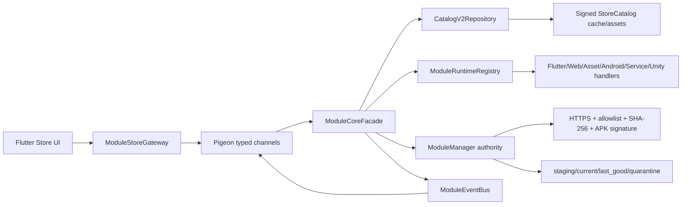

<!-- flutter-store release-evidence: 2026-07-22 -->
> **Flutter-first 发布证据快照：** 本文档记录 vc595 / 已签名 Catalog V8 的发布证据及预期架构边界。它不是当前全局事实来源；当前版本、活动实现与发布门槛见 [`../CURRENT_STATE.md`](../CURRENT_STATE.md)。

# Flutter-first Multi-runtime Module Store 架构

状态：已实现并发布；stable vc595 已用生产参数启用 Flutter 入口，源码默认关闭值保留为安全回退。更新时间：2026-07-22。

## 目标与边界

Flutter 负责商店页面、路由、筛选/搜索等 UI 状态；Android 继续独占目录信任、下载、SHA-256、APK 签名、安装、启停、回滚及运行时生命周期。Flutter 不接触 APK/DEX、模块根目录或密钥，也不维护第二套安装状态。

## 入口与 Engine

- Flutter module：`flutter_module/`，以 Add-to-App source 方式接入 `:flutter`。
- 缓存 Engine ID：`game_matrix_main_engine`。
- `App` 仅在 `ENABLE_FLUTTER_MODULE_STORE=true` 时预热；桥接在 Dart entrypoint 执行前注册。
- `ModuleStoreActivity` 是兼容宿主：开关开启时直接挂载缓存 Engine 的 Flutter Fragment，避免额外 Activity 跳转；初始化失败、开关关闭或传入 `force_legacy_module_store=true` 时渲染原生页面。
- Engine 随进程复用，Activity/Fragment 不销毁 Engine。

## 单一状态源

`ModuleManager` 与其 `module_manager_prefs` 仍是安装版本、启用状态和回滚信息的唯一权威。`CatalogV2Repository` 是只读模型层：读取现有签名校验后的商店缓存或 assets，并把记录与 `ModuleManager` 清单按 ID 合并；它不创建第二个目录缓存或安装数据库。

Flutter 只在原生 `flutter_module_store_ui` SharedPreferences 中保存以下 UI 偏好：`search_history`、`filter_state`、`sort_mode`、`view_mode`。

## 宿主底部导航扩展

底部导航不属于 Flutter 商店 UI，它继续由 Android 宿主 `BottomNavigationCatalog` 与 `BottomNavigationManager` 管理。已签名 Catalog 可为已安装的 Android 功能模块声明一个 `navigationContribution`；宿主从上次成功缓存恢复声明，使用宿主图标白名单，并在点击时通过 `ModuleShellFragment` 延迟加载模块 Fragment。

排序与隐藏偏好保存在 Android 私有 `bottom_navigation_preferences` 中，不进入 Flutter，也不改变远端 Catalog。游戏大厅强制可见，最多展示 6 项。安装、卸载、启用或禁用模块后，`MainActivity.onResume()` 会重新发现入口并应用用户偏好。

该扩展不允许远程注入 Flutter route、Activity、Service、资源 ID 或任意图标资源；Flutter route 仍必须随宿主编译，动态 APK 仍受证书、SHA-256、版本兼容和模块壳约束。

## 目录与兼容

- 正式 Multi-runtime V2：要求每个条目显式声明 `runtimeType` 和 `deliveryType`，经 `CatalogV2Parser` 与 `CatalogSchemaValidator` 验证。
- 已部署的旧 `modules.json` 和早期展示型 schema v2：经 `LegacyCatalogAdapter` 转为同一 `CatalogModule`。
- 原始目录的 Ed25519 校验、ETag、原子缓存与降级仍由现有 `DefaultStoreCatalogRepository` 执行。

## 事件和生命周期

下载/验证/安装/启停/回滚事件由 `ModuleCoreFacade` 发布到 `ModuleEventBus`，再由缓存 Engine 上唯一的 `ModuleStoreFlutterApi` 推送到 Dart。高频 `DownloadProgress` 直接更新 Dart 下载队列，不再逐帧回查完整模块；阶段切换事件才同步权威模块状态。`StoreController` 在销毁时取消 Dart Stream 订阅；进程级原生观察者与进程级 Engine 同生命周期。

## 安全不变量

- 远程包必须有 HTTPS 来源和 64 位十六进制 SHA-256。
- Android APK 沿用宿主证书/允许证书校验，不提供绕过路径。
- 正式 V2 非内置包必须先映射到 `ModuleManager` 权威清单；未映射时明确返回 `package_not_registered`，不进入排队态。
- Web/Asset ZIP 使用隔离目录、路径规范化、条目/单文件/总大小/压缩比限制和原子切换。
- Asset/Unity Content 分别强制 `asset-manifest.json`/`unity-manifest.json`；Native Service 只调用已注册 controller，未知 service type fail-closed。
- Catalog schema 与 Kotlin validator 双重强制 Runtime/Delivery 兼容矩阵。
- WebView 使用虚拟 HTTPS origin，只读私有目录，默认禁用 JavaScript，无 JavaScript bridge，阻断外域、`file://`、`content://` 和 SSL 错误。
- Flutter API 不返回文件系统路径，也不能直接加载代码。

## 当前发布判断

功能开关的源码默认值保持关闭以支持安全回退；stable vc595 通过生产构建参数启用。框架、UI、桥接、目录信任门禁、六类 Runtime、Android 11–15 签名 Release 矩阵和 Android 13 ARM64 真机流程均已验证。线上 Catalog V8 已具备 Ed25519 header 与显式 Runtime/Delivery，正式模块包和受控多 Runtime 灰度已完成；长期崩溃率、启动分位数和容量趋势继续纳入生产监控。
