# GameMatrixApp �布指�

## 2026-05-20 GitHub 上传网络说�

- 本机已��GitHub-only Git 代�：`git config --global http.https://github.com.proxy http://127.0.0.1:10808`�- 该�置�影� `https://github.com`，用�在�开�xray TUN/虚拟网�模�时完�`git push` �GitHub Release 上传�的 Git �作�- 如本地代�端��化，�行 `powershell -ExecutionPolicy Bypass -File 工具\\network\Configure-GitHubProxy.ps1 -Apply` �新检测并写入�置�
本文档说�如何将 GameMatrixApp APK 自动�布到所有更新��
## ��更新�026-05-12�

### �版本分������

�v1.3.19 开始，�布系统已��为**�版本分���*�

#### 核心�化
- **测试版和正�版完全分�*：VPS 上�时维�`app-beta.apk` �`app-release.apk`
- **上传脚本修�**：`upload_to_vps.py` �`cleanup_remote` 函数�在�护两个通�的文�
- **更新逻辑优化**�
  - 用户开��收测试� �检�version-beta.json
  - 用户关闭"�收测试� ��检�version-release.json
  - 旧版 APP 使用 /api/update/check API 自动兼容

#### �布命令

**�布测试�*�
```bash
python 工具/upload_to_vps.py --apk app/build/outputs/apk/release/app-release.apk \
    --version app/build/outputs/apk/release/version.json --channel beta
```

**�布正��*�
```bash
python 工具/upload_to_vps.py --apk app/build/outputs/apk/release/app-release.apk \
    --version app/build/outputs/apk/release/version.json --channel release
```

### APK 签�问题已修�

之�的版本存�APK 签��置问题，导致安装包�示"开�者签�异�。�已修�：

1. **修� keystore 路径错误**
   - 错误：`storeFile file(props['STORE_FILE'])`
   - 正确：`storeFile rootProject.file(props['STORE_FILE'])`

2. **�用 V1 �V2 签�方案**
   ```groovy
   signingConfigs {
       release {
           enableV1Signing = true
           enableV2Signing = true
       }
   }
   ```

3. **验�签�**
   ```bash
   cd app\build\outputs\apk\release
   jarsigner -verify app-release.apk
   # 输出：jar 已验��
   ```

### VPS 文件结�

```
/var/www/update/app/
├── app-beta.apk         # 测试版安装包
├── version-beta.json     # 测试版元数�
├── app-release.apk      # 正�版安装包
└── version-release.json  # 正�版元数�
```

---

## 更新�列�

| �� | 更新�| URL | 类� | 用�|
|------|--------|-----|------|------|
| 1 | 香港 VPS | https://your-server.example.com | SFTP | 主�更新�，�延�|
| 2 | �国 VPS | https://your-server.example.com:1443 | SFTP | 备用更新�|
| 3 | GitHub Releases | https://github.com/3571949306/GameMatrixApp/releases | HTTPS API | 公开分� |

## �置准备

### 1. 安装�赖

```bash
# 安装 Python �赖
pip install paramiko requests
```

### 2. �置签�

在项目根目录创建 `keystore.properties` 文件�

```properties
# GameMatrixApp 签��置
STORE_FILE=GameMatrix.keystore
STORE_PASSWORD=<your-store-password>
KEY_ALIAS=GameMatrix
KEY_PASSWORD=<your-key-password>
```

确� `GameMatrix.keystore` 文件存在�项目根目录�

### 3. �置 VPS 凭�

VPS �置文件�� `local_private/�务器部�` 目录（已�除在版本�制外）：

- `upload_config_hk.json` - 香港 VPS �置
- `upload_config_hk.json` - �国 VPS �置

�置示例�

```json
{
  "host": "your-vps-ip",
  "port": 22,
  "user": "root",
  "authMethod": "password",
  "password": "your-password",
  "remoteDir": "/var/www/update/app",
  "publicBaseUrl": "https://your-update-domain.com",
  "postUploadCommands": [
    "systemctl restart GameMatrix-update"
  ]
}
```

### 4. �� GitHub Token

1. 访问 https://github.com/settings/tokens
2. 创建�Token，勾�`repo` ��
3. �制 Token 并�存（�显示一次）

## �布方�

### 方�一：一键�布脚本（���

#### Windows (批处�

```bash
# �布 Beta �
publish-all.bat beta

# �布正��
publish-all.bat release
```

#### Python 脚本（跨平��

```bash
# �布 Beta �
python 工具/publish-all.py --channel beta --github-token YOUR_GITHUB_TOKEN

# �布正��
python 工具/publish-all.py --channel release --github-token YOUR_GITHUB_TOKEN

# �上传到特定更新�
python 工具/publish-all.py --channel beta --github-token YOUR_TOKEN --sources hk_vps github

# 跳过验�
python 工具/publish-all.py --channel release --github-token YOUR_TOKEN --skip-verify
```

### 方�二：分步执行

#### 步骤 1: 编译 APK

```bash
# 编译 Beta 版（带签�）
gradlew assembleRelease -x lintVitalReportRelease -x lintVitalRelease

# 编译正�版（带签�）
gradlew assembleRelease -x lintVitalReportRelease -x lintVitalRelease
```

**注�**：��APK 会自动签�，无需手动签�步骤�

#### 步骤 2: 生� version.json

```bash
gradlew generateVersionJson
```

version.json 会自动生�到�
- `app/build/outputs/apk/debug/version.json`
- `app/build/outputs/apk/release/version.json`

#### 步骤 3: 验�签�

```bash
cd app/build/outputs/apk/release
jarsigner -verify app-release.apk
# 输出：jar 已验��
```

#### 步骤 4: 上传�VPS

```bash
# 上传到香�VPS + �国 VPS
python 工具/upload_to_vps.py --apk app/build/outputs/apk/release/app-release.apk \
    --version app/build/outputs/apk/release/version.json \
    --channel beta
```

**注�**：�在使用已签��`app-release.apk`，而� `app-release-unsigned.apk`�

#### 步骤 5: 上传�GitHub Releases

```bash
python 工具/upload_to_github_release.py \
    app/build/outputs/apk/release/app-release.apk \
    "v1.3.17"
```

## �布�程

```mermaid
graph TD
    A[开始] --> B[清��建缓存]
    B --> C[编译 Release APK]
    C --> D[生� version.json]
    D --> E{选择�布渠�}
    E -->|Beta| F[上传�HK VPS]
    E -->|Release| F
    F --> G[上传�US VPS]
    G --> H[上传�GitHub Releases]
    H --> I[验�所有更新�]
    I --> J[�布完�]
```



## 验��布

### 1. 检�VPS 更新�

访问以下 URL 确认文件已上传：

- 香港 VPS: https://your-server.example.com/version-beta.json
- �国 VPS: https://your-server.example.com:1443/version-beta.json

### 2. 检�GitHub Releases

访问：https://github.com/3571949306/GameMatrixApp/releases

### 3. 应用内检查更�

在应用设置中切�到对应更新�，点�检查更��

## 常�问题

### Q: 上传�VPS 失败

**A:** 检查以下项目：
1. VPS �置文件是�存在且正�
2. 网络��是�正常
3. VPS �SSH �务是��行
4. 防�墙是���SSH ��

### Q: GitHub Releases 上传失败

**A:** 确认�
1. GitHub Token 是�有效
2. Token 是��`repo` ��
3. 仓库�称是�正确

### Q: 版本��匹�

**A:** 确��
1. `version.properties` 中的版本�已更新
2. 使用正确�`-PupdateChannel` �数
3. 清�旧的�建文件��新编�

## 自动化�布（CI/CD�

项目已��GitHub Actions 工作�(`.github/workflows/ci.yml`)，��代�时自动�建和上传�

如需手动触��布，�以使用：

```bash
# 本地一键��
python 工具/publish-all.py --channel beta --github-token ${{ secrets.GITHUB_TOKEN }}
```

## �布记录

�布记录会自动更新到 `CHANGELOG.md` �`RELEASE_NOTES_*.md` 文件�

---

**最�更�*: 2026-05-11  
**版本**: v1.11.0
---

## 2026-05-14 文档�步：文字适��应用语言

- 新�全局按钮文字适�样�，统一�� MaterialButton �平�Button 的最�高度�内边�和两行显示能力，�少“进入游��“���等按钮文字被�切的问题�
- 设置弹窗新�应用语言选项：跟�系统�中文�English；应用�动时会��已选择语言�
- AI 任务下拉改为资�字符串，切� English ��显示 Chat�Summary�Translate 等英文选项�
- �布�检查需覆盖中文/英文两�语言�深�浅色主题�游�大��片按钮�AI ��按钮�工具箱�按钮和斗地主�作按钮�
## 2026-05-15 文档�步：Dependabot �CI 修�

- Dependabot 安全告警已处�：�级 Android Gradle Plugin �8.13.2�Gradle Wrapper �8.13�Kotlin �2.2.21�Hilt �2.57.2�
- �建 classpath 已强制解�到安全版本：Netty 4.1.133.Final�BouncyCastle 1.84�commons-compress 1.26.0�jose4j 0.9.6�jdom2 2.0.6.1�
- GitHub Actions 已改为验�� CI：使�JDK 21，执�debug �建��元测试，�在云端�建 release 包，��暴露或��release 签�文件�
- CI 命令统一添加 `-PautoBumpVersion=false`，��自动修�`version.properties`�
- `.gitignore` �`data/` 规则已收窄为 `/data/`，防止误忽略 `app/src/main/java/com/GameMatrix/app/ai/data/` ���
- 最�GitHub Actions `CI/CD Pipeline` 已通过；正�签��R8 混淆��务器部�GitHub Release �布�以本机�布�程为准�

## 2026-05-19 Modularization Note

The build now includes `:core:common`, `:core:network`, and `:core:update`. Release and upload commands should continue to target `:app` tasks, but maintainers must keep module-level BuildConfig generation in sync when adding new release fields to `local.properties` or `version.properties`.

## 2026-05-24 文档�步
- 底部导航切�闪退修�：创�KeepStateNavigator 自定义导航器，使�add/show/hide 策略替代 Navigation 默认 replace 策略
- 模�下载修�：ModuleDownloader 全��写，添加全局异常�����超时��加日�- 内存泄�全�修�：移�WeakReference callback�Fragment �调安全检查�视图引用彻底清�- �力测试通过�0轮快速Tab切�无崩�

- 2026-05-24 游��化+中国象棋�示改进+�容�中国象棋模�商店上�：四个游�视觉�化（斗地主径���桌�五�棋木�D棋�/�容�深色��金色边�中国象棋木纹角标波浪线）；中国象棋�示改为棋盘�视化（�色脉冲光�箭头指引�中文棋谱�述；�容�和中国象棋创建独立APK模�（feature/games/klotski�feature/games/chinesechess）v2.0.0上�模�商店
