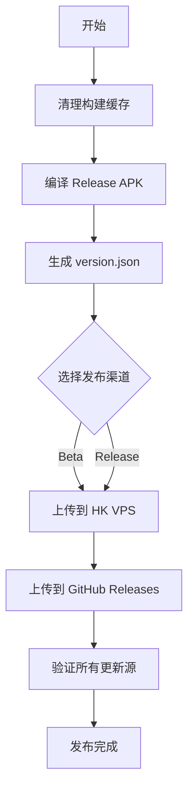

<!-- flutter-store-doc-sync: 2026-07-22 -->
> **Flutter-first production sync:** The Flutter module-store UI and customizable host navigation are live in stable vc595; Android remains authoritative for catalog trust, download, install, rollback, and runtime lifecycle. Production completion: 100%. See `/docs/flutter-store/MIGRATION_STATUS.md`.

# GameMatrixApp 发布指南

> **文档版本**: v1.12.0
> **最后更新**: 2026-07-21
> **维护者**: GameMatrixApp 开发团队
> **当前工作树/生产版本**: versionCode=595 / versionName=1.4.1 (lastStable=594/1.4.1)
> **项目根**: d:\Developmment\GameMatrixApp

---

## 目录

1. [重要更新](#重要更新)
2. [更新源列表](#更新源列表)
3. [前置准备](#前置准备)
4. [发布方式](#发布方式)
5. [发布流程](#发布流程)
6. [验证发布](#验证发布)
7. [预安装模块发布流程](#预安装模块发布流程)
8. [GitHub Actions CI/CD](#github-actions-cicd)
9. [常见问题](#常见问题)
10. [发布记录](#发布记录)

---

## 重要更新

### 2026-07-21 Flutter-first 商店发布门禁

- 默认发布构建保持 `ENABLE_FLUTTER_MODULE_STORE=false`；测试构建使用 `-PenableFlutterModuleStore=true`。
- 开启 Flutter 商店前必须通过 Flutter analyze/test、Android 单测/lint/构建、APK assets/ABI 检查、真机重复进入/旧商店回退及目标 logcat。
- 正式 V2 非内置包必须映射到权威 `ModuleManifest`，并具有 HTTPS、SHA-256、生产签名和可回收测试 ID。
- 客户端已移除 Catalog 占位公钥，Release 从构建参数/环境注入 1–3 把 Ed25519 公钥；stable vc595 已用 DPAPI 保护的生产密钥、公网 `X-Catalog-Signature` 和正式 V2 目录完成发布，后续版本不得降低这些门禁。
- Flutter staging Release 必须同时包含 `android-arm64,android-x64`，并使用 `--no-parallel --max-workers=1` 规避当前 Hilt ASM 并行输出竞态；stable 构建必须使用 `catalogSigningProfile=production` 且禁止 staging application ID。
- 发布流程不得只验证 Gradle 成功，必须验证 APK 签名/ABI/内置资产并在设备上进入 Flutter Activity；完整清单见 `/docs/flutter-store/TEST_PLAN.md`。
- 本地 Android 11/API 30、12/API 31、14/API 34、15/API 35 签名 Release 矩阵已通过；该结果不替代生产签名 Catalog、正式包和灰度监控。

### 2026-07-06 循环 19-24 复核更新

- **版本号**: `versionCode=567 / versionName=1.4.1`，`lastStableVersionCode=465 / lastStableVersionName=1.4.0`
- **CI/CD**: 循环 23 上线 `.github/workflows/android_ci.yml`（主 CI）+ `.github/dependabot.yml`（依赖周扫描）
- **安全修复**: 循环 24 Netty 4.1.134.Final → 4.1.135.Final，修复 7 个 CVE（3 高 4 中），Dependabot 当前 0 open alerts
- **分发架构**: HK VPS 主分发，美国 VPS 已于 2026-06-19 下线，`server.url.fallback` 字段保留空值向后兼容
- **新模块**: 循环 20 新增 `tools/wrongbook` 错题本模块，预装到 `app/src/main/assets/modules/feature_wrongbook_v100.apk`，由 `ENABLE_WRONGBOOK` feature flag 控制
- **宿主 Kotlin 迁移**: 循环 21-22 完成 App.kt / MainActivity.kt / games/GameRegistry.kt 迁移

### 双版本分发架构重构

自 v1.3.19 起，发布系统采用**双版本分发架构**：

- **测试版和正式版完全分离**：VPS 上同时维护 `app-beta.apk` 和 `app-release.apk`
- **上传脚本修复**：`upload_to_vps.py` 的 `cleanup_remote` 函数现在保护两个通道的文件
- **更新逻辑优化**：
  - 用户开启"接收测试版" → 检查 `version-beta.json`
  - 用户关闭"接收测试版" → 只检查 `version-release.json`
  - 旧版 APP 使用 `/api/update/check` API 自动兼容

#### 发布命令

**发布测试版**：

```bash
python 工具/upload_to_vps.py --apk app/build/outputs/apk/release/app-release.apk \
    --version app/build/outputs/apk/release/version.json --channel beta
```

**发布正式版**：

```bash
python 工具/upload_to_vps.py --apk app/build/outputs/apk/release/app-release.apk \
    --version app/build/outputs/apk/release/version.json --channel release
```

### APK 签名问题已修复

之前的版本存在 APK 签名配置问题，导致安装包提示"开发者签名异常"。现已修复：

1. **修复 keystore 路径错误**
   - 错误：`storeFile file(props['STORE_FILE'])`
   - 正确：`storeFile rootProject.file(props['STORE_FILE'])`

2. **启用 V1 和 V2 签名方案**

   ```groovy
   signingConfigs {
       release {
           enableV1Signing = true
           enableV2Signing = true
       }
   }
   ```

3. **验证签名**

   ```bash
   cd app\build\outputs\apk\release
   jarsigner -verify app-release.apk
   # 输出：jar 已验证。
   ```

### VPS 文件结构

```
/var/www/update/app/
├── app-beta.apk         # 测试版安装包
├── version-beta.json     # 测试版元数据
├── app-release.apk      # 正式版安装包
└── version-release.json  # 正式版元数据
```

---

## 更新源列表

| 序号 | 更新源 | URL | 类型 | 用途 |
|------|--------|-----|------|------|
| 1 | 香港 VPS | https://your-server.example.com | SFTP | 主要更新源，低延迟 |
| 2 | GitHub Releases | https://github.com/3571949306/GameMatrixApp/releases | HTTPS API | 公开分发 |

> **2026-07-06 复核**：美国 VPS 已于 2026-06-19 下线，从更新源列表移除。HK VPS 现为唯一 SFTP 更新源。

---

## 前置准备

### 1. 安装依赖

```bash
# 安装 Python 依赖
pip install paramiko requests
```

### 2. 配置签名

在项目根目录创建 `keystore.properties` 文件（不要提交到 Git）：

```properties
# GameMatrixApp 签名配置
STORE_FILE=GameMatrix.keystore
STORE_PASSWORD=<your-store-password>
KEY_ALIAS=GameMatrix
KEY_PASSWORD=<your-key-password>
```

确保 `GameMatrix.keystore` 文件存在于项目根目录。

### 3. 配置 VPS 凭证

VPS 配置文件位于 `local_private/服务器部署/` 目录（已排除在版本控制外）：

- `upload_config_hk.json` - 香港 VPS 配置

配置示例：

```json
{
  "host": "your-vps-ip",
  "port": 22,
  "user": "root",
  "authMethod": "password",
  "password": "your-password",
  "remoteDir": "/var/www/update/app",
  "publicBaseUrl": "https://your-update-domain.com",
  "postUploadCommands": [
    "systemctl restart GameMatrix-update"
  ]
}
```

### 4. 获取 GitHub Token

1. 访问 https://github.com/settings/tokens
2. 创建新 Token，勾选 `repo` 权限
3. 复制 Token 并保存（只显示一次）

---

## 发布方式

### 方式一：一键发布脚本（推荐）

#### Windows (批处理)

```bash
# 发布 Beta 版
publish-all.bat beta

# 发布正式版
publish-all.bat release
```

#### Python 脚本（跨平台）

```bash
# 发布 Beta 版
python 工具/publish-all.py --channel beta --github-token YOUR_GITHUB_TOKEN

# 发布正式版
python 工具/publish-all.py --channel release --github-token YOUR_GITHUB_TOKEN

# 只上传到特定更新源
python 工具/publish-all.py --channel beta --github-token YOUR_TOKEN --sources hk_vps github

# 跳过验证
python 工具/publish-all.py --channel release --github-token YOUR_TOKEN --skip-verify
```

### 方式二：分步执行

#### 步骤 1: 编译 APK

```bash
# 编译 Beta 版（带签名）
gradlew assembleRelease -x lintVitalReportRelease -x lintVitalRelease

# 编译正式版（带签名）
gradlew assembleRelease -x lintVitalReportRelease -x lintVitalRelease
```

**注意**：现在 APK 会自动签名，无需手动签名步骤。

#### 步骤 2: 生成 version.json

```bash
gradlew generateVersionJson
```

version.json 会自动生成到：

- `app/build/outputs/apk/debug/version.json`
- `app/build/outputs/apk/release/version.json`

#### 步骤 3: 验证签名

```bash
cd app/build/outputs/apk/release
jarsigner -verify app-release.apk
# 输出：jar 已验证。
```

#### 步骤 4: 上传到 VPS

```bash
# 上传到香港 VPS
python 工具/upload_to_vps.py --apk app/build/outputs/apk/release/app-release.apk \
    --version app/build/outputs/apk/release/version.json \
    --channel beta
```

**注意**：现在使用已签名的 `app-release.apk`，而非 `app-release-unsigned.apk`。

#### 步骤 5: 上传到 GitHub Releases

```bash
python 工具/upload_to_github_release.py \
    app/build/outputs/apk/release/app-release.apk \
    "v1.4.1"
```

---

## 发布流程



> **2026-07-06 复核**：发布流程图中"上传到 US VPS"步骤已移除（美国 VPS 下线）。

---

## 验证发布

### 1. 检查 VPS 更新源

访问以下 URL 确认文件已上传：

- 香港 VPS: https://your-server.example.com/version-beta.json

### 2. 检查 GitHub Releases

访问：https://github.com/3571949306/GameMatrixApp/releases

### 3. 应用内检查更新

在应用设置中切换到对应更新源，点击"检查更新"。

---

## 预安装模块发布流程

> **2026-07-06 新增**：循环 20 引入 `tools/wrongbook` 错题本模块后，预安装模块发布流程需要规范化。

### 1. 预安装模块清单

当前预安装到 `app/src/main/assets/modules/` 的动态 APK：

| 模块 ID | 文件名 | 版本 | Feature Flag | 说明 |
|---------|--------|------|--------------|------|
| `games_hall` | `feature_games_hall_v100.apk` | v1.0.0 | — | 游戏大厅 |
| `chinesechess` | `feature_chinesechess_v200.apk` | v2.0.0 | — | 中国象棋 |
| `game2048` | `feature_game2048_v100.apk` | v1.0.0 | — | 2048 |
| `klotski` | `feature_klotski_v200.apk` | v2.0.0 | — | 华容道 |
| `tts` | `feature_tts_v100.apk` | v1.0.0 | — | TTS 语音合成 |
| `ai` | `feature_ai_v100.apk` | v1.0.0 | — | AI 助手 |
| `browser` | `feature_browser_v100.apk` | v1.0.0 | — | 浏览器 |
| `tools` | `feature_tools_v100.apk` | v1.0.0 | — | 工具箱 |
| `vpn` | `feature_vpn_v100.apk` | v1.0.0 | — | VPN |
| `wrongbook` | `feature_wrongbook_v100.apk` | v1.0.0 | `ENABLE_WRONGBOOK` | 错题本（循环 20 新增） |

### 2. 构建预安装模块

当某个预安装模块源码变更时，需要重新构建模块 APK 并同步到 `app/src/main/assets/modules/`：

```powershell
# 示例：重建 wrongbook 模块
.\gradlew.bat :module-store:feature:tools:wrongbook:assembleDebug -PautoBumpVersion=false --stacktrace

# 同步到 app assets
.\gradlew.bat :app:bundlePreinstalledModules -PautoBumpVersion=false --stacktrace

# 重建宿主 APK
.\gradlew.bat :app:assembleDebug -PautoBumpVersion=false --stacktrace
```

### 3. 验证预安装模块

```powershell
# 验证 assets/modules/ 下 APK 文件大小与 SHA-256
Get-ChildItem app\src\main\assets\modules\*.apk | ForEach-Object {
    "$($_.Name) - $($_.Length) bytes - $((Get-FileHash $_.FullName -Algorithm SHA256).Hash)"
}
```

### 4. Feature Flag 控制

新增预安装模块应在 `app/build.gradle` 中添加 feature flag：

```groovy
buildConfigField "boolean", "ENABLE_WRONGBOOK", "true"
```

宿主代码通过 `BuildConfig.ENABLE_WRONGBOOK` 判断是否显示模块入口。发布时可通过修改此值快速禁用有问题的模块。

---

## GitHub Actions CI/CD

> **2026-07-06 循环 23 上线**：CI/CD 流程已就位，详见 `CLOUD-BUILD.md`。

### 1. CI Workflow 文件

| 文件 | 用途 | 触发 |
|------|------|------|
| `.github/workflows/android_ci.yml` | 主 CI（lint + test + debug build + gitleaks） | push / PR |
| `.github/workflows/cloud-build.yml` | 云编译专用（debug + release artifact 上传） | push / PR |
| `.github/dependabot.yml` | 依赖周扫描（Gradle + GitHub Actions） | 每周自动 |
| `.gitleaks.toml` | secret 扫描配置 | 由 CI 调用 |

### 2. Dependabot 状态

- **当前状态**: 0 open alerts（7 个历史 alerts 已在循环 24 Netty 升级后 dismissed）
- **扫描范围**: Gradle 依赖 + GitHub Actions 版本
- **频率**: 每周自动扫描，自动开 PR 升级

### 3. CI 触发

```bash
# 推到 main 分支自动触发
git push origin main

# 或在 GitHub 网页手动触发
# Actions 页面 → "CI" workflow → "Run workflow"
```

> **注意**：CI 默认出 unsigned release APK。要签正式版 release APK，需配置 GitHub Secrets（`KEYSTORE_BASE64` / `KEYSTORE_PASSWORD` / `KEY_ALIAS` / `KEY_PASSWORD`），详见 `CLOUD-BUILD.md` §4。

---

## 常见问题

### Q: 上传到 VPS 失败

**A:** 检查以下项目：

1. VPS 配置文件是否存在且正确
2. 网络连接是否正常
3. VPS 的 SSH 服务是否运行
4. 防火墙是否允许 SSH 连接

### Q: GitHub Releases 上传失败

**A:** 确认：

1. GitHub Token 是否有效
2. Token 是否有 `repo` 权限
3. 仓库名称是否正确

### Q: 版本号不匹配

**A:** 确保：

1. `version.properties` 中的版本号已更新
2. 使用正确的 `-PupdateChannel` 参数
3. 清理旧的构建文件后重新编译

### Q: 预安装模块未生效

**A:** 检查：

1. 模块 APK 是否已同步到 `app/src/main/assets/modules/`
2. 宿主 APK 是否已重新构建（`bundlePreinstalledModules` + `assembleDebug`）
3. Feature Flag 是否启用（如 `ENABLE_WRONGBOOK`）
4. `modules.json` 中模块元数据是否正确

---

## 发布记录

发布记录会自动更新到 `CHANGELOG.md` 和 `RELEASE_NOTES_*.md` 文件。

### 2026-07-06 循环 19-24 变更摘要

- **循环 19**: 浏览器原生重构
- **循环 20**: wrongbook 模块预装，由 `ENABLE_WRONGBOOK` feature flag 控制
- **循环 21-22**: 错题本推进 + 宿主 Kotlin 迁移（App.kt / MainActivity.kt / GameRegistry.kt）
- **循环 23**: CI 配置（`.github/workflows/android_ci.yml` + `.github/dependabot.yml`）
- **循环 24**: Netty 4.1.134.Final → 4.1.135.Final 安全修复（7 CVE），commit f978f06 已推送

### 历史发布记录

- **2026-05-24 文档同步**：
  - 底部导航切换闪退修复：创建 KeepStateNavigator 自定义导航器，使用 add/show/hide 策略替代 Navigation 默认 replace 策略
  - 模块下载修复：ModuleDownloader 全面重写，添加全局异常捕获、降低超时、增加日志
  - 内存泄漏全面修复：移除 WeakReference callback、Fragment 回调安全检查、视图引用彻底清理
  - 压力测试通过：10轮快速Tab切换无崩溃
  - 游戏美化+中国象棋提示改进+华容道/中国象棋模块商店上架：四个游戏视觉美化；中国象棋提示改为棋盘可视化；华容道和中国象棋创建独立APK模块 v2.0.0 上架模块商店

- **2026-05-19 Modularization Note**：
  - 构建现已包含 `:core:common`、`:core:network`、`:core:update`。Release 和 upload 命令应继续指向 `:app` 任务，但维护者在向 `local.properties` 或 `version.properties` 添加新 release 字段时，必须保持模块级 BuildConfig 生成同步。

- **2026-05-15 文档同步：Dependabot 与 CI 修复**：
  - Dependabot 安全告警已处理：升级 Android Gradle Plugin 到 8.13.2、Gradle Wrapper 到 8.13、Kotlin 到 2.2.21、Hilt 到 2.57.2
  - 构建 classpath 已强制解析到安全版本：Netty 4.1.133.Final、BouncyCastle 1.84、commons-compress 1.26.0、jose4j 0.9.6、jdom2 2.0.6.1
  - GitHub Actions 已改为验证型 CI：使用 JDK 17，执行 debug 构建与单元测试，不在云端构建 release 包
  - CI 命令统一添加 `-PautoBumpVersion=false`，避免自动修改 `version.properties`

- **2026-05-14 文档同步：文字适配与应用语言**：
  - 新增全局按钮文字适配样式，统一提升 MaterialButton 与平台 Button 的最小高度、内边距和两行显示能力
  - 设置弹窗新增应用语言选项：跟随系统、中文、English
  - AI 任务下拉改为资源字符串，切换 English 后可显示英文选项
  - 发布前检查需覆盖中文/英文两种语言、深色/浅色主题

---

**最后更新**: 2026-07-06
**版本**: v1.12.0

---
[🔙 返回文档索引](/docs/DOCUMENTATION_INDEX.md)
